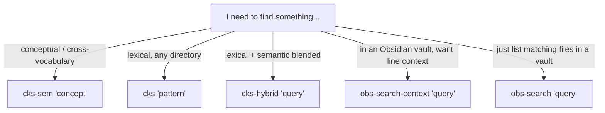

## The pattern in one sentence

**ck is the universal layer.** It works on any directory — vault or not — and exposes lexical (BM25), semantic (embeddings), and hybrid search both via bash helpers and as a native MCP server in Claude Code. **Obsidian CLI's `search` / `search:context` is an accelerator** for the subset of paths that happen to be Obsidian-registered vaults: faster than ck (uses Obsidian's already-built index), returns line context out of the box, no index build needed. Use ck as the default; reach for the Obsidian CLI when the target is a vault and you want the pre-indexed fast path with line context.

## Why this design (and not Omnisearch HTTP)

An earlier iteration of this pattern used [Omnisearch](https://github.com/scambier/obsidian-omnisearch)'s opt-in HTTP API (`localhost:51361`) as the lexical layer for Obsidian vaults. It was dropped because:

- **Omnisearch's HTTP API binds to `127.0.0.1` on the host running Obsidian.** When Obsidian runs on Windows and the agent runs in WSL, WSL's network namespace can't reach Windows-host `127.0.0.1` by default. Tested: `curl localhost:51361` from WSL times out, hitting the Windows gateway IP also times out. Solvable with WSL networking config changes, but not by default.
- **Obsidian CLI's `search` works from WSL without any config.** It calls the Windows-side `Obsidian.com` binary through the WSL→Windows interop, which is reliably set up.
- **Obsidian CLI returns equivalent or richer data.** `search` returns JSON array of file paths; `search:context` returns JSON with `{file, matches: [{line, text}]}` — line context that Omnisearch HTTP doesn't provide.
- **No plugin toggle needed.** Omnisearch's HTTP API requires opt-in per vault in plugin settings. The CLI is enabled at the Obsidian level (Settings → General → CLI → Register) once.
- **No port conflicts.** Two Obsidian apps simultaneously would fight for `:51361`. The CLI has no such issue — invocations are stateless per-call.

For environments where the CLI isn't available (e.g., the agent runs on a different machine from Obsidian, or you want HTTP-style stateless interop), Omnisearch HTTP remains a valid alternative — but it's the fallback, not the default.

## Decision flow — which surface to reach for



Rough rule: **ck for everything by default.** Switch to Obsidian CLI when you specifically want vault-only search with line context, or when the target tree is huge and you want to avoid ck's first-query index build cost.

## Track 1 (primary) — ck + the path registry

### Installation

Pre-built binaries on the [BeaconBay/ck releases page](https://github.com/BeaconBay/ck/releases) — cleanest path on Linux/WSL since `cargo install ck-search` requires `libssl-dev` and `pkg-config`:

```bash
curl -fsSL -o /tmp/ck.tar.gz \
  "https://github.com/BeaconBay/ck/releases/download/0.7.4/ck-0.7.4-x86_64-unknown-linux-gnu.tar.gz"
tar -C /tmp -xzf /tmp/ck.tar.gz
mv /tmp/ck ~/.cargo/bin/ck   # or anywhere on PATH
ck --version
```

Pre-built binaries also exist for macOS (Intel + ARM) and Windows. Use `cargo install ck-search` only if `libssl-dev` is already on the system.

### Native MCP server (one-line registration)

```bash
claude mcp add ck-search -s user -- ck --serve
```

`claude mcp list` should then show `ck-search: ck --serve - ✓ Connected`. Exposes `semantic_search`, `regex_search`, `hybrid_search`, `index_status`, `reindex`, `health_check` as native Claude Code tools, operating against the current project's `.ck/` index.

For cross-tree search outside the current project, the agent uses the `cks-*` bash helpers (below) — they fan out across all registered paths.

### The path registry

ck has no native registry for multi-tree federation (`ck --serve` is single-rooted, CLI takes one directory at a time). A thin bash registry plugs the gap:

- Registry file: `~/.config/ck-helpers/paths.list`. Plain text, one absolute path per line, `#` comments tolerated. Override via `CKS_REGISTRY` env var.
- Two registration modes: **lazy** (cheap, indexing happens on first query) and **eager** (indexes immediately).

```bash
# Lazy — register without indexing (instant)
cks-register /abs/path
cks-register-batch /path/A /path/B /path/C

# Eager — register and index now
cks-add /abs/path

# Maintenance
cks-list                # registered paths + per-path indexed status
cks-remove /abs/path    # deregister (leaves .ck/ intact)
cks-reindex             # reindex all
cks-reindex /abs/path   # reindex one tree
cks-warmup              # eager-index any registered-but-not-yet-indexed paths

# Search across registered paths
cks "regex" [ck-flags...]
cks-sem "concept" [ck-flags...]
cks-hybrid "blended" [ck-flags...]
```

### Lazy vs eager

- **Lazy registration** is the sane default for broad coverage. ck auto-indexes on first semantic / hybrid query. Disk cost amortizes to actual use.
- **Eager indexing** when you know you'll search the tree often and can't tolerate a slow first query.
- **Warmup** is the middle ground: register everything lazily, then `cks-warmup` on a high-traffic subset.

### OOM-prevention rails (added 2026-05-11)

A 13 GiB RAM spike during semantic indexing surfaced two structural weaknesses in the bare-ck flow. Both are now mitigated at the helper layer:

- **`.ckignore` template auto-applied on `cks-register` / `cks-add`.** Trees that lack a `.gitignore` (most Obsidian vaults, archive dirs, project trees with mixed-binary content) would otherwise have ck try to embed every file — including audio, video, images, PDFs, 3D models, archives. The template excludes 100+ binary file types and common build directories. Idempotent: won't overwrite an existing `.ckignore`. The template body lives in `_cks_default_ckignore_content` inside the helper file; edit there for project-wide changes.
- **`ulimit -v` memory ceiling.** Every cks helper that triggers indexing or semantic queries (`cks-sem`, `cks-hybrid`, `cks-add`, `cks-reindex`, `cks-warmup`) runs ck under `CKS_RAM_CAP_KB` virtual-memory cap (default 8 GiB, configurable). A runaway tree gets its ck process killed instead of taking the host down. **Calibration matters**: 4 GiB was too aggressive — ck's ONNX runtime + embedding model + library mmaps need ~6 GiB just to operate. 8 GiB is the sweet spot: enough headroom for normal work, still bounded vs the user's 15+ GiB host. Lower it via `CKS_RAM_CAP_KB=<kib>` if you have a constrained host; set to 0 to disable (not recommended).

The fan-out helpers (`cks`, `cks-sem`, `cks-hybrid`) don't share ck processes across trees — each tree runs its own subshell — so the cap is per-tree, not per-fan-out. A 37-tree fan-out won't accumulate 37 × cap.

### Diagnostic + cleanup helpers

```bash
cks-doctor    # health check: running ck processes (with RSS + elapsed),
              # embedding cache size, per-tree size + index status +
              # .ckignore presence, anomaly flags ("large tree without
              # .ckignore"), free RAM, current settings. Read-only.
cks-cleanup   # kill any lingering ck --serve daemons. Safe — uses
              # /proc/PID/cmdline inspection rather than `pkill -f`,
              # so it cannot match its own caller's command line.
```

Run `cks-doctor` any time RAM feels off or after a long Claude Code session — it surfaces the multi-server case (one ck --serve per Claude Code session, can accumulate to multiple GiB of mmaps) immediately. `cks-cleanup` kills them; next MCP request from any session respawns one.

### Output shape from the fan-out helpers

`cks` / `cks-sem` / `cks-hybrid` group results by registered tree with a header line:

```
── <tree-name> ── (/abs/path/to/tree)
/abs/path/to/tree/file.md:
  <matching content>
/abs/path/to/tree/other.md:
  <matching content>

── <next-tree> ── (/abs/path/to/next-tree)
...
```

Properties of this output:

- **Tree attribution** — header shows which registered root each match came from. Necessary because 37 registered paths could all have a `CLAUDE.md` matching the same query.
- **Absolute paths** — ck normally prints `./relative` paths (relative to its cwd, which the helper sets to the tree root); the helper rewrites these to absolute, so the agent can pass them directly to `Read`.
- **Silent on empty trees** — if a tree returns zero matches, nothing is printed for it (no "no matches found" noise).
- **Errors surface to stderr** — if a tree fails (e.g., ck binary issue, model missing), the failure shows as `── <tree-name> ── ⚠ <error>` on stderr, without aborting the fan-out across other trees.
- **First-query indexing announcement** — `cks-sem` and `cks-hybrid` print `── <tree-name> ── (building index — first query for this tree, may take a moment…)` to stderr when about to trigger an auto-index. Aware of cost, agent can decide whether to wait or abort.

### Adding a new folder

Single command:

```bash
cks-register /new/path   # or cks-add if you want it indexed immediately
```

The agent can invoke this via the Bash tool — registering a new folder is first-class from Claude Code's perspective.

## Track 2 (accelerator) — Obsidian CLI for vault paths

### What it adds over ck

For an Obsidian vault:

- **No index build.** Obsidian's own full-text index is already there.
- **Line context.** `search:context` returns `{file, matches: [{line, text}]}` directly. Useful when the agent wants to read context around matches before deciding to `Read` the full file.
- **Multi-vault aware.** `vault=<name>` arg targets a specific registered vault; `obs-vaults` lists them.
- **Cross-environment reliability** — works through WSL→Windows interop without HTTP / network surprises.

### Requirements

Obsidian 1.12+ with the CLI registered (Settings → General → Command line interface → toggle on → click Register). One-time per machine.

On WSL the default binary path is `/mnt/c/Users/<you>/AppData/Local/Obsidian/Obsidian.com` — the helpers detect this; override with `OBSIDIAN_CLI` env var if needed.

### Helpers

```bash
obs-status                              # confirm CLI available + report vault count
obs-vaults                              # list registered vaults
obs-search "query" [limit] [vault]      # JSON array of matching file paths
obs-search-context "query" [limit] [vault]  # JSON with line context
```

### When to reach for which

| Want | Reach for |
|---|---|
| "find me notes about X" — synonym/concept tolerant | `cks-sem "X"` |
| "find me files containing X literally" — across all my registered trees | `cks "X"` |
| "find me notes mentioning X in this specific vault, with the actual lines" | `obs-search-context "X" 10 my-vault` |
| "find me notes mentioning X in this vault, just paths" | `obs-search "X" 10 my-vault` |
| "lexical + semantic blended ranking" | `cks-hybrid "X"` |

## From the agent's perspective

Three reachable surfaces, in increasing scope:

1. **Native MCP tools** (`semantic_search`, `regex_search`, `hybrid_search`, etc.) — operate against the current project's `.ck/` index. Cleanest for "search this project."
2. **`cks` / `cks-sem` / `cks-hybrid` via Bash** — fan out across every registered path. Default for "search across my whole workspace."
3. **`obs-search` / `obs-search-context` via Bash** — when the target is specifically an Obsidian vault and the line-context return is useful.

## Index storage and disk cost (ck)

- Per-tree: `<tree>/.ck/`, ~1–3× source size.
- Embedding models cached at `~/.cache/ck/models/` (shared across trees).
- ck respects `.gitignore` by default — `node_modules`, `dist`, `target` etc. skipped if listed there. Override with `--no-ignore` or `--exclude <pattern>`.
- `.ck/` directories are gitignored at the scaffold level so they don't get committed.

## Obsidian handoff — close the loop from agent to human

Search finds the doc; the handoff opens it. Instead of "the file is at `<path>`" (human goes vault-spelunking), the agent ends with the doc **already open in Obsidian**:

```bash
obs-open <path>    # opens the doc in the Obsidian GUI (WSL → Windows protocol handler)
obs-uri <path>     # prints a clickable obsidian:// link instead (shareable, pasteable)
```

Mechanics worth knowing:

- Uses the **absolute-path URI form** — `obsidian://open?path=<percent-encoded windows path>` — so Obsidian resolves the owning vault itself. No registered-vault-name lookup (vault *names* in the CLI don't reliably map to paths; absolute paths always do). The containing vault must be registered in Obsidian.
- From WSL, the path is converted with `wslpath -w` and launched via `powershell.exe Start-Process` (NOT `cmd /c start` — cmd's parser breaks on `&` in URIs).
- Steering lives in CLAUDE.md (always-loaded): agents hand off docs via `obs-open`/`obs-uri`, never bare paths — per the firing-reliability doctrine, the behavior steer is config-tier, this doc is the content.

## Cross-references

- [`agent-skill-pairing.md`](./agent-skill-pairing.md) — deterministic firing pattern; this doc follows it (CLI + bash + MCP combination, not a probabilistic skill).
- `.claude/skills/proactive-patterns/SKILL.md` § *Firing Reliability — Pick the Right Mechanism FIRST* — why this is bash + native MCP, not a probabilistic skill.
- Forward reference: the MegaMem evaluation will live as tier-2 once promoted from tier-3 draft.

## When to graduate beyond this layer

Enough for:

- "Where did I write about X?"
- "Find all notes / files mentioning Y."
- "Semantically similar notes to this concept."

Not enough for:

- "How are these two notes related?" → graph queries, MegaMem.
- "What changed about my opinion on X between January and now?" → temporal/bi-temporal, MegaMem.
- "Synthesize across notes referencing each other transitively." → relationship traversal, MegaMem.

Promote to MegaMem (or equivalent graph-RAG layer) when those questions become routine. Until then, ck + Obsidian CLI is the right tool for the job.
