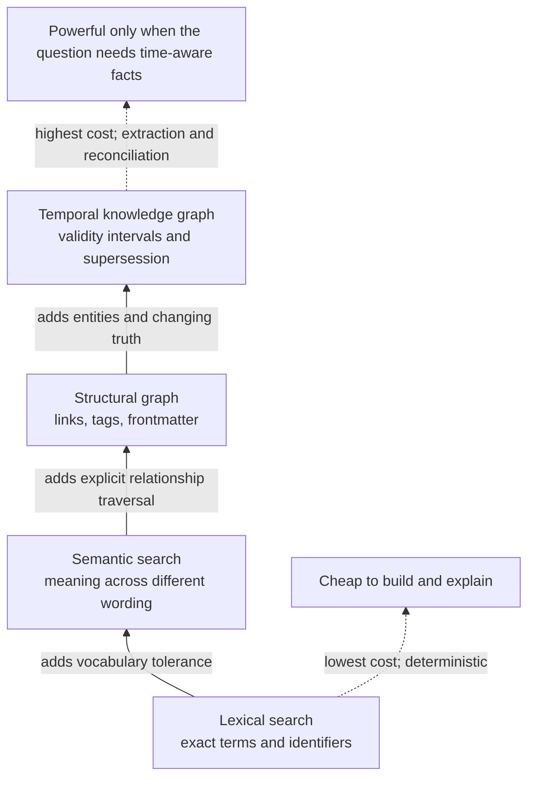
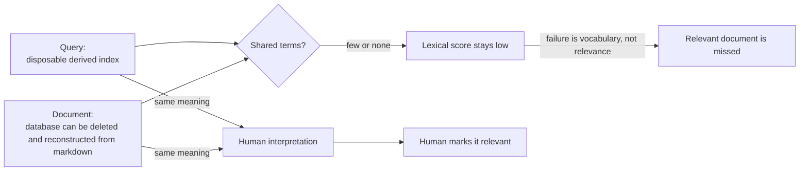
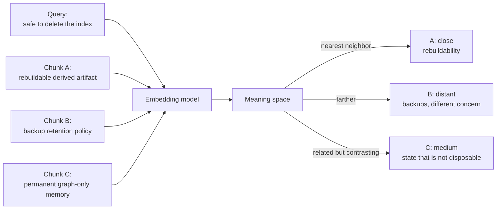
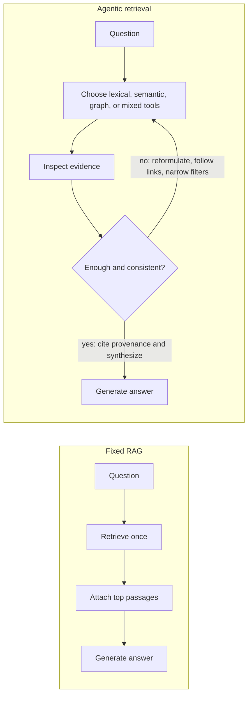

## The pattern (stratum 2)

**Retrieval is not one problem.** It is a family of question shapes, and each shape rewards a different representation of the same source material.

A directory of markdown files can support at least four useful views:

1. **Lexical index** — which documents contain these words?
2. **Semantic index** — which passages mean something like this?
3. **Structural graph** — what explicitly links to, belongs to, or depends on this?
4. **Temporal knowledge graph** — what was believed about this entity at a particular time, and what superseded it?

The mistake is to treat these as four generations of the same technology, where each new layer replaces the one before it. They are complementary. Semantic search does not make `grep` obsolete. A graph does not make search obsolete. A temporal knowledge graph does not justify its cost unless questions about entities, relationships, and changing truth are routine.

The durable architecture keeps the markdown as the source of truth and treats every retrieval structure as a **disposable projection**. Delete the index, rebuild it from the files, and lose no authored knowledge. A layer that accepts facts which exist only in its database has crossed from index into source-of-truth state and needs a different recovery and governance model.



This is a **capability ladder, not a migration path**. Climb only as high as the question requires.

## 1. Lexical search: find the words that were written

### The everyday problem

You remember the text, identifier, command, error message, filename, or phrase you want. The system should show where that character sequence appears.

That is lexical retrieval: matching the query's words against the words in the corpus.

At its simplest, this is `grep`:

```bash
grep -R "content_sha256" ~/vault
```

The search is strong because the target is exact. A semantic model is unnecessary and may be worse: `content_sha256` is not an idea to interpret; it is a token to locate.

### From grep to BM25

`grep` answers a Boolean question: did the pattern occur or not? Search engines usually need a ranked answer: which matching documents are probably most useful?

**BM25** is a widely used lexical ranking method. Its intuition is straightforward:

- A document should rank higher when it contains more of the query terms.
- A rare term is more informative than a common term.
- Repeating a term helps, but with diminishing returns.
- A long document should not win merely because it contains more words and therefore more accidental matches.

If the query is `graph rebuild procedure`, a short note containing all three terms prominently should outrank a long worklog that happens to mention each term once.

The important point is not the formula. It is that BM25 remains **word-based**. It ranks lexical evidence better than raw substring matching, but it cannot reward a concept expressed with entirely different vocabulary.

### The vocabulary problem

Suppose the note says:

> The database can be deleted and reconstructed from the markdown files.

The query says:

> disposable derived index

A human sees the connection. A lexical system may see no shared content words. This is the **vocabulary mismatch problem**: the author and searcher mean the same thing but choose different language.



Lexical search therefore excels when wording is stable and fails when wording is variable.

### Where lexical search earns its keep

Use it for:

- Exact identifiers: function names, configuration keys, issue IDs, hashes.
- Error messages and quoted phrases.
- Known commands, filenames, paths, tags, and frontmatter fields.
- Audits such as “find every note containing `status: parked`.”
- Negative proof with careful scope: “does this exact term appear anywhere?”

Its strengths are substantial:

- Deterministic and easy to inspect.
- Cheap to build; sometimes no index is needed.
- Fast to update.
- Excellent for precise filters and reproducible automation.
- Easy to explain: the result matched these words in this location.

Its core weakness is equally clear: **it cannot match language that is not there**.

## 2. Semantic search: find nearby meaning

### The everyday problem

You remember the idea but not the wording. You may ask “where did I write about indexes being safe to delete?” while the note says “rebuildable derived artifact.”

Semantic search tries to bridge that vocabulary gap.

### What an embedding is

An **embedding** is a list of numbers that represents a piece of content as a point in a high-dimensional space. The useful intuition is geometric:

- Pass a text chunk through an embedding model.
- The model assigns it coordinates.
- Texts with similar meaning tend to land near one another.
- A query is embedded in the same space.
- Retrieval returns the chunks whose points are closest to the query point.

The dimensions are not usually human-readable labels such as “rebuildability” or “databases.” Meaning is distributed across many numeric directions. What matters operationally is the neighborhood: nearby points are treated as semantically similar.



A real embedding space has hundreds or thousands of dimensions, not a neat two-dimensional map. The map is only a teaching aid for the principle: **meaning becomes distance**.

### Why chunking exists

Embedding an entire vault as one vector would produce one point for everything. That point could not tell the retriever which paragraph answers the question. Even embedding one vector per long document can blur several unrelated topics into an average.

So semantic systems split documents into **chunks**: paragraphs, heading sections, fixed token windows, or structure-aware segments. Each chunk gets its own embedding and provenance back to the source file.

Chunk size creates a tradeoff:

- **Too small:** the chunk loses context. A sentence containing “this approach” may no longer say what “this” means.
- **Too large:** multiple subjects blur together, and irrelevant text enters the retrieved context.
- **Overlapping chunks:** preserve boundary context but create duplicates and increase index size.
- **Structure-aware chunks:** respect headings, lists, and frontmatter, often producing cleaner retrieval than arbitrary character windows.

Chunking is not merely preprocessing. It defines the unit the system can remember and return.

### The inverse failure of lexical search

Semantic retrieval solves word mismatch but introduces the opposite weakness: it can be imprecise where exactness matters.

A query for `GraphClientFactory` may return passages about graph clients, factories, connection setup, or dependency injection without returning the one file containing that exact symbol. To the embedding model, these are meaningfully related. To a developer debugging a specific identifier, they are wrong.

Other semantic failure modes include:

- Short or unusual identifiers have weak semantic content.
- Numbers, hashes, versions, and punctuation-heavy strings may not embed distinctly.
- Near-synonyms can hide important oppositions: “state is disposable” and “state is not disposable” discuss the same topic but assert different things.
- A nearest-neighbor result is always “nearest,” even when nothing is truly relevant, unless the system applies a threshold.
- Embedding models and chunking rules can change ranking after a rebuild.

Lexical search misses **same meaning, different words**. Semantic search can miss **same token, weak meaning**, or retrieve **related topic, wrong claim**.

### Why hybrid search exists

**Hybrid search** runs lexical and semantic retrieval together, then combines their candidate sets or scores.

This lets exact evidence rescue semantic results and semantic similarity rescue vocabulary mismatch. A query containing both a concept and an identifier — `GraphClientFactory rebuild semantics` — can benefit from both.

Combining scores is not trivial because BM25 and vector similarity live on different scales. Common approaches include score normalization or rank-based fusion, where results are rewarded for appearing near the top of either list.

### Why reranking exists

The first retrieval pass must be fast across many chunks, so it uses relatively cheap scoring. A **reranker** takes the smaller candidate set and evaluates query–passage relevance more carefully.

The pipeline becomes:

1. Lexical and semantic search retrieve broad candidates.
2. Fusion combines them.
3. A reranker reads the query together with each candidate.
4. The best few passages enter the final context.

A reranker can notice details that vector distance blurs, including whether the passage directly answers the query, merely discusses the same topic, or contradicts the requested condition. It improves precision at the cost of extra compute and latency.

The practical default for a serious general-purpose search layer is therefore often **hybrid retrieval plus reranking**, while retaining direct lexical search for exact work.

## 3. Structural graph: traverse the relationships already authored

### The everyday problem

Search answers “which passages look relevant?” It does not naturally answer:

- What links to this note?
- Which decisions cite this principle?
- What documents share this project, status, owner, or tag?
- What is two hops downstream from this architecture note?
- Which notes are orphaned?

These are relationship questions. The answer depends less on textual similarity than on explicit structure.

### A markdown vault is already a graph

A wiki-linked markdown collection already contains nodes and edges:

- Each note is a node.
- `[[wikilinks]]` and Markdown links are directed edges.
- Backlinks are the reverse view of those edges.
- Tags connect notes to categories.
- Frontmatter fields create typed relationships such as `status`, `branches`, `project`, `related`, or `supersedes`.
- Folder membership can be represented as containment edges when useful.

A graph database is not what creates this graph. It is one possible index for querying the graph efficiently. The relationships exist in the files first.

This distinction preserves rebuildability. A parser can scan the markdown, extract links and properties, and regenerate an adjacency list, SQLite projection, or graph database at any time.

### What traversal adds

Lexical and semantic retrieval compare a query to content. Graph traversal begins at a known node or property and follows edges.

For example:

1. Start at a note describing a principle.
2. Follow incoming links to every pattern that cites it.
3. Follow each pattern's `related` edges to implementation notes.
4. Filter the reached notes to `status: observed`.

No search score expresses that chain as cleanly. The value comes from authored relationships and path constraints.

Structural graphs are especially useful for:

- Backlink and dependency exploration.
- Transitive impact analysis.
- Neighborhood views around a known note.
- Orphan, hub, and broken-link detection.
- Filtering by frontmatter and then traversing links.
- Explaining provenance: “this note was included because A links to B, which cites C.”

### What the structural graph does not know

A link graph knows that two notes are connected, not necessarily why beyond the edge type available in the files. An untyped wikilink may mean “depends on,” “disagrees with,” “example of,” or merely “see also.”

It also does not automatically resolve entities mentioned in prose. Two notes can discuss the same product, person, system, or decision without linking to a canonical entity note. Search may still be needed to discover those implicit connections.

The structural graph is therefore the cheapest graph layer because humans authored its edges. Its power grows with link and frontmatter discipline.

## 4. Temporal knowledge graphs: represent facts that change

### The everyday problem

Some questions are not about documents at all. They are about entities and facts:

- What database backed the service in March?
- When did the preferred search tool change?
- Which decision superseded the earlier one?
- What did we believe before the incident, and what became true afterward?
- Which relationships were valid at the time a report was written?

A current-state note can answer “what is true now.” It often cannot answer “what was true then?” if edits overwrite the old statement.

### From documents to entities and facts

A knowledge graph typically extracts or accepts:

- **Entities:** people, projects, tools, systems, concepts.
- **Relations:** uses, depends on, owns, supersedes, caused, belongs to.
- **Facts:** subject–relation–object claims, often with provenance.

A temporal knowledge graph adds time to those claims. A fact may carry:

- When it became valid.
- When it stopped being valid.
- When the system learned it.
- Which source asserted it.
- Which later fact invalidated or superseded it.

Instead of overwriting:

> Search layer = Tool A

with:

> Search layer = Tool B

the graph keeps both facts and their lifetimes:

| Subject | Relation | Object | Valid from | Valid until |
|---|---|---|---|---|
| search layer | uses | Tool A | January | May |
| search layer | uses | Tool B | May | open |

This is **supersede, do not overwrite**. History remains queryable, and the current answer is the fact whose validity interval includes now.

### Event time and ingestion time

Temporal systems often need two clocks:

- **Valid time:** when the fact was true in the world or project.
- **Transaction time:** when the system learned or recorded it.

A note written in July may document a change that happened in May. If the graph stores only ingestion time, it will incorrectly claim the change began in July. Reference dates and explicit event dates in the source material improve reconstruction.

### The honest cost

This layer is not “semantic search with edges.” It introduces an interpretation pipeline.

For each changed note, the system may need to:

1. Detect entities.
2. Resolve whether a mention refers to an existing entity.
3. Extract relation claims.
4. Determine dates and validity intervals.
5. Compare new claims with old claims.
6. Invalidate or supersede conflicting facts.
7. Preserve provenance back to the source passage.

Many current systems use a language model for several of these steps. That creates real costs:

- **Per-update inference:** changed notes may trigger extraction, deduplication, contradiction handling, and embeddings.
- **Non-determinism:** rebuilding from the same files can produce different entity boundaries, aliases, relations, or invalidation choices.
- **Operational weight:** an entity store, graph index, vector index, extraction queue, and model configuration may all need maintenance.
- **Harder debugging:** a wrong answer may come from the source, the extractor, entity resolution, temporal logic, or query generation.
- **Governance pressure:** graph-only “memory” writes can quietly turn the database into irreplaceable state.

A temporal KG earns its keep when time-aware entity questions are frequent enough to repay this cost. It should not be adopted merely because a graph demo looks intelligent.

### A safe boundary for markdown-first systems

The safest pattern is one-way projection:

```text
markdown sources → extraction → temporal graph → queries
```

Corrections go back into markdown, then the graph is rebuilt or incrementally refreshed. Avoid graph mutation tools that create durable facts with no source note. If such tools are enabled, the graph is no longer disposable.

Even with one-way ingestion, a rebuild may be semantically non-deterministic when language models perform extraction. “Rebuildable” then means all authored evidence survives and the graph can be regenerated, not that every node ID and extracted edge will be byte-for-byte identical.

## What RAG actually is

**Retrieval-augmented generation (RAG)** is a sequence, not a database type:

1. Retrieve material relevant to a question.
2. Put that material into the language model's context.
3. Generate an answer grounded in the retrieved material.

The retriever might be BM25, semantic search, hybrid search, a graph query, or several of them. “RAG” does not imply embeddings, although vector search is common.

The benefit is that the generator does not need every source fact encoded in its model parameters or pasted into every prompt. It receives a small, query-specific evidence set at answer time.

The failure boundary is equally important: retrieval can return the wrong evidence, omit decisive evidence, or supply passages that look relevant but conflict. Generation quality cannot recover information that never entered context. Evaluation must inspect retrieval separately from prose quality.

### Fixed RAG versus agentic retrieval

Classic RAG is usually a fixed pipeline: one query, one retrieval pass, one generated answer. A tool-using agent turns retrieval into an adaptive loop.



The agent can notice that a semantic result contains the concept but not the exact version, issue a lexical search for the identifier, follow a backlink to the decision note, and then query a temporal graph for the fact valid on the requested date.

This flexibility is powerful, but it moves control from a deterministic pipeline into a model-driven loop. The tool surface, stopping rules, cost bounds, provenance requirements, and permission model become part of retrieval quality.

A useful framing is:

- **RAG:** the application decides the retrieval recipe before the question is answered.
- **Agentic retrieval:** the model chooses and revises the retrieval recipe while answering.

The second should be used when question shapes vary enough that one fixed recipe routinely fails, not merely because an agent loop is available.

## Choosing the cheapest sufficient paradigm

Start with the shape of the question, not the tool currently in fashion.

| Question shape | Primary paradigm | Why | Common supplement |
|---|---|---|---|
| “Where does this exact string, symbol, error, tag, or ID occur?” | Lexical (`grep`, regex, BM25) | Exact tokens are the evidence | File filters, frontmatter filters |
| “Where did I discuss this idea, possibly using different words?” | Semantic | Bridges vocabulary mismatch | Lexical search for named terms |
| “Find conceptually relevant passages, but preserve exact identifiers.” | Hybrid lexical + semantic | Covers both inverse failure modes | Reranking for precision |
| “What links to this note?” | Structural graph | This is an edge query, not a similarity query | Metadata filters |
| “What depends on X two or three hops away?” | Structural graph traversal | Path shape carries the answer | Search to choose the starting node |
| “Which notes share this status, branch, tag, or property?” | Structural graph / metadata index | Frontmatter already encodes the relation | Lexical audit for malformed fields |
| “How are these two concepts implicitly related?” | Semantic first; graph second | Search discovers candidate bridges; traversal verifies explicit paths | Agentic iteration |
| “What was true about entity X on date Y?” | Temporal knowledge graph | Requires fact lifetimes, not current documents alone | Source-note retrieval for provenance |
| “What changed, what did it replace, and when?” | Temporal knowledge graph | Supersession and validity intervals are first-class | Timeline notes or version history |
| “Answer from the knowledge base with citations.” | RAG using the cheapest suitable retriever | Retrieval supplies evidence; generation synthesizes | Hybrid retrieval and reranking |
| “Investigate this open-ended question across exact terms, concepts, and links.” | Agentic retrieval | The retrieval plan must adapt to evidence | Hard iteration and cost bounds |

## Practical adoption order

For a markdown-first knowledge base, the low-regret sequence is:

1. **Ship lexical search first.** It is cheap, deterministic, and indispensable even after every other layer exists.
2. **Add semantic search when vocabulary mismatch becomes routine.** Preserve direct lexical access rather than hiding it behind one universal search box.
3. **Blend with hybrid retrieval and reranking when users need one broad default.** Keep result provenance and expose why a passage ranked.
4. **Project the structural graph already present in links and frontmatter.** Do not wait for a graph database to begin using graph questions.
5. **Add temporal entity extraction only after time-aware questions recur.** Measure ingest cost, rebuild behavior, correction flow, and model dependence before making it operationally important.
6. **Expose the layers as tools to agents only with bounds.** Require provenance, cap retrieval loops, and keep write authority separate from read-only indexes.

The governing principle is simple: **represent only as much structure as the questions justify**. Exact words are cheap. Meaning costs an embedding index. Explicit relationships cost parsing and traversal. Changing truth costs extraction, entity resolution, temporal reconciliation, and ongoing inference.

Each step buys a new class of answer. Each also creates a new class of failure. The right stack keeps all four available, makes their boundaries visible, and never confuses a sophisticated index with the knowledge itself.

## Related

- [Vault knowledge engine architecture](./vault-knowledge-engine-architecture.md) — how the retrieval layers remain disposable projections over markdown and are exposed through a common agent access layer.
- [Vault search and memory landscape — July 2026](./vault-search-and-memory-landscape-2026-07.md) — candidate tools evaluated against rebuildability, local operation, ingest cost, and agent access.
- [Local search for the agentic workflow](../01-ai-coding/local-search-ck-and-obsidian-cli.md) — the current lexical, semantic, and hybrid search implementation.
