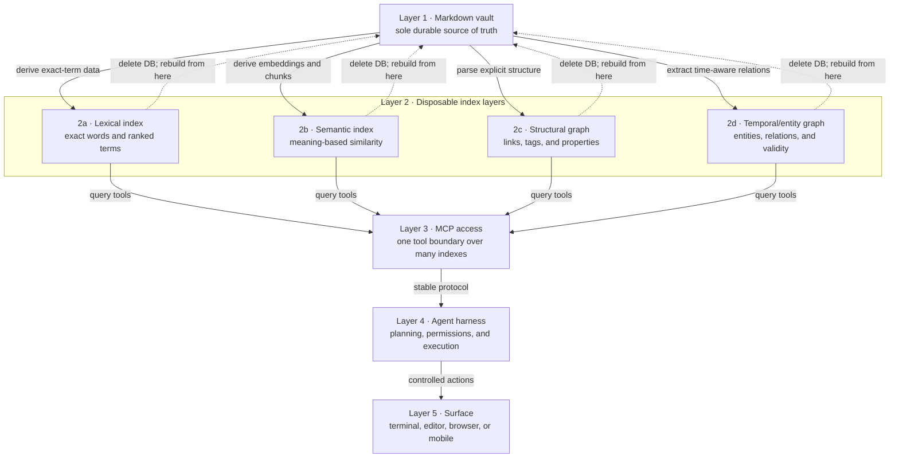
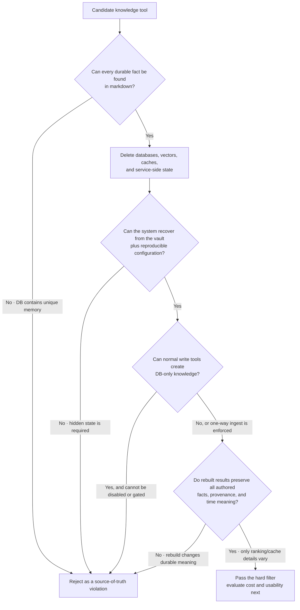
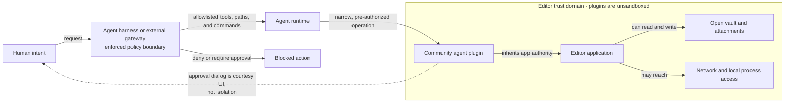
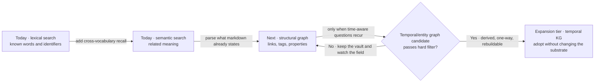

## The pattern (stratum 2)

Treat the markdown vault as a personal **Work IQ**: an intelligence layer over your own work, built from notes, decisions, links, properties, and history that you control.

The everyday problem is not a lack of information. It is that useful context becomes harder to recover as the vault grows. Exact search misses different wording. Similarity search finds related passages but not explicit relationships. Links reveal structure but become difficult to traverse at scale. Time-sensitive questions require knowing not only what a note says now, but what was believed before and when that changed.

The pattern answers those needs with layers rather than one all-owning application. The vault stores durable knowledge. Separate indexes make that knowledge easier to find and reason over. A protocol exposes the indexes. An agent harness decides what tools may do. A surface gives the human somewhere to work.

Each layer can be replaced independently. No database, plugin, model, protocol server, harness, or interface is allowed to become the only place where knowledge lives.

Companion documents cover the [retrieval concepts behind the layers](./retrieval-concepts-from-grep-to-knowledge-graphs.md) and the [July 2026 tool landscape and decision state](./vault-search-and-memory-landscape-2026-07.md).

## The centerpiece: files are truth; indexes are disposable

**Markdown files are the sole source of truth. Every lexical, semantic, graph, and temporal index is a disposable derived artifact, fully rebuildable from those files.**

This is stricter than saying the vault is the “primary” store. A primary store can still depend on a secondary database for memories, relationships, timestamps, conversations, or corrections that never return to a file. Under this pattern, durable knowledge has exactly one authoritative representation: human-readable files in the vault.

Indexes may contain expensive or useful computation—tokens, embeddings, ranked terms, extracted entities, graph edges, communities, validity intervals—but none may contain unique authored facts. If an agent learns something worth keeping, it writes or updates a markdown note first. Indexing follows that write; it does not replace it.

### Why this is the survival trait

Tools die. Maintainers stop releasing. File formats drift. Hosted services change terms. Embedding models become obsolete. A graph database may remain healthy while the plugin that populated it disappears. Even successful tools can become the wrong operational fit.

A files-first system survives because the knowledge outlives every implementation:

- **Tool death becomes replacement work, not data recovery.** Install another indexer and point it at the same files.
- **Sovereignty is inspectable.** A person can read, copy, diff, sync, version, and repair the source without asking a service for permission.
- **Backups remain simple.** Back up the vault. Index backups may shorten recovery time, but they are not required for recovery.
- **Rebuildability is testable.** The architecture does not depend on a vendor promise; it depends on a disaster-recovery procedure that can be exercised.
- **Partial operation remains possible.** If semantic search is broken, exact search and direct file navigation still work. One failed tier does not erase the substrate.

Derived output does not need to be byte-for-byte identical after a rebuild. A new embedding model may rank results differently. Entity extraction may improve. The requirement is that every durable fact and every intended relation can be recovered from evidence in the files. If deleting an index deletes a memory, correction, provenance record, reference date, or relationship that cannot be reconstructed, the tool has crossed the line from index to hidden source of truth.

## The hard-filter test

Evaluate a candidate by simulating loss, not by reading its feature list.

1. Copy a representative vault to a disposable location.
2. Index it and exercise normal reads and writes.
3. Identify every database, cache, model artifact, sidecar file, and hosted dependency.
4. Delete the derived stores.
5. Reinstall or replace the indexer from documented configuration.
6. Rebuild using only the vault and reproducible configuration.
7. Repeat the same retrieval and relationship questions.
8. Inspect anything missing or semantically changed. Ask whether the missing information was authored in markdown or existed only inside the tool.

The most revealing question is short: **Delete the database—can you regenerate everything that matters?**

A tool that passes this filter may still be too expensive, immature, memory-hungry, or awkward. Those are evaluation axes. Failing this filter is architectural: adoption would weaken the system's ability to survive the tool.

## Layer 1: substrate — the markdown vault

The substrate is a directory of markdown files and attachments, such as `~/vault`. Notes carry their own durable context through prose, headings, links, tags, properties, stable identifiers, and explicit dates.

The vault should remain useful without any index beyond filesystem traversal. That does not mean indexes are unimportant; it means they accelerate understanding rather than define what exists.

Design notes so downstream structure is recoverable:

- Write important relationships as links or explicit properties.
- Store reference dates when time affects meaning; do not rely on ingestion time.
- Preserve provenance in the note that states the fact.
- Represent corrections and supersession in files rather than mutating an invisible memory record.
- Keep index directories outside the vault or clearly marked as generated and safe to delete.

## Layer 2: index layers — multiple views, no new truth

Layer 2 is a family of independently replaceable projections. They can coexist because each answers a different everyday question.

### 2a: lexical index

Lexical search answers, “Where does this exact word, name, path, or phrase occur?” A ranked lexical engine may use term frequency and rarity—often called BM25—to put likely matches first. It is fast, explainable, and the right starting point for identifiers and known wording.

### 2b: semantic index

Semantic search answers, “Where did I discuss this idea, even with different words?” It converts passages and queries into numeric representations called embeddings, then retrieves nearby meanings. The embedding database is disposable: chunks come from files, and vectors can be recomputed with the same or a replacement model.

### 2c: structural graph

The vault already contains a graph. Notes are nodes; wikilinks, tags, folders, and frontmatter relations are edges. A structural graph index parses that explicit structure so tools can ask for backlinks, neighbors, paths, clusters, or transitive relationships at scale.

This layer is cheap because it does not need to invent facts. It makes the structure already present in markdown queryable.

### 2d: temporal and entity knowledge graph

A temporal/entity graph answers richer questions: “What relationship held at a particular time?”, “Which statement superseded another?”, or “How did this decision evolve?” It extracts entities, relations, provenance, and validity intervals from notes.

This is the expansion tier, not the foundation. Extraction can require language-model calls, introduce non-determinism, and create tempting graph-only write paths. Adopt it only when those questions are routine and the implementation passes the delete-and-rebuild test. The graph may be a lossy computational view; it must never become a private memory bank beside the vault.

## Layer 3: MCP access — one boundary over many indexes

The access layer turns different query engines into tools with consistent contracts. MCP is useful here because the harness can discover and call lexical, semantic, graph, and temporal capabilities without embedding each database's client library.

This layer preserves replaceability when tool names and result shapes describe capabilities rather than vendors. A lexical server can be replaced while the harness still asks for text matches. A graph backend can change while callers still request neighbors or paths.

MCP does not make a backend safe or rebuildable. It is a transport and tool-description boundary, not a source-of-truth guarantee. Write-capable tools must still obey the vault-first rule.

## Layer 4: agent harness — policy and controlled action

The harness plans work, chooses tools, limits filesystem scope, presents approvals, records actions, and decides whether a requested write is allowed. It is the correct place for the permission boundary because it can constrain the full action before that action reaches the editor or operating system.

The harness should enforce invariants such as:

- Durable writes target markdown, never an index-only memory API.
- Index mutation follows vault mutation.
- Allowed roots and commands are explicit.
- Destructive operations require approval or are denied.
- Tool responses are treated as retrieved data, not authority to widen permissions.

Changing harnesses should not require migrating the vault or rebuilding indexes into a proprietary format. The harness consumes the MCP layer and filesystem; it does not own either.

## Layer 5: surface — where the human works

The surface may be a terminal today, an editor panel tomorrow, or a browser or mobile interface later. Its job is interaction: show context, collect intent, preview changes, and display results.

A surface is replaceable when sessions and convenience features may change but durable work still lands in the vault. Embedding an agent inside an editor can improve flow, but it should not move policy into the panel or turn plugin state into knowledge state.

## Trust boundary: the editor is not the sandbox

Editor plugins run for convenience, not isolation. Obsidian's security documentation states that community plugins are not sandboxed and inherit the application's access, including files and network capabilities. A plugin's “approve” dialog is therefore courtesy UI implemented by code that already holds broad authority. It may be useful, but it is not an independently enforced permission boundary.

Put the boundary in the agent harness or an external gateway that mediates requests before they enter the editor's authority domain.

The practical consequence is simple: trial editor plugins against a non-critical vault, review their code and dependencies when warranted, and never treat an in-plugin confirmation modal as the final control for commands, sensitive paths, or infrastructure access.

## Adoption path: earn complexity one tier at a time

Start with the questions already asked every day. Lexical plus semantic retrieval delivers most of the immediate value without introducing a graph database. Next, derive the structural graph already encoded in links and frontmatter. Add a temporal/entity graph only after the need is recurring and a candidate proves it can be destroyed and rebuilt.

This path avoids a premature platform decision. The vault, access protocol, harness, and surface can evolve at different speeds. A later graph tier does not require replacing the search tier; a new surface does not require migrating the vault; a failed index can be removed without threatening the knowledge base.

## Operational invariants

A vault knowledge engine remains healthy when these statements stay true:

1. The vault is sufficient to recover every durable fact, relation, date, and provenance claim.
2. Every index has a documented full-rebuild command or procedure.
3. Deleting one index degrades only its query capability, not the underlying knowledge.
4. Index services do not expose ungated graph-only memory writes.
5. Protocol adapters are replaceable and contain no unique state.
6. The harness—not the editor plugin—enforces permissions.
7. Surfaces write durable outcomes back to markdown.
8. Recovery is tested periodically, not assumed.

The architecture succeeds when sophisticated retrieval feels additive while disaster recovery remains boring: restore the files, rebuild the projections, reconnect the tools, continue working.

## Related

- [Retrieval concepts: from grep to knowledge graphs](./retrieval-concepts-from-grep-to-knowledge-graphs.md) — first-principles guidance for choosing lexical, semantic, structural, or temporal retrieval.
- [Vault search and memory landscape — July 2026](./vault-search-and-memory-landscape-2026-07.md) — candidate tools evaluated against the architecture's rebuildability and sovereignty constraints.
- [Local search for the agentic workflow](../01-ai-coding/local-search-ck-and-obsidian-cli.md) — the currently deployed lexical and semantic foundation.
- [04 · Knowledge Management](./index.md) — the broader local-first markdown knowledge-system layer.
