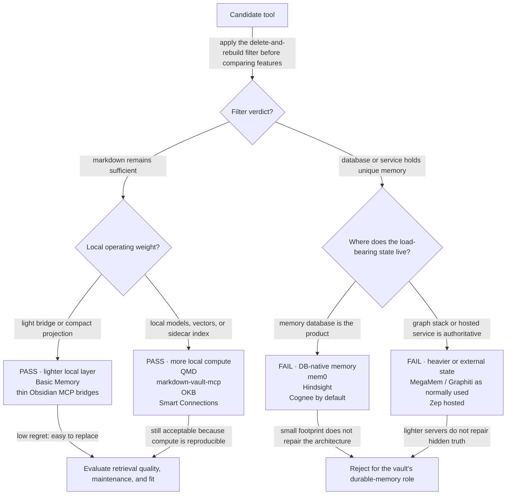
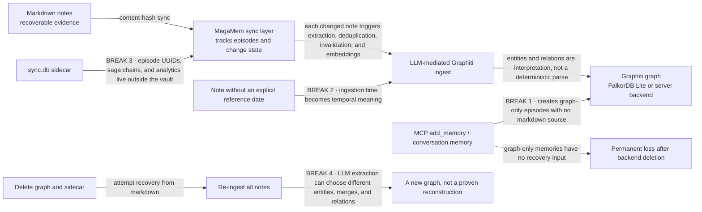
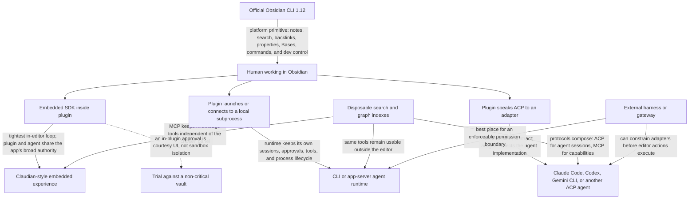

## The pattern (stratum 2)

**Choose knowledge tools by what survives their deletion, not by how intelligent their demo looks.**

This document is the dated field snapshot for that choice. The governing filter and recovery test live in [Vault knowledge engine architecture](./vault-knowledge-engine-architecture.md); apply that test here rather than re-deriving it. The companion [Retrieval concepts guide](./retrieval-concepts-from-grep-to-knowledge-graphs.md) explains what lexical, semantic, structural, and temporal retrieval each contribute before products enter the discussion.

> **Snapshot date: 2026-07-18. Verdicts rot.** Versions, defaults, write surfaces, local-model support, and recovery procedures can change. Treat every verdict below as a time-bounded claim, not a permanent label. The [source research note](../../agent-context/zz-research/2026-07-18-vault-knowledge-engine-landscape.md) holds the full survey, versions, evidence, and source links.

The verdict is deliberately narrower than “good product” or “bad product”:

- **PASS** means markdown remains the durable truth and the index can be discarded and regenerated.
- **FAIL** means normal use can create durable knowledge that exists only in a database or service, or no credible recovery path proves otherwise.
- **Infrastructure weight is secondary.** A tiny hidden source of truth still fails. A heavier local index can pass if it remains disposable.

The ordering matters: **filter verdict first, operational weight second**. FalkorDB Lite can remove a server, and a hosted API can remove local administration, but neither fact answers whether deleting the backend destroys knowledge.

## PASS — markdown stays authoritative

These candidates keep authored knowledge in files and use databases, vectors, or caches as replaceable projections.

| Candidate | Why it passes | Operational shape | Agent surface |
|---|---|---|---|
| **QMD** | The standout: one rebuildable SQLite index over source files, with explicit update and forced re-embedding paths. | Fully local GGUF stack for embeddings, reranking, and query expansion; roughly a multi-gigabyte model footprint; Node 22 or Bun. | First-class MCP over stdio and stateless Streamable HTTP, plus daemon mode. |
| **Basic Memory** | Relations and observations are encoded **in markdown** rather than existing only as graph rows; SQLite is an explicit disposable projection with full reindexing. | Local SQLite plus FastEmbed; intentionally file-centered. | stdio MCP. |
| **markdown-vault-mcp** | Its FTS5 and vector stores are derived from frontmatter-aware markdown chunks; content hashes support incremental refresh and configuration changes can trigger a cold rebuild. | Local SQLite FTS5, NumPy vectors, FastEmbed or an optional local embedding service. | stdio, SSE, and Streamable HTTP; optional OAuth for network exposure. |
| **OKB / obsidian-kb-plugin** | Lexical, semantic, and link-graph retrieval all derive from vault content into a replaceable `.obsidian-kb` index. | Obsidian plugin plus local sidecar binary; promising but early and lightly adopted. | Local HTTP `/mcp` for multiple coding-agent harnesses. |
| **Thin Obsidian MCP bridges** | They pass almost trivially because they add no independent memory store: they expose the filesystem, Local REST API, official CLI, links, properties, Dataview, or Bases. | Lowest index weight, though some require the live Obsidian app or a companion plugin. | MCP wrappers around existing vault primitives; transport varies by project. |
| **Smart Connections** | Its `.smart-env/` vectors are rebuildable from the vault rather than authoritative; a community bridge can reuse those vectors without re-embedding. | Local semantic index inside the Obsidian ecosystem; custom non-OSI license is a separate adoption concern. | Community stdio MCP bridge. |

### Why QMD moved to the front

The ordinary problem is not merely “find similar text.” A practical local search layer must retrieve exact terms, bridge vocabulary mismatch, rerank noisy candidates, expose tools to agents, and recover after its index is deleted.

QMD now packages those needs unusually cleanly: FTS5, vector search, local GGUF models, rebuildable SQLite, and both common MCP deployment modes. It answers the largest open questions from the earlier local-search survey without requiring a hosted model or a database server. That makes it the strongest candidate for a controlled comparison against the current ck layer—not an automatic replacement.

The comparison still needs measurements: cold indexing time, warm query latency, recall on known questions, exact-identifier behavior, memory ceilings, multi-root ergonomics, model disk cost, and failure recovery. Passing the architecture filter earns an evaluation; it does not pre-decide the evaluation.

### Why the smaller passes still matter

The field is separating into useful shapes:

- **Basic Memory** proves that graph-like relations can remain file-native.
- **markdown-vault-mcp** shows how far a purpose-built vault index can go while retaining cold-rebuild behavior.
- **OKB** targets the attractive combined tier: lexical + semantic + explicit link graph behind one local endpoint.
- **Thin bridges** preserve optionality by exposing capabilities without inventing a second memory system.
- **Smart Connections** offers an installed-base path where an existing local vector index can be reused by agents.

These are not interchangeable. The pass verdict says only that each can fit inside the architecture without becoming the archive.

## FAIL — the database becomes truth

These systems fail the current vault role because normal operation stores durable memory outside markdown, recovery is undocumented or incomplete, or both.

| Candidate | Why it fails the filter | What would change the verdict |
|---|---|---|
| **mem0** | Its core abstraction is a memory store whose records are created and updated in the memory backend. Markdown is not the enforced authoritative representation. | A supported one-way file-ingest mode with durable writes disabled and a documented full rebuild from files. |
| **Zep hosted** | The service is authoritative for memory and graph state; the official MCP surface reads from hosted state rather than proving that a local markdown corpus can regenerate it. | A self-contained, documented vault-to-index recovery path with no unique hosted state. |
| **Hindsight** | Memory banks and synthesized “mental models” live in its database. Deleting the backend deletes more than a search acceleration structure. | File-native export as the normal write path plus tested deterministic recovery from those files. |
| **Cognee by default** | Its normal MCP `remember` and `forget` operations mutate permanent graph memory. A disciplined one-way deployment could behave like an index, but the product does not enforce that boundary. | A read/index-only profile that disables graph-native memory writes and documents delete-and-reingest recovery. |
| **MegaMem / Graphiti** | MegaMem combines vault ingestion with graph-only memory tools, LLM-mediated extraction, ingestion-time defaults, sidecar state, and no documented full disaster-recovery procedure. Rebuilding cannot reproduce graph-only episodes and may not reproduce the same extracted graph. | All durable writes returning to markdown, a tested rebuild procedure, stable source dates, and supported ingest that does not depend on metered or non-deterministic extraction for every change. |

A fail here is not a claim that the project is unhealthy. It is a claim about **state ownership under this architecture**.

## The nuanced failure: MegaMem and Graphiti

MegaMem is important because it nearly matches the desired product shape: an Obsidian-facing temporal knowledge graph with agent tools. Graphiti underneath it is healthy and actively developed. FalkorDB Lite now supplies an embedded local-file graph backend, removing the earlier assumption that a single user must operate Neo4j or a separate graph server.

That infrastructure improvement does not resolve the rebuild question.

Four distinct concerns are easy to blur:

1. **Graph-only memories are unique state.** If `add_memory` creates an episode without a note, the graph is no longer disposable.
2. **Re-extraction is non-deterministic.** The same prose can produce different entity boundaries, deduplication decisions, communities, or invalidation results on a later run.
3. **Time can be reconstructed incorrectly.** A note without an explicit reference date may receive its ingestion time; rebuilding later changes the apparent history.
4. **Recovery is not documented end to end.** Content hashes and sync status are not a disaster-recovery guarantee.

Graphiti's ingest cost also remains material. Each changed episode can require language-model extraction, deduplication, contradiction handling, and embeddings. Bulk operations reduce calls but do not remove the meter. Local named-entity recognition covers only part of the pipeline, and fully supported language-model-free ingest has not landed in this snapshot.

A constrained deployment could prohibit graph-native writes, require dates in frontmatter, and treat the graph as a lossy cache. That lowers the damage of failure, but it is a behavioral rule around the product rather than an architectural guarantee supplied by it. The current verdict therefore remains **watch, not adopt**.

## Agent surface — how the same vault reaches an agent

The search or memory verdict answers where knowledge lives. A separate question answers where the human drives the agent. As of July 2026, three integration shapes dominate.

### The July 2026 surface column

| Surface | Snapshot | Architectural reading |
|---|---|---|
| **Claudian** | Roughly **1.4 million downloads** at the snapshot date, with a full coding-agent loop in Obsidian: vault reads and writes, shell tools, inline diffs, planning, skills, MCP, subagents, and resumable sessions. | The category is already real. Adopt and evaluate before building another desktop panel. Its convenience still lives inside an unsandboxed plugin trust domain. |
| **ACP** | Agent Client Protocol is emerging as the neutral boundary between an editor client and interchangeable agent runtimes, analogous to treating agents more like language servers. | The strongest long-term option for avoiding a surface tied to one provider or one private app-server API. Still younger than MCP and dependent on adapter quality. |
| **Official Obsidian CLI 1.12** | The platform now exposes note CRUD, search with context, backlinks, properties, tasks, Bases, workspaces, commands, plugin management, and development controls to local automation. | This is the foundational primitive, not an agent by itself. It lets external harnesses drive the live application without each plugin inventing a private control plane. |
| **Copilot for Obsidian v4 direction** | The announced direction is a host that can wrap multiple coding-agent runtimes with staged review of writes rather than remaining a proprietary single-agent implementation. | Market confirmation that the surface is becoming a client for external agents. Treat preview claims as directional until shipped and verified. |

The architecture choice is no longer “terminal or build an Obsidian agent.” The practical choice is which client boundary to trust:

- **Embedded SDK** for the richest immediate editor experience.
- **Subprocess or app-server** when the agent runtime should retain its own lifecycle and approval model.
- **ACP** when interchangeability is the main design goal.
- **Official CLI** underneath or beside all three as the stable application primitive.

MCP and ACP solve different seams. MCP exposes tools and knowledge capabilities to an agent. ACP connects an agent client to an agent runtime and session. They can coexist: an Obsidian ACP client talks to an external agent, and that agent queries QMD, ck, or a structural graph through MCP.

## Decision state — July 2026

1. **Keep the temporal/entity knowledge-graph tier on watch.** MegaMem/Graphiti does not yet meet the recovery guarantee, and ingest still attaches language-model work to note changes.
2. **Evaluate QMD against ck.** QMD is the clearest new pass with a complete local retrieval stack and first-class MCP. Measure it rather than inferring from features.
3. **Prefer the cheap structural graph next.** Links, tags, properties, backlinks, Dataview, Bases, OKB, or a small derived SQLite/JSON projection answer many graph questions without entity extraction.
4. **Adopt an existing local agent surface before building one.** Claudian is mature enough to trial on a non-critical vault. The differentiated problem is external, remote, or multi-device orchestration—not another desktop chat panel.
5. **Keep the permission boundary outside the editor when consequences matter.** Obsidian plugins inherit broad app authority; a panel's approval dialog is not isolation.

## Watch triggers

Re-open the temporal-KG decision when one or more of these becomes concrete and testable:

- **A documented rebuild procedure lands.** It must start from markdown plus reproducible configuration, delete graph and sidecar state, rebuild, and account for provenance, reference dates, graph-native memories, and failure recovery.
- **Language-model-free ingest lands.** Entity and relation ingestion should have a supported path that does not meter a model call for each changed note, or it should cleanly separate deterministic structural ingestion from optional interpretive enrichment.
- **Local embeddings land as a supported path.** “Compatible in theory” is insufficient; the current factories, defaults, documentation, and recovery flow must work with a local embedding implementation.
- **Graph-only write tools become disableable or vault-backed.** A safe profile should prevent an agent from creating permanent memories that have no markdown representation.
- **A repeated question justifies the tier.** Time-aware entity questions must recur often enough that a temporal graph solves a demonstrated problem rather than creating an aspirational platform.

Until then, the low-regret stack is clear: markdown truth, lexical and semantic retrieval, a derived structural graph, MCP access, an external permission boundary, and a replaceable editor surface.

## Related

- [Vault knowledge engine architecture](./vault-knowledge-engine-architecture.md) — the hard filter, layered design, trust boundary, and recovery invariants used for these verdicts.
- [Retrieval concepts: from grep to knowledge graphs](./retrieval-concepts-from-grep-to-knowledge-graphs.md) — first-principles intuition for the retrieval layers evaluated here.
- [Local search for the agentic workflow](../01-ai-coding/local-search-ck-and-obsidian-cli.md) — the currently deployed ck and Obsidian CLI search layer.
- [Source research note](../../agent-context/zz-research/2026-07-18-vault-knowledge-engine-landscape.md) — full July 2026 evidence, versions, and source links behind this snapshot.
