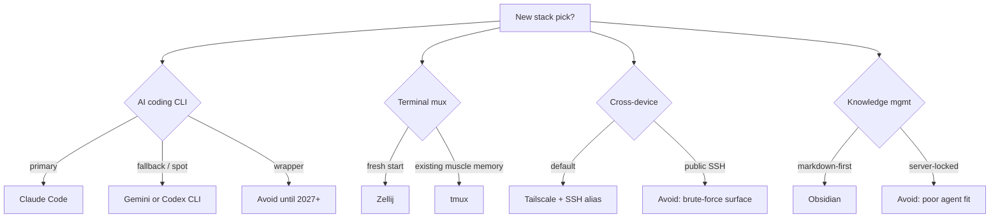

## At a glance

## AI Coding CLI

| Option | Pick | Reasoning |
|---|---|---|
| **Claude Code** | ✅ primary | Best agentic execution I've used; Anthropic's Opus/Sonnet tiers have real headroom; the $100/mo Max plan makes intensive use affordable |
| **Gemini CLI** | ◐ fallback | Free tier; different model family for sanity checks; spot tasks when rate-limited on Claude |
| **Codex CLI** | ◐ alternative | OpenAI ecosystem fluency; second option for comparison |
| OpenCode / OpenClaw / T3Code | ❌ avoid | Ban risk, ecosystem instability, unvetted security surface |
| IDE-embedded (Cursor, Continue, Cline) | ❌ for primary use | Couples AI to editor; bad for cross-device portability |

**When to revisit wrappers:** 2+ years clean operation, verified code audit, provider cooperation. Maybe 2027.

## Terminal Multiplexer

| Option | Pick | Reasoning |
|---|---|---|
| **Zellij** | ✅ primary | Discoverable keybindings (status bar), modern Rust impl, works well with Claude Code + OpenCode |
| **tmux** | ◐ fallback | Universally installed, battle-tested; some tools (OpenCode) historically quirky inside tmux |
| WezTerm mux | ❌ for sessions | Local-only; doesn't cross devices. Fine as terminal emulator though |
| screen | ❌ | Older than tmux; no reason to pick it today |

## Cross-Device Access

| Option | Pick | Reasoning |
|---|---|---|
| **Tailscale + SSH config alias** | ✅ primary | Device-mesh auth; no public ports; MagicDNS gives stable names; Tailscale SSH removes key management |
| **Termux** (Android) | ✅ for phone | Real Linux userspace; full SSH + tooling |
| **Termix** (iOS) | ◐ if needed | Less powerful; no Linux userspace; workable for emergencies |
| GitHub Codespaces | ◐ for specific cases | Different model; fine for cloud-first devs, not for my-own-machine workflow |
| Raw SSH over public internet | ❌ | Public exposure; brute-force surface; key management tax |
| Headscale (self-hosted) | ❌ for now | Control-plane maintenance tax; free Tailscale fits my use |

## Knowledge Management

| Option | Pick | Reasoning |
|---|---|---|
| **Obsidian** | ✅ primary | Plain markdown on filesystem; strong plugin ecosystem; now has CLI; my Obsidian-Flavored-Markdown works with this site |
| Obsidian CLI (v1.12.4+) | ✅ for automation | Search/open/get from terminal |
| Logseq | ❌ for me | Outliner-first UX; prefer document-first |
| Notion | ❌ | Not plain text; server-locked; poor agent fit |
| Roam / similar | ❌ | Same concerns as Notion |
| Plain markdown + VS Code | ❌ | No graph navigation; drops once vault gets large |

## Image Paste for Terminal AI

| Option | Pick | Reasoning |
|---|---|---|
| **Zipline (self-hosted) + ShareX + sharex-clip2path** | ✅ primary | One-hotkey screenshot → URL; Tailscale-gated; zero public exposure |
| Imgur / public paste services | ❌ | Public exposure; privacy concerns for work content |
| Terminal-native image display (iTerm2's imgcat) | ◐ for some cases | Doesn't give AI an accessible URL |

## OS / Runtime

| Option | Pick | Reasoning |
|---|---|---|
| **WSL2 on Windows** | ✅ my choice | Windows is my primary OS; WSL2 gives Linux for dev tools; best of both |
| Native Linux | ✅ equally good | What most dev machines run; everything in this scaffold works natively |
| Native macOS | ✅ equally good | Similar — most tools work identically |
| Windows without WSL | ❌ | Most dev tooling assumes Unix; friction is constant |

## Editor (alongside terminal)

| Option | Pick | Reasoning |
|---|---|---|
| **VS Code** | ✅ primary | Good extension ecosystem; works well alongside terminal CLI |
| [vscode-terminal-workspaces](https://github.com/cybersader/vscode-terminal-workspaces) | ✅ my ext | Sidebar GUI for tmux-style sessions (works well with Claude Code, Gemini CLI) |
| [vscode-terminal-image-paste](https://github.com/cybersader/vscode-terminal-image-paste) | ✅ my ext | Paste clipboard images directly into terminal (alternative to Zipline flow) |
| Neovim / Helix | ◐ for some | Terminal-native; good if you prefer terminal everywhere |

## Home Lab

| Option | Pick | Reasoning |
|---|---|---|
| **TrueNAS (specifics in `03-work/homelab/`)** | ✅ | ZFS, containers, decent UI |
| Self-host behind Tailscale | ✅ | Auth via device identity; no public exposure |
| Public-facing with reverse proxy + auth | ❌ for most | Adds config surface I don't need |

## The general rules

1. **Pick one primary, have 1–2 fallbacks.** More than three options per layer is indecision.
2. **Prefer official over wrappers** until wrappers prove 2+ years of stability.
3. **Tailscale-gate anything self-hosted** unless there's a specific reason to expose it.
4. **Terminal-first, editor-integrated.** Editors sit alongside; terminal is the universal substrate.
5. **Revisit every 6–12 months.** The ecosystem moves; old decisions expire.
