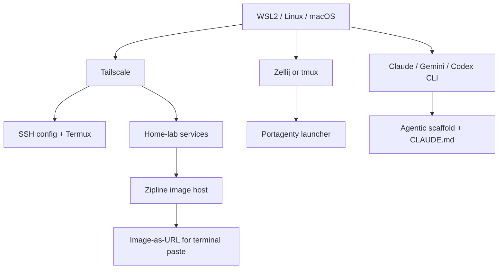

This is the opinionated toolkit I use for agentic knowledge work and software development. It is **tier 2** of the three-tier scaffold: neither universal (that's the [kernel](../kernel/)) nor specific to my actual projects (that's [my work](#private-reference)).

The stack is a coherent *sandwich* of layers that expect each other. Claude Code expects a terminal; Zellij expects a terminal that supports it; Portagenty expects Zellij or tmux to be installed. Tailscale gates the homelab services; Termux on Android connects via Tailscale.

Fork this layer if your setup looks similar: WSL on Windows, Claude Code / Gemini CLI / Codex CLI, Obsidian for knowledge, Zellij or tmux for sessions, Tailscale for the network fabric.

## The layers (top to bottom)

```
┌──────────────────────────────────────────────────────────┐
│  07  Editor Extensions                                    │
│      VS Code + Terminal Workspaces + Terminal Image Paste │
├──────────────────────────────────────────────────────────┤
│  06  Dev Infra                                            │
│      Zipline (self-hosted) + ShareX + sharex-clip2path    │
├──────────────────────────────────────────────────────────┤
│  05  Home Lab                                             │
│      Self-hosted services, Tailscale-gated                │
├──────────────────────────────────────────────────────────┤
│  04  Knowledge Management                                 │
│      Obsidian + Obsidian CLI + curated plugins            │
├──────────────────────────────────────────────────────────┤
│  03  Cross-Device                                         │
│      Tailscale SSH + Termux (Android) + SSH aliases       │
├──────────────────────────────────────────────────────────┤
│  02  Terminal / Session                                   │
│      Zellij (primary) + tmux (fallback) + Portagenty      │
├──────────────────────────────────────────────────────────┤
│  01  AI Coding CLI                                        │
│      Claude Code (primary) + Gemini CLI + Codex CLI       │
├──────────────────────────────────────────────────────────┤
│  00  OS / Runtime                                         │
│      WSL2 on Windows (or Linux/Mac native equivalent)     │
└──────────────────────────────────────────────────────────┘
```

## The philosophical bias

Before any specific picks, the stack reflects a few biases:

**1. Official first, wrappers second.** I use Claude Code directly rather than wrappers like OpenCode / OpenClaw / T3Code. Wrappers add ban-risk (provider may suspend the account), instability (new wrappers churn), and a security surface I can't vet. I'd rather wait for the wrapper ecosystem to stabilize than absorb unknown risk on every commit. If you're different — go for it. This is an opinion, not a law.

**2. Self-hosted, Tailscale-gated.** Anything that would otherwise expose a port to the internet (Zipline, homelab services) sits behind Tailscale. Authentication via device identity, no public endpoints, no password theater. Trades convenience-for-randos for control.

**3. Terminal-first, editor-integrated.** Real work happens in the terminal with AI coding CLIs. VS Code is for UI moments — large refactors, visual file comparisons, specific extensions. The editor lives alongside the terminal, not above it.

**4. Portable across machines via filesystem.** Everything I need to rebuild my setup lives in a file somewhere — bashrc snippets, SSH config, Tailscale login, Obsidian vault path. The [rebuild guide](#private-reference) (tier 3) is the canonical walkthrough.

## Layer pages

| # | Layer | Page |
|---|---|---|
| 01 | AI Coding CLIs | [01-ai-coding/](./01-ai-coding/) |
| 02 | Terminal & Session | [02-terminal/](./02-terminal/) |
| 03 | Cross-Device | [03-cross-device/](./03-cross-device/) |
| 04 | Knowledge Management | [04-knowledge-mgmt/](./04-knowledge-mgmt/) |
| 05 | Home Lab | [05-homelab/](./05-homelab/) |
| 06 | Dev Infra | [06-dev-infra/](./06-dev-infra/) |
| 07 | Editor Extensions | [07-editor-ext/](./07-editor-ext/) |

## Patterns & decisions

- [Cross-device SSH](./patterns/cross-device-ssh.md) — Tailscale + SSH config + Termux → "ssh pc" works from any of my devices
- [Image-paste pipeline](./patterns/image-paste-pipeline.md) — Zipline + ShareX + sharex-clip2path → screenshot becomes URL in one hotkey
- [Parallel agents with worktrees](./patterns/parallel-agents-worktrees.md) — running multiple Claude Code sessions without file conflicts
- [Decision matrix](./decisions/index.md) — Claude Code vs Gemini vs Codex; Zellij vs tmux; Obsidian vs alternatives

## Dependency graph



Each layer expects the one below. The lower a layer is, the less frequently you touch it but the more it matters when it breaks.

## Status

This overview is stable (2026-04-17). Per-layer pages are being filled in during Phase 4 of the project init — some are deep, some are stubs pending detailed content. The decision matrix and patterns pages are the densest reading if you want the "why" behind picks.

## See also

- [Kernel — universal scaffold](../kernel/) — the layer below this one (philosophy + meta-patterns)
- [Work — my projects + rebuild](#private-reference) — the layer above this one (what I actually build with this stack)
- [Principles](../principles/) — the invariants this stack is an implementation of
