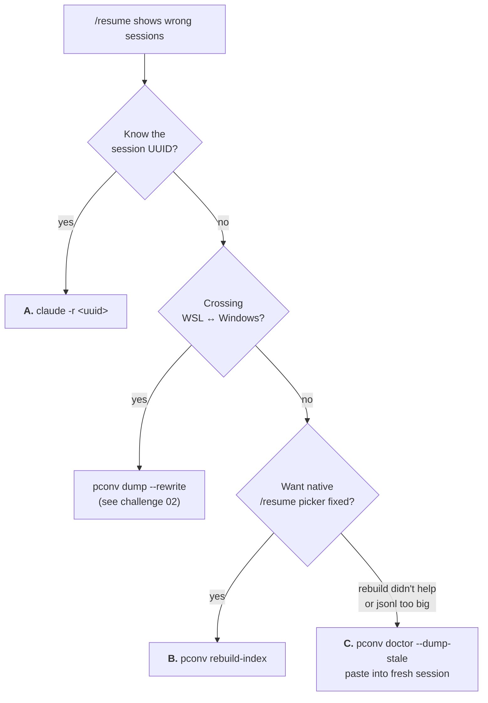

## The promise

When `/resume` shows the wrong sessions, wrong summaries, or loses your active session entirely, you have three recovery primitives ordered by cost. Pick one in under a minute. No data lost.

## The two failure modes (same surface, different mechanisms)

Both surface as "`/resume` is lying" — but the fix is different for each.

### 1. Stale `sessions-index.json`

Claude Code caches session summaries in `~/.claude/projects/<encoded-cwd>/sessions-index.json`. The `/resume` picker reads it. **The write path only runs on graceful shutdown.** Ungraceful closures skip it:

- `wsl --shutdown`
- WSL terminal window closed without typing `/exit`
- Machine suspend / sleep
- OOM-kill, SIGKILL, force-quit
- Upstream bug in the rewrite path itself ([#41946](https://github.com/anthropics/claude-code/issues/41946) — clean exits can also lose entries)

The `.jsonl` session content keeps accumulating (append-on-write), but the index lags. Scan your machine:

```bash
for d in ~/.claude/projects/*/; do
  idx=$(stat -c %Y "$d/sessions-index.json" 2>/dev/null)
  jsonl=$(ls -t "$d"/*.jsonl 2>/dev/null | head -1)
  [ -n "$jsonl" ] && jsonl_mt=$(stat -c %Y "$jsonl")
  if [ -n "$idx" ] && [ -n "$jsonl_mt" ] && [ $((jsonl_mt - idx)) -gt 86400 ]; then
    echo "$((  (jsonl_mt - idx) / 86400 ))d lag: $(basename "$d")"
  fi
done
```

On one machine: **14 projects lagged up to 93 days.** Upstream canonical issue: [#25032](https://github.com/anthropics/claude-code/issues/25032).

### 2. Cross-OS content poisoning

Different bug, different fix. When you launch Claude Code from both WSL (`/mnt/c/…/project`) and Windows (`C:\…\project`), you get two encoded dirs under `~/.claude/projects/`:

- `-mnt-c-Users-...-project/`
- `C--Users-...-project/`

`/resume` from one doesn't see the other's history. Worse: the `.jsonl` content carries OS-specific absolute paths (tool_use inputs, cwd fields, prose) — so even if you merge the storage, a resumed session tries to `Read /mnt/c/…` on Windows and fails.

Captured in [challenge 02](../../research/zz-challenges/02-claude-code-conversation-fragmentation.md). Resolved via `portaconv`'s extract-and-paste design.

## The three recovery primitives

Ranked by cost. Start at the top of the table and stop at the first one that fits.

| Primitive | Cost | When | Limits |
|---|---|---|---|
| [`claude -r <uuid>`](#a-claude--r-by-id) | Zero | You know the session UUID; picker is unreliable | Requires knowing the UUID |
| [`pconv rebuild-index`](#b-pconv-rebuild-index) | One command | Stale index; want native picker to work | Requires the session to be in the right encoded bucket |
| [`pconv doctor --dump-stale`](#c-pconv-doctor--dump-stale) | Paste into fresh session | Index rebuild didn't help OR the `.jsonl` is too big to resume practically OR cross-OS content poisoning | Abandons the stale session; you're pasting a window, not continuing |

### A. `claude -r <UUID>` by id

Skips the picker entirely. Reads the `.jsonl` directly.

```bash
# Find the UUID — newest jsonl by mtime in your project's encoded dir.
ls -t ~/.claude/projects/-mnt-c-...your-project.../*.jsonl | head -1
# => …/97d7b58b-09f5-41ea-a59f-a12f230083b0.jsonl

claude -r 97d7b58b-09f5-41ea-a59f-a12f230083b0
```

Works *now*, no tool installation, immune to index staleness. The obvious move when you know which session you want.

### B. `pconv rebuild-index`

Rewrites `sessions-index.json` from the actual `.jsonl`s. Native `/resume` picker works correctly afterwards.

```bash
# Check what's stale first (read-only).
pconv doctor

# Single project:
pconv rebuild-index --project ~/.claude/projects/-mnt-c-...your-project

# All projects on this machine (skips fresh ones with --lag-threshold-hours):
pconv rebuild-index --all --lag-threshold-hours 24

# Dry-run to see what would change:
pconv rebuild-index --all --dry-run
```

Atomic write + dated `.bak-YYYY-MM-DD` backup. [Portaconv v0.1.0+](https://github.com/cybersader/portaconv).

**Install:**

```bash
cargo install --git https://github.com/cybersader/portaconv
```

**Routine maintenance** (weekly cron):

```crontab
0 9 * * 1 pconv rebuild-index --all --lag-threshold-hours 168
```

Runs Monday 09:00, rebuilds any project whose index lags by more than a week.

### C. `pconv doctor --dump-stale`

Detects stale projects AND emits paste-ready markdown for the newest session in each. Start a fresh `claude` session, paste, continue.

```bash
pconv doctor                    # list stale projects, read-only
pconv doctor --dump-stale       # + paste-ready markdown for each
pconv doctor --format json      # machine-readable for scripting
```

This is the **escape hatch** — use it when rebuild doesn't apply (cross-OS case) or when the `.jsonl` is so large that continuing in place is more painful than starting fresh. The paste inherits enough context for the new session to pick up where the old one left off; you abandon the stale session.

### Decision tree

Pick the cheapest primitive that fits — read top to bottom, stop at the first YES.



## MCP integration

If Claude Code agents need to self-heal, `pconv mcp serve` exposes `doctor` alongside `list_conversations` and `get_conversation`:

```jsonc
// ~/.claude.json or project .mcp.json
{
  "mcpServers": {
    "portaconv": { "command": "pconv", "args": ["mcp", "serve"] }
  }
}
```

Agents call `doctor` via `tools/call` → JSON result with `project_dir`, `lag_hours`, `missing`, `newest_session_id`, `newest_jsonl_mtime_ms`. `rebuild-index` is deliberately CLI-only — write operations via MCP risk unintended fan-out.

## Prevention

The honest answer: you can't fully prevent this from inside Claude Code. The rewrite path is ungraceful-shutdown-vulnerable by design, and shell-level signal traps don't survive `wsl --shutdown` or process-group-kill.

What you *can* do:

- **Habit:** type `/exit` before closing WSL terminals. Catches the graceful-shutdown subset.
- **Cron:** weekly `pconv rebuild-index --all --lag-threshold-hours 168` as above.
- **Awareness:** when the picker looks wrong, it usually *is* wrong — don't assume you misremembered.

## Why it matters

`/resume` is one of the most-used Claude Code commands. When it silently shows the wrong list:

- Users lose confidence in the tool's memory
- Accidental session restarts instead of continuations (lost context)
- Wasted tokens reloading context the agent already had
- Unaudited work — "did we actually resume that yesterday?"

The symptom ("picker wrong") is indistinguishable between the two failure modes, but the fix is different. This pattern separates them so you pick the right one in under a minute.

## See also

- [Research learning](../../research/learnings/2026-04-23-stale-sessions-index-detection-and-recovery.md) — why detect-and-recover-via-extractor generalizes past Claude Code (the append-log-plus-summary-index pattern)
- [Challenge 02](../../research/zz-challenges/02-claude-code-conversation-fragmentation.md) — cross-OS fragmentation, the sibling failure mode
- [Original investigation note](../../agent-context/zz-research/2026-04-23-stale-sessions-index-bug.md) — full evidence, upstream issue landscape, third-party tool survey
- [portaconv on GitHub](https://github.com/cybersader/portaconv) — `doctor` + `rebuild-index` subcommands ship in v0.1.0
- [Upstream canonical issue #25032](https://github.com/anthropics/claude-code/issues/25032) — where to push for an upstream fix
