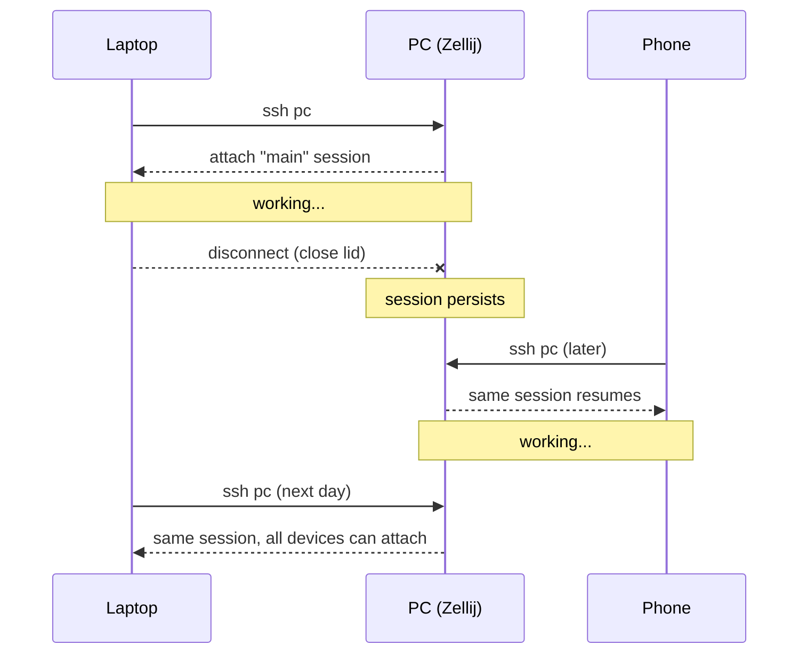

## The promise

Run `ssh pc` from any device you own — laptop, phone, remote machine — and land inside the PC's WSL shell, reattach the running Zellij session, pick up exactly where you left off. No port forwarding, no key management, no IP memorization.

## What you need

| Component | Role |
|---|---|
| [Tailscale](https://tailscale.com/) | Device-mesh authentication + stable IP per device |
| SSH daemon on the PC | The actual SSH target |
| `~/.ssh/config` with an alias | One-word hostname |
| [Termux](https://f-droid.org/en/packages/com.termux/) (Android) or Termix (iOS) | Mobile client |
| Zellij or tmux inside the SSH session | So the session survives disconnect |

## Setup

### 1. Install Tailscale everywhere

On the PC (server side):

```bash
# WSL2 on Windows:
curl -fsSL https://tailscale.com/install.sh | sh
sudo tailscale up
```

On the phone (Android): Install Tailscale from Play Store, sign in with the same account.

On any other device: same — install the client, sign in. All devices now appear in your tailnet.

### 2. Enable Tailscale SSH (optional but recommended)

```bash
sudo tailscale up --ssh
```

This lets Tailscale handle SSH authentication via the tailnet identity — no SSH keys needed. Per-device authorization happens in the Tailscale admin console.

If you prefer classic SSH key auth, skip `--ssh` and continue with normal `~/.ssh/authorized_keys`.

### 3. Find your PC's tailnet name

```bash
# On the PC
tailscale status
```

You'll see a MagicDNS name like `pc-name.your-tailnet.ts.net` and an IP like `100.x.y.z`. MagicDNS is preferred — it's stable across IP reassignments.

### 4. Configure SSH alias on each client device

In `~/.ssh/config` on laptop, phone, any other client:

```
Host pc
    HostName pc-name.your-tailnet.ts.net
    User your-username
    ForwardAgent yes
    ServerAliveInterval 60
    ServerAliveCountMax 3
```

Replace `pc-name.your-tailnet.ts.net` with your actual MagicDNS name (or the `100.x.y.z` IP if you skip MagicDNS).

### 5. Test

```bash
ssh pc
```

You should land on the PC's shell. If Tailscale SSH is enabled: no password prompt, no key prompt. Authentication happened via Tailscale.

### 6. Chain into Zellij

Two options:

**Option A: Auto-attach on SSH login** — append to `~/.bashrc` on the PC:

```bash
# If SSH'd in and not already in zellij, attach main session
if [[ -n "$SSH_CONNECTION" ]] && [[ -z "$ZELLIJ" ]]; then
    zellij attach --create main
fi
```

**Option B: Manual attach** — just run `zellij attach main` after SSH'ing in, or use the `z`/`zk`/`zl` helpers from [`../profiles/bashrc-snippets/zellij-helpers.sh`](../profiles/bashrc-snippets/).

**Option C: Portagenty** — from [github.com/cybersader/portagenty](https://github.com/cybersader/portagenty) — run `pa` to pick a workspace, which attaches the right session.

## Mobile client: Termux on Android

```bash
# On first install
pkg update && pkg upgrade
pkg install openssh

# Copy ~/.ssh/config from laptop to Termux's ~/.ssh/config
# Then
ssh pc
```

Tailscale's Android app keeps the mesh up in the background. As long as Tailscale is active, `ssh pc` works.

## iOS workaround

Termux doesn't exist for iOS due to Apple's sandboxing. Options:

- **Termix** — iOS SSH client with a terminal emulator. Works. Less rich than Termux.
- **GitHub Codespaces** — access a cloud dev env from mobile. Different model (dev container vs your-machine).
- **a-Shell** — Linux-ish shell for iOS. Limited SSH capability.

I haven't committed to an iOS workflow. Termix is the lowest-effort path.

## Session-survives-disconnect flow

The session lives on the PC. Any client with Tailscale + SSH config reattaches it.



## Security hygiene

- **Disable public SSH port** on the PC. Tailscale makes this fine — clients reach the PC via the tailnet only.
- **Tailscale ACLs** — if your tailnet has multiple users, restrict who can SSH to your dev machine.
- **Rotate Tailscale auth keys** periodically. Tailscale admin console supports this.
- **Don't use `ForwardAgent yes`** on untrusted systems. Only on your own devices.

## Gotchas

### PC's Tailscale IP changed

Use MagicDNS hostnames in your SSH config, not IPs. Hostnames are stable; IPs can rotate.

### SSH times out while working

Add `ServerAliveInterval 60` to the SSH config (already in the example above). This keeps the session alive during brief network blips.

### Zellij session disappeared

Check if the PC rebooted. Zellij sessions don't survive reboots unless you use a supervisor. For reboot survival, consider [zellij-layout](https://zellij.dev/documentation/layouts) with auto-launch via systemd user unit.

### Termux won't connect

Confirm Tailscale is active on Android (notification shield icon). Confirm `ssh your-full-tailnet-hostname` works from another device before trying the alias.

## Integration

- [03 · Cross-Device](../03-cross-device/) — this pattern is the core walkthrough.
- [02 · Terminal](../02-terminal/) — Zellij provides the session survival.
- [Tailnet browser access](./tailnet-browser-access/) — sibling pattern: same tailnet, but for serving a directory or rendered site to a browser instead of a shell.
- [Portagenty](https://github.com/cybersader/portagenty) — wraps the attach logic per workspace.

## See also

- [Tailscale SSH docs](https://tailscale.com/kb/1193/tailscale-ssh)
- [Termux wiki](https://wiki.termux.com/)
- [`../../01-kernel/principles/06-single-canonical-addressability.md`](../../01-kernel/principles/06-single-canonical-addressability.md) — why one alias beats many IPs
