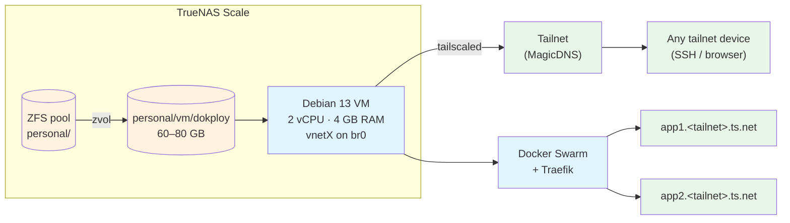

## The promise

You have a TrueNAS Scale box and you want a self-hosted PaaS — push-to-deploy, web UI, SSL, the whole bag. You'd love it on the NAS itself. **The NAS won't let you.** The fix is well-trodden: run Dokploy inside a Debian VM that lives on the NAS, then use Tailscale for the post-install access plane so VNC becomes a one-time setup tool, not a recurring chore.

This is a generic pattern. It doesn't assume anything about your TrueNAS layout, tailnet name, or app inventory beyond "you have a homelab and Tailscale."

## Why VM-not-direct (in one minute)

PaaS tools (Dokploy, Coolify, CapRover) want **complete ownership of Docker**: their own daemon config, Swarm mode initialized their way, ports 80/443/3000 unconditional. TrueNAS Scale **also** wants complete ownership of Docker — its middleware regenerates `/etc/docker/daemon.json` on every boot with `iptables: false` and `bridge: none`, which is incompatible with Swarm. Two systems, one Docker daemon, deadlock.

A VM sidesteps it: the VM has *its own* kernel, Docker daemon, and network stack. TrueNAS sees a `vnetX` device. Dokploy inside the VM doesn't know it's not on a VPS.

For the deeper why, including the receipts: see [`knowledge-base/02-learnings/self-hosted-paas-truenas-conflict.md`](../../knowledge-base/02-learnings/self-hosted-paas-truenas-conflict.md). For the broader PaaS landscape: [`knowledge-base/03-reference/self-hosted-deployment-platforms.md`](../../knowledge-base/03-reference/self-hosted-deployment-platforms.md).

## Architecture



Three things to note in the diagram:

1. **The zvol is the only NAS-side artifact.** Everything else lives inside the VM's filesystem.
2. **Tailscale runs *inside* the VM**, not on TrueNAS — that's what makes the VM reachable as `dokploy.<tailnet>.ts.net` regardless of LAN IP.
3. **Apps deployed by Dokploy** route through Traefik, which is what you wire to per-app `*.ts.net` hostnames later (see [Tailscale HTTPS three levels](./tailscale-https-three-levels.md)).

## The setup, end to end

### 0 · Provision the zvol

TrueNAS UI → **Datasets** → pick the pool you want VMs in (e.g. `personal/vm/`) → **Add Zvol**:

| Setting | Value |
|---|---|
| Name | `dokploy` |
| Size | 60–80 GB (Dokploy's minimum is ~30; leave headroom) |
| Block size | default (16K is fine) |
| Sparse | **Yes** (thin-provisioned; reclaims unused space) |
| Compression | `lz4` (default) |
| Sync | `standard` |

Final path: `personal/vm/dokploy` (or whatever pool you picked).

### 1 · Create the VM

TrueNAS UI → **Virtualization** (or **Virtual Machines** depending on Scale version) → **Add**:

| Setting | Value | Notes |
|---|---|---|
| OS | Linux | |
| Name | `dokploy` | |
| CPU | 2 vCPU | bump if you'll run many apps |
| Memory | 4 GB | Dokploy's minimum is 2 GB; 4 leaves room for apps |
| Boot loader | UEFI | |
| Disk | use existing zvol → `personal/vm/dokploy` | type **VirtIO** |
| Network | bridge to `br0` (or your LAN bridge) | type **VirtIO** |
| CD-ROM | Debian 13 netinst ISO | upload to a TrueNAS dataset first |
| Display | VNC | TrueNAS auto-assigns port 590X |

> **Don't add a second disk.** Dokploy + apps + everything fits on the single 60–80 GB zvol. Multiple disks is a future-VM problem.

### 2 · Install Debian via VNC (one-time)

Boot the VM. Note the VNC port (e.g. `590X`). Connect with **TigerVNC** (Windows/macOS/Linux, ~1 MB standalone binary):

```
<truenas-lan-ip>:590X
```

Walk through the Debian installer. The full screen-by-screen recipe lives at [Debian VM tailnet bootstrap](./debian-vm-tailnet-bootstrap.md) — load that if it's your first time. Key choices:

- **User** named for the VM's purpose (e.g. `cybersader`, `admin`, etc.). Save the password.
- **Software selection:** UNCHECK every "desktop environment" entry; LEAVE CHECKED `SSH server` + `standard system utilities`. **Don't skip SSH** — it's how you escape VNC.
- **At "Installation complete":** before clicking Continue, **detach the CD-ROM** in the TrueNAS UI (Devices → CD-ROM → Delete). Otherwise the VM boots into the installer again on reboot — a loop costing you another 15 minutes.

> **Two installer footguns to know about** (covered fully in the bootstrap doc):
> 1. Setting a root password during install → installer **skips installing `sudo`**. Fix: `su -` after first boot, then `apt install sudo && usermod -aG sudo <user>`, then re-login.
> 2. `curl` is not "standard system utilities" anymore. Install it before the Tailscale/Dokploy commands work: `apt install -y curl ca-certificates`.

### 3 · Tailscale handoff — VNC retires

After first reboot, log in at the console as your user. Find the LAN IP:

```bash
ip -4 a | grep inet
# inet 192.168.x.y/24 ... enp1s0
```

Close VNC. SSH from anywhere on your LAN:

```bash
ssh <user>@192.168.x.y
sudo apt update
sudo apt install -y curl ca-certificates
curl -fsSL https://tailscale.com/install.sh | sh
sudo tailscale up --ssh --hostname=dokploy
# Open the printed URL in a browser, approve, return.
```

After auth completes, log out, then from any tailnet device:

```bash
ssh <user>@dokploy           # MagicDNS resolves
```

That's the watershed: **VNC retires forever**, LAN IP becomes irrelevant, the VM survives DHCP changes, and you can manage it from your phone if needed.

### 4 · Dokploy install

```bash
sudo -i
curl -sSL https://dokploy.com/install.sh | sh
```

What happens:

- Installs Docker if absent
- `docker swarm init` (so the VM is its own single-node Swarm manager)
- Pulls and starts: `dokploy`, `dokploy-postgres`, `dokploy-redis`, `dokploy-traefik`
- ~2–4 min

The installer's final message says "go to `http://<some-IP>:3000`". **The IP it prints is whatever `curl ifconfig.me` returned — usually your WAN address.** Don't use it. Open instead:

```
http://dokploy:3000               # over tailnet (preferred)
http://192.168.x.y:3000           # over LAN
```

The Dokploy onboarding screen creates the admin account. Then **Settings → Server → IP / Domain** → set it to the tailnet IP (`100.x.y.z` from `tailscale ip -4`) or the tailnet hostname. That's the URL Dokploy shows in deploy-link buttons henceforth.

### 5 · HTTPS, optionally

For now you're on `http://`. Tailscale's WireGuard tunnel is encrypted at the wire level, so this is *real* security — just not the browser-padlock kind. When you actually need browser-grade HTTPS (Service Workers, mixed-content avoidance, deployed apps that demand it), follow [Tailscale HTTPS three levels](./tailscale-https-three-levels.md). Don't pre-optimize this — many homelabs run happily on HTTP-over-tailnet for years.

## Resource tuning

Defaults assume "I'll deploy a few small apps." Adjust if your goals differ:

| Workload shape | Adjust |
|---|---|
| Mostly static sites (Astro, Hugo) | 2 vCPU / 4 GB is plenty; zvol can be 40 GB |
| Node/Bun/Python services | 4 vCPU / 8 GB; zvol 100 GB if any DBs |
| One big DB (Postgres, MariaDB) | bump RAM to 16 GB; zvol to size of largest DB ×3 |
| Multiple apps with build steps | bump CPU; Docker builds fight over cores |

Resize is doable later (zvol → grow; VM CPU/RAM → edit while stopped) but not seamless — sizing slightly above current need is the usual trade-off.

## Common footguns

| Symptom | Cause | Fix |
|---|---|---|
| VM boots into installer after reboot | CD-ROM still attached | TrueNAS → VM → Devices → delete CD-ROM (may need to stop VM first) |
| `sudo: command not found` | Set root password during install → `sudo` not installed | `su -` then `apt install sudo && usermod -aG sudo <user>` then relog |
| `curl: command not found` | Debian "standard utilities" no longer includes curl | `apt install -y curl ca-certificates` |
| `tailscale up` hangs at auth URL | URL not opened, or terminal closed | Re-run `tailscale up --ssh --hostname=dokploy` |
| Dokploy installer prints WAN IP as "go here" | Installer uses `ifconfig.me` to guess external IP | **Ignore it.** Use `http://dokploy:3000` over tailnet instead. **DO NOT port-forward 3000.** |
| Dokploy UI loads but app deploys 502 | Traefik can't reach app container | Check `docker service ls` — service may have failed to converge; logs in Dokploy UI |
| Old `personal/dokploy/*` datasets won't delete | Stale TrueNAS middleware reference from a prior failed install attempt | See [TrueNAS stuck ZFS dataset](./truenas-stuck-zfs-dataset.md) — rename-then-destroy |
| Site shows browser warning "Not secure" | HTTP-over-tailnet (no app-layer TLS) | Either accept it (encrypted at WireGuard layer) or move to [Tailscale HTTPS Level 2](./tailscale-https-three-levels.md) |

## When this pattern is wrong

| You should not use this when… | Reach for instead |
|---|---|
| You only need one static site, deployed once a week | [Cron-pull tier-3 deploy](#private-reference) — same outcome, fewer moving parts |
| You need public-internet apps (not tailnet-only) | Either Cloudflare Tunnel + Cloudflare Access, or `tailscale funnel` (consciously) |
| Your homelab is a single Pi or a low-spec mini-PC | Run Dokploy directly on Debian/Ubuntu — no VM needed, no NAS conflict to dodge |
| You don't have Tailscale and don't want to add it | Workable but lose the tailnet-handoff benefit; LAN-only setup is fine, document the IPs you'll need |

## Composition with other patterns

| Pattern | How it fits |
|---|---|
| [Debian VM tailnet bootstrap](./debian-vm-tailnet-bootstrap.md) | The granular installer walkthrough referenced from §2 |
| [Tailscale HTTPS three levels](./tailscale-https-three-levels.md) | The follow-on pattern for adding browser-grade HTTPS to Dokploy + deployed apps |
| [TrueNAS stuck ZFS dataset](./truenas-stuck-zfs-dataset.md) | Cleanup playbook for prior failed Dokploy-on-TrueNAS-direct attempts |
| [Tailnet browser access](./tailnet-browser-access.md) | Sibling pattern for *ad-hoc* HTTPS exposure (without standing up a full PaaS) |
| [Cross-device SSH](./cross-device-ssh.md) | Underlies "manage Dokploy from your phone over tailnet" |

## See also

- [`knowledge-base/02-learnings/self-hosted-paas-truenas-conflict.md`](../../knowledge-base/02-learnings/self-hosted-paas-truenas-conflict.md) — the why (TrueNAS / PaaS Docker conflict)
- [`knowledge-base/03-reference/self-hosted-deployment-platforms.md`](../../knowledge-base/03-reference/self-hosted-deployment-platforms.md) — the broader landscape (why Dokploy over Coolify/CapRover/Dokku)
- [Dokploy docs](https://docs.dokploy.com/) — upstream reference
