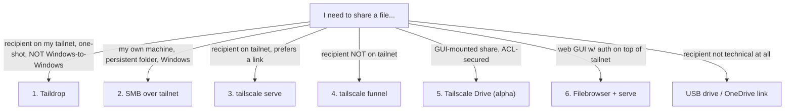

## The pattern in one sentence

For any "send a file over the network" problem, pick the flavor based on **who's receiving** — peer-on-tailnet → Taildrop *(but verify it works; broken on Windows-to-Windows)*, persistent shared folder → SMB over tailnet, ad-hoc HTTPS link for someone on the tailnet → `tailscale serve` *(from the Windows host, not from a WSL2-resident daemon)*, ad-hoc HTTPS link for someone *not* on the tailnet → `tailscale funnel`, GUI-native mounted share → **Tailscale Drive** (alpha but the right architectural answer), or a web GUI for browsing → **Filebrowser + serve**.

> ⚠️ **Reality check (2026-05 field experience):** the original "Taildrop is ~80% the answer" claim is wrong for Windows. Windows Taildrop has a recurring upstream bug ([tailscale/tailscale#14393](https://github.com/tailscale/tailscale/issues/14393)) where the receiving Windows daemon fails to advertise as a Taildrop target; sends silently succeed on the sender but never deliver. There's also **no built-in "Receive files" GUI on Windows** in current versions. For Windows recipients, default to **Tailscale Drive** (Flavor 5) once you've enabled it via ACL, or **`tailscale serve` from the Windows host directly** (Flavor 3 with the workaround documented below). See [diagnostics](#diagnostic-recipes) for the recurring Windows quirks.

## Decision flow



Refined rule (replaces the old 80% claim): **Tailscale Drive is the right structural answer** once it's enabled on your tailnet (single ACL change). Taildrop remains useful for Linux/macOS-to-Linux/macOS one-shots, but for anything involving a Windows receiver, prefer Drive or `serve`. Funnel exists for the case where the recipient can't or won't install Tailscale.

## Flavor 1 — Taildrop (`tailscale file cp`)

**Who:** recipient on the same tailnet. Both machines you control, or a fellow Tailscale user who's added you to a shared node.

**Why:** dead simple, end-to-end encrypted, no setup beyond having Tailscale.

**Send:**

```bash
tailscale file cp some-file.zip peer-hostname:
```

The peer hostname is what shows in `tailscale status`. Trailing colon is required.

**Receive (Linux/macOS — files are queued, not auto-saved):**

```bash
tailscale file get .
```

**Receive (Windows):** ⚠️ *Don't trust the previous "auto-save to Downloads" claim — verify per-version.* Current Tailscale Windows builds have **no reliable Taildrop receive GUI**. The CLI receive command (`tailscale file get $env:USERPROFILE\Downloads\`) silently outputs nothing when no files are queued, which makes failure indistinguishable from "no transfer yet." Plan to verify on the receiver before assuming delivery.

The bashrc helper wraps this:

```bash
tdrop some-file.zip peer-hostname     # send (trailing colon optional in helper)
tdrop-get [destdir]                    # receive (Linux/macOS only)
```

### Reality check: Windows-to-Windows Taildrop is broken (2026-05)

`tailscale status --json` reports `Self.TaildropTarget: None` on Windows even when MagicDNS and SSH otherwise work. Upstream bug [tailscale/tailscale#14393](https://github.com/tailscale/tailscale/issues/14393) tracks this — multiple users report sends succeeding silently on the sender side but never delivering. Retrying the send after a "success" returns `409 Conflict: file already exists`, which is misleading — the sender's daemon thinks it has a queued outbound, but the receiver never gets it.

**For Windows recipients, prefer Flavor 5 (Tailscale Drive) or Flavor 3 (`tailscale serve` from the Windows host).** Reach for Taildrop only when both endpoints are Linux/macOS, or as a quick probe to confirm whether your particular tailnet hits the bug.

## Flavor 2 — SMB over tailnet

**Who:** ongoing folder access between machines you own.

**Why:** good for "any time I'm working on the home server, I want a drive letter for this folder." More setup than Taildrop, but persistent.

**Sender side (Windows):** right-click → Properties → Sharing → Advanced Sharing → enable.

**Receiver side:**

```powershell
# Mount via Tailscale hostname:
net use Z: \\<peer-hostname>\<share-name> /user:<windows-user>

# Or via Tailscale IP (more reliable if MagicDNS isn't resolving):
net use Z: \\100.x.y.z\<share-name>
```

**Firewall note:** Tailscale traffic is identified as Private network by default on Windows, so you don't need new firewall rules if File and Printer Sharing is already allowed on Private profile.

No bashrc helper for this — Windows-side admin operation, run once per share.

## Flavor 3 — `tailscale serve` (tailnet-only HTTPS)

**Who:** recipient who's on your tailnet but wants a link instead of Taildrop. Or a browser-style download (large directory, multiple files).

**Why:** gives the recipient a friendly URL with a real cert (Tailscale-issued via Let's Encrypt). Only reachable from your tailnet — nobody else can hit the URL.

**Two-terminal setup:**

```bash
# Terminal 1 — serve the directory over plain HTTP locally:
cd /path/to/share/
python3 -m http.server 8000

# Terminal 2 — expose it over HTTPS via tailscale serve (tailnet-only):
tailscale serve --bg --https=443 --set-path=/ http://localhost:8000
```

URL: `https://<your-host>.<your-tailnet>.ts.net/`

The bashrc helper rolls both into one command:

```bash
tshare /path/to/share/             # default port 8000
tshare /path/to/share/ 9000        # custom port
```

The helper spawns python3's http.server in the background (PID recorded under `/tmp/`), then invokes `tailscale serve`. URL discoverable via `tailscale serve status`.

**Teardown:**

```bash
tshare-down [port]                  # stops both the http.server and the tailscale serve
```

### WSL2 sender → native-Windows receiver: this fails (2026-05)

When the Tailscale daemon runs **inside WSL2** and the receiver is a native-Windows machine on a different host, `tailscale serve` exposes a tailnet URL that the receiver **can't reach** even though MagicDNS resolves and Tailscale ping works. Cause: WSL2's NAT in front of the Tailscale-in-WSL daemon breaks inbound TCP from native-Windows tailnet peers (asymmetric path).

**Workaround — serve from the Windows host directly, not from WSL.** Native Tailscale on Windows can serve a filesystem path with no backing HTTP server, in one elevated command:

```powershell
# Elevated PowerShell (Right-click → Run as Administrator). Required for path-based serve.
tailscale serve --bg --https=443 "C:\path\to\folder\"
```

The URL becomes `https://<windows-hostname>.<tailnet>.ts.net/` (note: the Windows-host hostname, not the WSL one). The receiver hits it in any browser; directory listing rendered by Tailscale itself, no Python required.

Reasons this works when WSL serve doesn't:
- Windows-host Tailscale binds directly to Windows network stack (no WSL2 NAT)
- Tailscale Serve can take a file/directory path directly — no proxy port needed
- Cert is auto-issued by Tailscale for the Windows host's MagicDNS name

The admin requirement is **only for path-based serve** — proxying a port (`http://localhost:PORT`) doesn't need admin.

### Diagnostic recipes (Windows-side troubleshooting)

When the receiver's browser says "site can't be reached" or downloads stall at 0 bytes, the standard `nslookup` is **misleading**. Run these instead, in order:

```powershell
# 1. Confirm Tailscale's MagicDNS resolver works
#    (nslookup queries the adapter's DNS and bypasses Tailscale's NRPT — don't trust it)
Resolve-DnsName <host>.<tailnet>.ts.net -Server 100.100.100.100

# 2. Confirm the TCP path is open
Test-NetConnection <host>.<tailnet>.ts.net -Port 443

# 3. Functional test (NRPT-aware unlike nslookup)
Invoke-WebRequest -Uri https://<host>.<tailnet>.ts.net/file -OutFile <path>
```

If you're downloading a large file (>50 MB), **skip `Invoke-WebRequest`** in Windows PowerShell 5.1 — its progress bar is single-threaded and makes large transfers crawl. Use `curl.exe` (built into Win10/11):

```powershell
curl.exe -o "$env:USERPROFILE\Downloads\<file>" `
  "https://<host>.<tailnet>.ts.net/<file>"
```

Or disable the progress bar:

```powershell
$ProgressPreference = 'SilentlyContinue'
Invoke-WebRequest ...
$ProgressPreference = 'Continue'
```

## Flavor 4 — `tailscale funnel` (public HTTPS)

**Who:** recipient is NOT on your tailnet. Workshop attendees, family member without Tailscale, anyone with just a browser.

**Why:** ad-hoc public link with a real cert; no need to teach the recipient anything about Tailscale.

**Same setup as Flavor 3, but funnel instead of serve:**

```bash
cd /path/to/share/
python3 -m http.server 8000

tailscale funnel --bg --https=443 --set-path=/ http://localhost:8000
```

URL: `https://<your-host>.<your-tailnet>.ts.net/` — but now reachable from anywhere on the internet.

Bashrc helper:

```bash
tfunnel /path/to/share/            # default port 8000
tfunnel /path/to/share/ 9000       # custom port
tshare-down [port]                 # teardown is the same
```

**Caveats:**

- Public URL. Anyone with it can download. **Take it down (`tshare-down`) when you're done.**
- The bundle is served from your machine — keep it online for the share window.
- Funnel is free for personal Tailscale plans, but check current pricing if you're on a team plan.
- The Tailscale-issued cert is from Let's Encrypt; some corporate environments treat unfamiliar `.ts.net` domains as suspicious. Test before relying on it for important recipients.

## Flavor 5 — Tailscale Drive / Taildrive (alpha)

**Who:** GUI-mounted persistent share between machines on the same tailnet. The structural answer for "I want a folder on machine A to appear on machine B with native file-manager UX, secured by tailnet identity."

**Status (2026-05):** still officially alpha. Available in Tailscale 1.64+ but **gated behind ACL configuration** — there's no top-level "Drive" panel in the admin console; enablement is via the tailnet policy file. CLI subcommand: `tailscale drive {share,list,rename,unshare}`.

**Enable on your tailnet (admin console → Access Controls → policy editor):**

```json
{
  "nodeAttrs": [
    {
      "target": ["autogroup:member"],
      "attr": [
        "drive:share",
        "drive:access"
      ]
    }
  ]
}
```

Tighten `target` to specific users or tags if you want narrower scope.

**Create a share (on the host of the data):**

```bash
tailscale drive share workshop "/path/to/folder"     # Linux/macOS
tailscale drive share workshop "C:\path\to\folder"   # Windows
tailscale drive list                                  # see what you've published
```

Share names are forced to lowercase; one share name = one path.

**Access from another tailnet device:** the Tailscale tray/menu app on macOS 1.74+ and recent Windows builds surfaces "Drive" or "Shared folders" with one-click mount. Older builds expose WebDAV at a tailnet-routed URL (clunky format).

**Why this is the future answer:**

- **Tailnet-identity auth** at the WireGuard layer; no separate user accounts to manage
- **ACL-controlled** at the same place all other tailnet permissions live
- Native file manager UX on the receiver — drag, copy, double-click
- No `tailscale serve` config, no HTTP server, no public surface
- Cross-platform: Windows / macOS / Linux can host shares; iOS / Android can mount (not host)

**Caveats:**

- Alpha. Mounting UX varies by client version; expect rough edges
- Server component only on Windows / macOS / Linux (mobiles are receive-only)
- Free-tier limits may apply on personal plans — check current docs

Reference: https://tailscale.com/kb/1369/tailscale-drive

## Flavor 6 — Filebrowser + `tailscale serve`

**Who:** when Tailscale Drive's alpha-stage UX isn't acceptable yet, but you want a **full web GUI** for browsing/uploading/managing files over the tailnet with auth on top of tailnet identity.

**What it gives you:** a polished web file manager — drag-drop uploads, thumbnails, multi-user accounts, in-browser editor, search — exposed at a tailnet-only HTTPS URL.

```powershell
# Windows (admin PowerShell for the serve step):

# 1. Install (one-time)
winget install filebrowser.filebrowser

# 2. Run locally on port 8080
filebrowser -r "C:\path\to\folder" -a 127.0.0.1 -p 8080

# 3. Expose via Tailscale (separate elevated PowerShell)
tailscale serve --bg --https=443 http://localhost:8080
```

Linux equivalent:

```bash
sudo apt install filebrowser  # or: curl -fsSL https://raw.githubusercontent.com/filebrowser/get/master/get.sh | bash
filebrowser -r /srv -a 127.0.0.1 -p 8080 &
tailscale serve --bg --https=443 http://localhost:8080
```

Receiver: open `https://<host>.<tailnet>.ts.net/` in any browser, get a Filebrowser login screen.

**Two-factor by topology:**

1. You must be on the tailnet to reach the URL (network-layer identity)
2. You must have a Filebrowser account to authenticate (app-layer identity)

**When this beats Tailscale Drive:**

- Want a web UI you can hit from a non-Tailscale device temporarily (paired with `tailscale funnel` — public URL with Filebrowser auth as the only gate)
- Want fine-grained Filebrowser permissions (read-only users, scoped paths) above tailnet ACLs
- Want stability over alpha

## Status / inspection

The bashrc helper bundles a status command:

```bash
tshare-status
```

Shows `tailscale status` (tailnet peer list), `tailscale serve status`, `tailscale funnel status`, plus any local http.server processes the helper has spawned (with their PIDs).

## Realistic recommendations — scenario table

| Scenario | Best path |
|---|---|
| Sharing Linux/macOS → Linux/macOS, one-shot | **Taildrop** — `tdrop file peer` — 30 seconds |
| Sharing Windows → Windows, one-shot | **`tailscale serve` from the Windows host** (elevated, path-based) — Taildrop is unreliable here per [GH #14393](https://github.com/tailscale/tailscale/issues/14393) |
| WSL2 sender → native-Windows receiver | Move the file to the Windows host first, **then** `tailscale serve` from Windows. WSL2-resident serve fails for inbound from native peers. |
| One tech-savvy collaborator who can install Tailscale | **Taildrop** (test first if both ends are Windows) |
| Multi-file persistent share between your own machines | **Tailscale Drive** (after one-time ACL enablement) OR **SMB over tailnet** — Drive gives you OS-native mount UX, SMB is the battle-tested Windows path |
| Web GUI for browsing/uploading from any tailnet device | **Filebrowser + `tshare`** — polished UI, multi-user accounts |
| Sharing to one tailnet-savvy person who wants a download URL | **`tshare`** (tailscale serve) — make sure it's NOT running from inside WSL2 |
| Workshop attendees / public download / non-technical recipient | **`tfunnel`** OR **OneDrive / Drive share link** — the latter is often simpler because the recipient already knows how to click a download link |
| You want to demo the install live on YOUR machine via screen-share | Use the file directly, no transfer needed |
| Recipient is tech-uncomfortable and you'll be in the same physical room | **USB drive** — zero infrastructure, 100% reliable |

## When NOT to use Tailscale at all

Tailscale-based sharing is a great tool for your own multi-device life, but it adds onboarding friction for every recipient who isn't already on your tailnet. If the recipient is tech-uncomfortable, **OneDrive / Google Drive share links or a USB drive are the right answer.** Don't make people learn Tailscale just to download a file once.

Funnel skips the recipient-onboarding step but exposes your machine to public traffic during the share window. Acceptable for a 10-minute workshop window, less ideal as a persistent distribution channel.

## Cross-references

- [`tailscale-https-three-levels.md`](./tailscale-https-three-levels.md) — when you need a *persistent* HTTPS endpoint (web app, dashboard), not an ad-hoc file share.
- [`debian-vm-tailnet-bootstrap.md`](./debian-vm-tailnet-bootstrap.md) — getting a Linux machine onto your tailnet in the first place.
- `profiles/bashrc-snippets/tailscale-share-helpers.sh` — the actual helper functions implementing this pattern.

## Origin

Recipe extracted from a 2026-05 conversation about sharing parish-workshop installer bundles. Distilled to the six-flavor decision frame above so future-me doesn't re-derive the choice tree.

**2026-05-11 revision:** original draft claimed "Taildrop is the answer ~80% of the time" — this turned out to be wrong for Windows-to-Windows. Empirical findings from that session:

- Taildrop on Windows hits upstream bug [#14393](https://github.com/tailscale/tailscale/issues/14393); silent send-failure
- `tailscale file get` on Windows is silent on "no files queued," indistinguishable from "transfer worked"
- Windows-host Tailscale tray has no reliable Taildrop-receive GUI in current versions
- `tailscale serve` from a WSL2-resident daemon doesn't accept inbound from native-Windows tailnet peers (asymmetric NAT)
- Windows `nslookup` bypasses Tailscale's NRPT and reports "Non-existent domain" for `*.ts.net` even when MagicDNS is working — verify with `Resolve-DnsName -Server 100.100.100.100` instead
- `Invoke-WebRequest` in Windows PowerShell 5.1 is unusable for >50 MB downloads — `curl.exe` works fine

Added: Flavor 5 (Tailscale Drive / Taildrive) as the *future* answer once it leaves alpha, and Flavor 6 (Filebrowser) as the production-ready web GUI fallback. Field notes for the originating session live in the personal vault at `33 - Home Lab, Home Server/2 - Reference/Guides/Tailscale File Transfer on Windows — Field Notes.md`.
