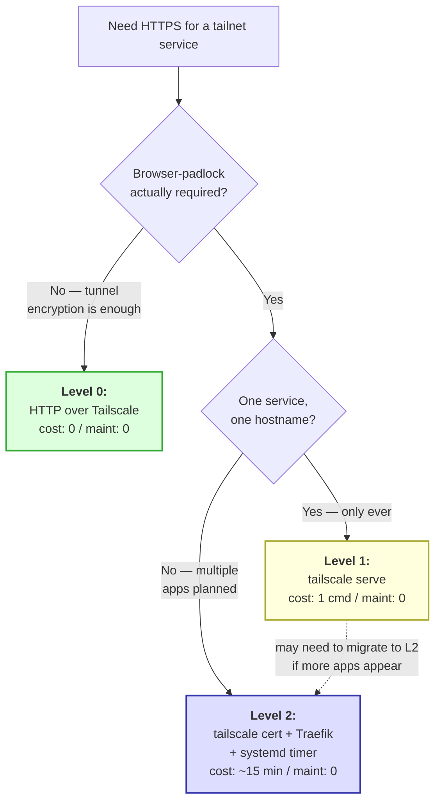

## The promise

You have services on your tailnet (Dokploy, Home Assistant, internal tools). You want HTTPS. There are exactly three levels of effort, and they look identical from the browser side. **Most people overshoot Level 0 → Level 2 by default and burn an afternoon for no benefit.** This doc names the levels, says when each is the right call, and gives concrete recipes for the two that are worth setting up deliberately.

## Decision in one tree



The mistake to avoid: skipping Level 0 ("but the browser shows a warning!") when in fact your traffic is already TLS-equivalent encrypted by Tailscale's WireGuard tunnel. The "warning" is cosmetic security theater for tailnet-internal services.

## Level 0: HTTP over Tailscale

**Setup:** none. Just visit `http://<host>.<tailnet>.ts.net:PORT` or `http://<host>:PORT` from a tailnet device.

**Why this is real security:** WireGuard wraps every packet in an authenticated, encrypted tunnel between your device and the tailnet host. From the threat-model side, this is equivalent to "HTTPS to a server inside a VPN." The browser doesn't know about the WireGuard layer, so it shows "Not secure" — that's a UI quirk, not a vulnerability.

**Where Level 0 breaks:**

| Browser feature | Refuses on HTTP? |
|---|---|
| Service Workers | ✓ requires HTTPS |
| WebRTC `getUserMedia` (camera/mic) | ✓ requires HTTPS |
| `Clipboard.writeText` (sometimes) | ✓ on most browsers |
| Mixed-content (HTTPS site fetching HTTP resources) | ✓ blocked |
| Browser autofill / save passwords | △ may suppress |
| HTTP/2 | ✓ requires HTTPS |
| Pretty UI / non-cosmetic | ✗ Level 0 is fine |

**Right when:** internal dashboards (Dokploy, Portainer, Grafana, Home Assistant pre-2.0 era) that don't trip the browser-API restrictions. ~80% of homelab services live here happily.

## Level 1: `tailscale serve`

One command turns a local port into an HTTPS endpoint with an auto-renewed Let's Encrypt cert:

```bash
sudo tailscale serve --bg --https=443 http://localhost:3000
```

Now `https://<host>.<tailnet>.ts.net` is browser-padlock-valid, with cert managed by Tailscale (no setup, no rotation, no thinking).

**The catch:** `tailscale serve` binds port 443 on the **tailnet interface** of the machine. If anything else on the same machine wants to terminate TLS on port 443 — most notably, Dokploy's bundled Traefik, or any reverse proxy you run yourself — you have a port conflict. Move the conflicting service to a different port, or accept that this machine has exactly one HTTPS endpoint.

**Inspect / change / undo:**

```bash
tailscale serve status                       # show active configs
tailscale serve reset                        # undo all
tailscale serve --set-path=/foo http://localhost:8080  # path-based fanout
```

**Right when:**

- One self-contained service on the box (no Traefik, no nginx, no other reverse proxy)
- Tinkering / proof-of-concept where deploy ergonomics matter more than future flexibility
- A separate machine dedicated to a single service (e.g. a Home Assistant box, a Pi-hole)

**Wrong when:**

- You're standing up a PaaS (Dokploy / Coolify / CapRover) — the bundled reverse proxy will fight for 443
- You expect to add a second app later — Level 1 doesn't compose with itself for multiple hostnames on one machine
- You like having one cert pipeline regardless of how many apps you deploy

## Level 2: `tailscale cert` + Traefik + systemd timer

This is the path for "one machine, many HTTPS apps, durable for years." It's a bit more work upfront. Maintenance after that is zero.

### Architecture

```
┌─────────────────────────┐
│ Let's Encrypt (DNS-01   │
│ challenge via Tailscale)│
└────────────┬────────────┘
             │  tailscale cert
             ▼
┌─────────────────────────────────┐
│  /etc/dokploy/certs/            │
│   dokploy.<tnet>.ts.net.crt     │
│   app1.<tnet>.ts.net.crt        │
│   app2.<tnet>.ts.net.crt        │
└────────────┬────────────────────┘
             │  Traefik dynamic config
             ▼
┌─────────────────────────────────┐
│  Traefik (Dokploy-managed       │
│  or hand-rolled — same shape)   │
│   80/443 with host-based routes │
└─────────────────────────────────┘
             │
             ▼
   browser sees padlock-green
```

Three load-bearing pieces:

1. **`tailscale cert <host>` writes cert files** — Tailscale handles the ACME negotiation against Let's Encrypt with a DNS-01 challenge through its own infrastructure. You get standard Let's Encrypt certs (90-day validity), signed and chained.
2. **Reverse proxy reads the cert files** — Traefik (Dokploy's bundled), nginx, Caddy, anything that takes a `certFile`/`keyFile` pointer.
3. **systemd timer re-runs `tailscale cert` weekly** — idempotent (Tailscale only re-issues if <30 days remain on the cert), so safe to run frequently. After regen, the proxy gets a SIGHUP to pick up the new cert.

### Find your tailnet domain

[login.tailscale.com/admin/dns](https://login.tailscale.com/admin/dns) → "Tailnet name" — something like `tail-XXXXX.ts.net`. Throughout this doc, `<tailnet>` is a placeholder for that.

### Initial cert + wiring (5 min)

On the host, as root (or with `sudo`):

```bash
mkdir -p /etc/dokploy/certs
cd /etc/dokploy/certs

# Generate first cert (interactive prompt confirms tailnet domain on first run)
tailscale cert dokploy.<tailnet>.ts.net

# You should now see two files:
ls -la
# -rw-------  dokploy.<tailnet>.ts.net.crt
# -rw-------  dokploy.<tailnet>.ts.net.key
```

Wire it into Traefik. **Path A — Dokploy UI** (newer versions):

> **Settings → Certificates** (sometimes "SSL Certificates") → **Add** → paste cert + key, name it `tailscale-dokploy` → **Settings → Domain** → assign `dokploy.<tailnet>.ts.net` to the dashboard.

**Path B — Traefik dynamic config** (everything else, or older Dokploy):

```yaml
# /etc/dokploy/traefik/dynamic/tailscale-tls.yml
tls:
  certificates:
    - certFile: /etc/dokploy/certs/dokploy.<tailnet>.ts.net.crt
      keyFile: /etc/dokploy/certs/dokploy.<tailnet>.ts.net.key
```

Reload Traefik:

```bash
docker kill -s HUP $(docker ps -q -f name=dokploy-traefik)
```

Visit `https://dokploy.<tailnet>.ts.net` — padlock-green.

### Auto-renewal (the durable bit)

Three small files. Drop them once, forget for years.

**`/usr/local/bin/renew-tailscale-certs.sh`** — the renewal script. Add a line for each new app domain you stand up later.

```bash
#!/bin/bash
set -euo pipefail

HOSTS=(
  dokploy.<tailnet>.ts.net
  # app1.<tailnet>.ts.net    # uncomment as you deploy apps
  # app2.<tailnet>.ts.net
)

CERT_DIR=/etc/dokploy/certs
mkdir -p "$CERT_DIR"
cd "$CERT_DIR"

for host in "${HOSTS[@]}"; do
  echo "Renewing $host"
  tailscale cert "$host"
  chmod 644 "$host.crt"
  chmod 600 "$host.key"
done

# Reload Traefik so it picks up any new certs
docker kill -s HUP $(docker ps -q -f name=dokploy-traefik) 2>/dev/null || true
```

```bash
chmod +x /usr/local/bin/renew-tailscale-certs.sh
```

**`/etc/systemd/system/tailscale-cert.service`** — the unit:

```ini
[Unit]
Description=Renew Tailscale-issued TLS certs and reload Traefik

[Service]
Type=oneshot
ExecStart=/usr/local/bin/renew-tailscale-certs.sh
```

**`/etc/systemd/system/tailscale-cert.timer`** — the schedule:

```ini
[Unit]
Description=Renew Tailscale TLS certs weekly

[Timer]
OnCalendar=weekly
Persistent=true
RandomizedDelaySec=1h

[Install]
WantedBy=timers.target
```

```bash
systemctl daemon-reload
systemctl enable --now tailscale-cert.timer
systemctl list-timers tailscale-cert*    # confirm next-run time
```

### Adding a new app (the recurring move)

When Dokploy deploys `app1.<tailnet>.ts.net`:

1. **In Dokploy:** set the project's domain to `app1.<tailnet>.ts.net`. Traefik picks up the routing rule automatically.
2. **On the host:** uncomment / add the line in `/usr/local/bin/renew-tailscale-certs.sh`:
   ```bash
   HOSTS=(
     dokploy.<tailnet>.ts.net
     app1.<tailnet>.ts.net    # ← new
   )
   ```
3. **Run once now**, so the cert exists immediately:
   ```bash
   /usr/local/bin/renew-tailscale-certs.sh
   ```
4. The weekly timer handles all subsequent renewals. **One line of work per new app.**

### Why this is "long-term durable"

| Reason | Effect |
|---|---|
| Tailscale's ACME flow has no DNS provider to configure | No API tokens to rotate, no DNS records to check |
| Renewal script is idempotent | Safe to run on every boot, every hour, weekly — Tailscale won't re-issue unless <30d remain |
| `tailscale cert` doesn't depend on inbound network reachability | Works behind any NAT, no port-forwards, no public DNS |
| Traefik picks up new certs on SIGHUP | No service restart, no dropped connections |
| HOSTS list is the only thing that grows | Adding/removing apps is a one-line edit |

## Why not a wildcard cert?

Tempting: `tailscale cert "*.<tailnet>.ts.net"` once, never touch it again. As of late 2025 this is **possible** but with caveats:

- Wildcards require Tailscale ACL configuration (`enableHTTPS`/`tagOwners` setups that allow the cert subject)
- Some tailnets / org policies disallow wildcards
- One bad cert breaks every app it covers (vs. one app breaking with a per-host cert)

Per-host certs with the systemd timer is the **conservative durable** choice. Revisit wildcards if your HOSTS array exceeds ~10 apps and per-app certs become tedious — by which point you'll have plenty of context on how much TLS you actually need.

## Migrating between levels

| From | To | Cost |
|---|---|---|
| Level 0 → Level 1 | `tailscale serve --bg --https=443 http://localhost:3000` | seconds; no rollback friction |
| Level 0 → Level 2 | follow this doc end-to-end | ~15 min |
| Level 1 → Level 2 | `tailscale serve reset`, then follow this doc | ~15 min; brief HTTPS gap during transition |
| Level 2 → Level 1 | rare; rip out the cert files + timer + Traefik config; `tailscale serve --bg ...` | ~5 min |
| Level 2 → Level 0 | rip out cert wiring, leave services on HTTP | ~2 min |

The friction is low in every direction. **Don't over-design at start time.** Pick the cheapest level that meets your current need. Migrate when reality forces it.

## When this pattern is wrong

| Don't use Tailscale HTTPS when… | Reach for instead |
|---|---|
| You need *public* HTTPS (anyone on the internet) | Cloudflare Tunnel, real domain + Let's Encrypt + DNS, or `tailscale funnel` (consciously) |
| You're not on Tailscale and don't want to add it | Standard Traefik or Caddy with their built-in ACME — same shape, different DNS provider |
| You need EV/OV certs for compliance | Tailscale issues DV-only Let's Encrypt; buy from a CA |
| You want to terminate TLS on a load balancer in front of multiple hosts | This is per-host; for fleets, a real LB (HAProxy, nginx) with one cert source makes sense |

## Composition with other patterns

| Pattern | How it composes |
|---|---|
| [Dokploy on TrueNAS via VM](./dokploy-on-truenas-via-vm.md) | Level 2 is the natural HTTPS layer for the Dokploy VM pattern |
| [Tailnet browser access](./tailnet-browser-access.md) | That doc uses Level 1 (`tailscale serve`) for ad-hoc serving — same building block, different use |
| [Tier-3 private deploy](#private-reference) | The static-site cron-pull pattern uses Level 2 as its HTTPS plane |

## See also

- [Tailscale HTTPS docs](https://tailscale.com/kb/1153/enabling-https) — upstream reference
- [Tailscale Serve docs](https://tailscale.com/kb/1242/tailscale-serve) — Level 1 reference
- [Tailscale ACME docs](https://tailscale.com/kb/1153/enabling-https#issue-a-cert) — Level 2 cert generation
- [Traefik dynamic config — TLS](https://doc.traefik.io/traefik/https/tls/) — the file-based cert source used in Level 2
