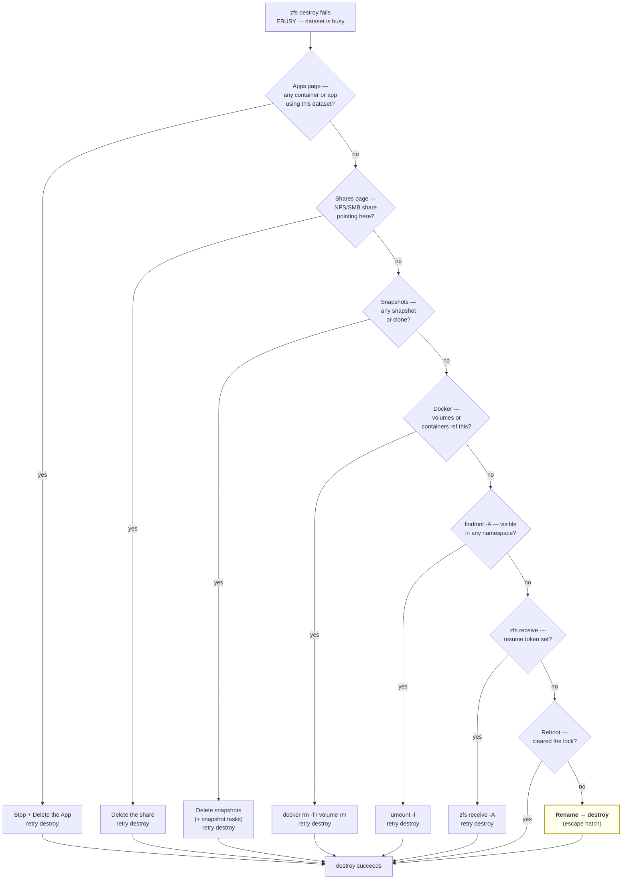

## The promise

You tried to `zfs destroy` (or delete via the TrueNAS UI) some leftover dataset. ZFS says **`cannot destroy '<dataset>': dataset is busy`**. You ran `mount`, `lsof`, `findmnt`, `zfs holds`, `docker ps`, even rebooted — nothing visible holds it. You've now lost an hour to ZFS gaslighting. This doc is the way out.

The diagnostic ladder is in cheapest-first order. **Step 8 (rename-then-destroy) is the most opaque escape hatch and the one that's hardest to find anywhere else.** If steps 1–7 are obviously not your case, skip straight to it.

## Decision tree



## Step 1 — Apps / containers (most common cause)

TrueNAS UI → **Apps** → look for anything whose name or volumes reference the dataset path.

```bash
# Or from shell, if the UI is missing something:
docker ps -a 2>/dev/null
docker volume ls 2>/dev/null | grep <dataset-name>
docker container ls -a --filter "volume=<volume-name>" 2>/dev/null
```

For each match: **Stop**, then **Delete** (and tick "remove volumes" if asked).

> Even an *exited* container counts. Docker holds bind-mounts open until the container is removed (not just stopped).

## Step 2 — NFS / SMB shares

TrueNAS UI → **Shares** → check NFS, SMB, iSCSI tabs:

```bash
# Or from shell:
exportfs -v 2>/dev/null | grep <dataset-name>
cat /etc/exports 2>/dev/null | grep <dataset-name>
```

Delete any share pointing into the dataset. Retry destroy.

## Step 3 — Snapshots / clones / replication

```bash
zfs list -t all -r <dataset>      # any snapshots? clones?
zfs holds -r <dataset>            # any explicit holds?
```

TrueNAS UI → **Datasets** → click the dataset → **Snapshots** tab → select all → Delete. Also:

- **Data Protection → Periodic Snapshot Tasks** — delete any task that targets the dataset (otherwise it regenerates snapshots between your delete and your destroy)
- **Data Protection → Replication / Cloud Sync / Rsync Tasks** — delete any task referencing the dataset

## Step 4 — Docker bind-mounts in another namespace

Docker bind-mounts can show up in `mount` differently than expected — sometimes only inside Docker's own mount namespace.

```bash
# Find the mount across ALL namespaces (not just root)
findmnt -A | grep <dataset-name>

# Walk every PID's mount table to identify the holder
for pid in $(ls /proc 2>/dev/null | grep -E '^[0-9]+$'); do
  grep -l <dataset-name> /proc/$pid/mountinfo 2>/dev/null && \
    echo "  ↑ PID $pid = $(cat /proc/$pid/comm 2>/dev/null)"
done

# Nuclear cleanup of orphaned containers and volumes
docker ps -aq --filter "status=exited" --filter "status=dead" --filter "status=created" | xargs -r docker rm -f
docker volume ls -q | grep -i <dataset-name> | xargs -r docker volume rm
```

## Step 5 — Lazy unmount

If `findmnt -A` did show a mount but `lsof` shows nothing, the kernel is hanging onto stale file descriptors. Force-detach the namespace:

```bash
umount -l /mnt/<dataset-path>
zfs destroy -R -f -v <dataset>
```

`umount -l` (lazy) detaches the filesystem from the namespace immediately and finishes cleanup as the last open fd closes. ZFS should let go after this.

## Step 6 — Interrupted `zfs receive`

```bash
zfs get -r receive_resume_token <dataset>
```

If any value other than `-` shows up, an interrupted replication left a partial receive holding the dataset. Abort:

```bash
zfs receive -A <dataset>           # repeat per child if needed
zfs destroy -R -f -v <dataset>
```

## Step 7 — Restart middlewared / reboot

TrueNAS Scale's `middlewared` (the Python process that backs the web API) caches dataset state in its own bookkeeping. After certain interrupted operations — Apps install/uninstall, replication, snapshot task that errored — that cache can claim a dataset is in use even when no kernel-level reference remains.

Lighter than reboot:

```bash
systemctl restart middlewared
sleep 5
zfs destroy -R -f -v <dataset>
```

If that doesn't free it, full reboot:

1. UI → power icon → **Restart** (~2 min)
2. **Immediately** after SSH returns (before Apps fully initialize), run:
   ```bash
   zfs destroy -R -f -v <dataset>
   ```

A reboot clears every kernel mount cache, every Docker namespace, every middlewared lock at once. It's the conventional answer for "everything ruled out, still busy."

## Step 8 — Rename, then destroy (the escape hatch)

When the destroy still fails after a fresh reboot — `mount` empty, `findmnt` empty, no holds, no snapshots, no Docker, no NFS/SMB, middlewared restarted — the lock is opaque enough that you need to change the dataset's identity.

```bash
zfs rename <dataset> <pool>/_trash_<old-name>_$(date +%Y-%m-%d)
zpool sync <pool>
zfs destroy -R -f -v <pool>/_trash_<old-name>_*
```

If the rename succeeds (it usually does even when destroy doesn't), and the destroy *still* fails after, try child-by-child:

```bash
zfs destroy -f <pool>/_trash_<old-name>_*/data
zfs destroy -f <pool>/_trash_<old-name>_*/pgdb
zfs destroy -f <pool>/_trash_<old-name>_*/redis
zfs destroy -f <pool>/_trash_<old-name>_*
```

**This works in the 90%+ of remaining cases.**

### Why renaming releases the lock

TrueNAS Scale's middleware tracks datasets by **path string** in its internal SQLite DB, not by ZFS dataset GUID. When some prior Apps operation registered the dataset for management, that bookkeeping entry held the path open even after the App was gone. The kernel honored this as an `EBUSY` because middlewared holds an internal reference count.

Renaming changes the path string. Middlewared's stale bookkeeping entry now points at a non-existent path. The reference dangles, the kernel reclaims it, the dataset is free to destroy.

It's a real ZFS quirk surfaced by TrueNAS's specific bookkeeping shape — not the kind of thing that's documented in `zfs(8)` because it's a layer above ZFS, but it shows up reliably enough to be the right "everything else failed" tool.

## Worst-case acceptance

If even rename-then-destroy fails (extremely rare; would imply pool-level corruption or an active replication you didn't know about), the workaround is:

1. **Leave the renamed `_trash_*` dataset where it is.** It costs whatever it weighs on disk — usually MBs for app leftovers. You have terabytes free; it's safe to ignore.
2. **Retry after the next TrueNAS minor version update.** Updates often migrate the middleware's internal state and release stale references.
3. **As a last resort:** `zpool export <pool>` then `zpool import <pool>` clears every cached state for the entire pool. Schedule when you can take the pool offline briefly. Verify backups first.

## Composition with related runbooks

| Scenario | Where this applies |
|---|---|
| You're cleaning up a failed Dokploy-on-TrueNAS-direct attempt | Datasets like `<pool>/dokploy/{data,pgdb,redis}` from the prior install — see [Dokploy on TrueNAS via VM](./dokploy-on-truenas-via-vm.md) for the proper architecture |
| You used the TrueNAS Apps catalog and the App is gone but its dataset isn't | Step 1 + Step 8 cover most of this combination |
| You imported a pool from another machine | Step 3 (snapshots/clones from the other side may have come along) often resolves it |
| You moved away from k3s-era TrueNAS Apps (Scale Bluefin/Cobia → Dragonfish/Electric Eel) | k3s persistent volumes can leave datasets registered. Step 4 + reboot + Step 8 covers this combination |

## See also

- [`zfs destroy(8)`](https://openzfs.github.io/openzfs-docs/man/master/8/zfs-destroy.8.html) — flag reference, especially `-R -f` semantics
- [TrueNAS Scale Apps documentation](https://www.truenas.com/docs/scale/) — Apps lifecycle reference
- [Dokploy on TrueNAS via VM](./dokploy-on-truenas-via-vm.md) — the right architecture (vs. the failed-attempt cleanup this doc helps with)
