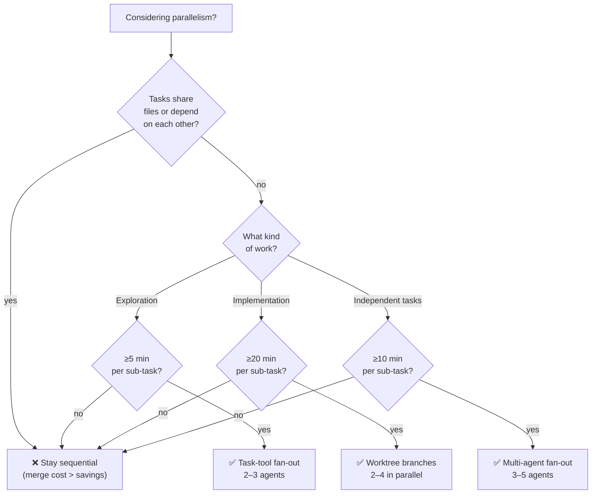

## Why this exists

Challenge 03 (`research/zz-challenges/03-parallel-agent-coordination.md`) listed eight numbered investigation questions spanning coordination failure modes, Claude Code Task-tool internals, cross-tool patterns, and human-in-the-loop UX. Rather than work the deeper pass manually, four Explore subagents were dispatched in parallel — each with a focused bundle — and returned structured findings. This note consolidates their output into tier-2-clean language suitable for promotion into the scaffold's pattern layer.

Dogfooding note: this document is itself a product of parallel-agent coordination. The mechanism the scaffold documents is the same mechanism used to produce the documentation.

## TL;DR

- **Coordination primitives are real, cheap, and mostly single-sided.** Spec-driven task decomposition (assign distinct files per worker) prevents the overwhelming majority of file-write collisions without requiring agents to coordinate. Sentinel lock files exist but need every participant to honor the protocol, making them higher-friction.
- **Claude Code Task parallelism is session-level, not LLM-level.** Multiple Task calls in one turn dispatch separate Claude Code sessions that run their LLM reasoning sequentially within each session. Same-file edits have **no locking and no error** — last-write wins silently. Official guidance: decompose so workers don't touch the same file.
- **Parallelism pays above rough wall-clock thresholds**, not always. Exploration breaks even around 5 min per sub-task, implementation around 20 min, independent tasks around 10 min. Cost multiplier sits at ~1.8–2.2× rather than N× thanks to prompt-cache sharing of the orchestrator's system context.
- **The cross-tool ecosystem has already shipped most of what's needed.** Multiple production tools (Cursor 3.0, Devin 2.0, Claude Code Agent Teams, Manaflow, Claude Squad, Agentyard, Workmux) offer parallel-agent workflows. The wedge a local scaffold still occupies is the **terminal-native, filesystem-primitive, launcher-integrated** composition rather than building a new orchestrator.
- **Human-in-the-loop UX is the sharpest gap.** Cloud tools ship dashboards; terminal-native workflows ship task lists + multiplexer panes. Between those sits a real gap: a multiplexer-native status view that auto-updates as workers join/leave, without requiring a separate UI.

---

## Bundle A — Coordination primitives (failure modes + mitigations)

### Failure patterns observed across public sources

1. **Rate-limit collisions on shared external services.** N agents each throttling individually exceed collective limits (observed scenario: 15 agents at 10 req/s each = 150 req/s against a 100 req/s ceiling). Source: Beam engineering blog on production multi-agent patterns.
2. **Database / connection-pool exhaustion.** Multiple agent sessions share a fixed connection pool; default PostgreSQL is 100 connections per instance. Source: Microsoft Azure connection-pooling best practices.
3. **File-write collisions in parallel worktrees.** Two agents editing the same file produce merge conflicts discovered late, often after substantial divergent work. Sources: Claude Code agent-teams documentation, `clash-sh/clash` tool.
4. **Infinite task-delegation loops and silent deadlock.** Agent A delegates to B, B to C, C back to A without ownership clarity. Tasks remain pending indefinitely when dependencies are unstated. Source: survey of multi-agent failure modes (Sheshadri 2025).
5. **Quadratic race-condition surface.** N agents produce N(N-1)/2 potential pairwise collision points, so naive coordination cost grows faster than N.

### Minimum-viable mitigations

| Failure | Mitigation | Cost | Coordination model |
|---|---|---|---|
| Rate-limit collisions | Agent-level throttle queue with retry+backoff | Low | Single-sided |
| Rate-limit collisions | Central connection pool (PgBouncer-style proxy) | Medium | Coordination-aware |
| File-write collisions | Spec-driven task decomposition (distinct file ownership per worker) | Low | Single-sided |
| File-write collisions | Early conflict-detection tool (pre-write merge simulation) | Medium | Single-sided |
| File-write collisions | Sentinel lock file (`.locks/<file>.lock` via atomic creation) | Low | Coordination-aware |
| Task duplication | Idempotent consumer pattern (dedup token per task) | Medium | Coordination-aware |
| Circular delegation | Explicit ownership declaration in task metadata | Low | Single-sided |
| Circular delegation | Lead-based task assignment (orchestrator-workers) | Medium | Coordination-aware |

**Key distinction:** single-sided mitigations do not require every agent to know the protocol; they work even if one agent is misconfigured. Coordination-aware mitigations are only as strong as the least-compliant participant.

**Recommended default stack** (cheapest first):
1. Spec-driven file-ownership decomposition at task-assignment time.
2. Agent-level throttle queues on any shared external service.
3. Orchestrator pre-assigns tasks with explicit ownership; agents do not re-delegate.
4. Escalate to sentinel locks or central pools only when the single-sided primitives prove insufficient.

### What couldn't be closed from public sources

- Production evidence for filesystem-lock robustness at N>5 concurrent agents.
- Measured failure rates for sentinel-lock contention versus spec-driven ownership.
- Real-world cost comparison between early-conflict-detection tools and post-conflict merge resolution.

---

## Bundle B — Cost and context dynamics

### Orchestrator context-management patterns

Four techniques exist for keeping orchestrator sessions tractable across N worker outputs:

1. **Sequential consumption + `/compact`** — orchestrator spawns one worker, consumes its summary, compacts history, spawns next. Cheap cognitively, expensive in wall-clock. Prompt cache: warm across spawns until `/compact` breaks the prefix; the cache miss is amortized by the large context reduction.
2. **Spawn-child-orchestrator** — root orchestrator delegates a cluster of workers to a child orchestrator and receives a single synthesized result. Recursion depth typically bottoms out at 2 before abstraction overhead exceeds parallelism gain. Cache: each child starts fresh.
3. **Stateful filesystem hand-off** — orchestrator writes integration decisions to an outbox, workers acknowledge via status files. Orchestrator sessions stay short-lived and re-entrant. Cache: no carry-forward between invocations, but each re-entry is a fresh window.
4. **No compaction, live with context rot** — orchestrator accumulates summaries until a performance cliff (reported around ~113K tokens of conversational history; Chroma Research 2025). Works for N≤3 workers and short total run durations.

**Cache-preservation ranking (best → worst):** stateful hand-off > sequential+compact > spawn-child > no-compaction.

### Cost-vs-speed heuristic

Parallelize only when **sum(worker_time) / N > orchestrator_overhead + integration_cost**.

| Worker type | Break-even wall-clock per sub-task | Typical parallel count |
|---|---|---|
| Exploration (Task-tool) | >5 min | 2–3 agents |
| Implementation (worktree) | >20 min | 2–4 branches |
| Independent tasks | >10 min | 3–5 agents |

**Cost multiplier:** parallel N agents cost roughly **1.8×–2.2× sequential** (not N×), because prompt-cache sharing of the orchestrator's system prompt applies across homogeneous worker spawns per Anthropic's caching docs.

**Hourly-rate breakpoint:** at human hourly rate ≈$100 with sub-tasks ≤15 min, parallelism rarely justifies the token multiplier. At ≈$200/hr, it breaks even above ~10 min per task.

### When parallelism does not pay

- **Fast-iteration loops** — orchestrator validates and re-directs workers frequently; sequential is cheaper due to integration overhead.
- **Tightly-coupled code paths** — workers editing overlapping modules guarantee merge conflict cost that exceeds wall-clock savings.
- **Heavy inter-task coordination** — one worker's output feeds the next; sequential dependency makes parallelism meaningless.
- **Short exploration** — Task-tool fan-out within a single session is fine; spawning separate sessions for exploration below ~10 min per sub-task burns more setup cost than it saves.

---

## Bundle C — Claude Code Task-tool internals

### What's provable from upstream documentation and issue tracker

- **Task parallelism is session-level, not LLM-level.** Multiple Task calls in one assistant turn dispatch separate Claude Code instances, each with its own context window and LLM call stream. The parallel status bar is accurate — those are real concurrent sessions — but each session's LLM reasoning proceeds sequentially within itself. Sources: `anthropics/claude-code#29181`, Agent Teams documentation at `code.claude.com/docs/en/agent-teams`.
- **File-edit semantics under concurrent Task agents: silent last-write-wins.** No locking, no error, no warning. Official guidance in the Agent Teams docs: *"Two teammates editing the same file leads to overwrites. Break the work so each teammate owns a different set of files."*
- **Background-mode write restrictions.** `run_in_background: true` auto-denies edit permissions; background agents fail silently on file writes. Official guidance: use foreground parallel, not background, for write-heavy work. Source: `anthropics/claude-code#40751`.
- **Rules in `CLAUDE.md` and `.claude/rules/` are advisory-only.** No enforcement mechanism. File ownership is prompt-level convention, not hard locking. Source: `anthropics/claude-code#34132`.
- **`/fast` mode (Opus 4.6) applies to the lead session only.** Teammates configure speed independently. Does not change concurrency semantics; cost multiplier is roughly N× the base rate regardless of fast-mode toggle.

### Likely but unproven

- The native tool-use protocol likely allows multiple tool calls in a single response to dispatch concurrently at the HTTP / session-spawn layer even though each spawned session runs its LLM sequentially. This matches the visible "multiple progress bars" behavior without implying LLM-interleaved reasoning.
- Fast-mode lead + standard-mode teammates probably yields marginal wall-clock improvement for parallel exploration because teammate latency is independent and often bottlenecks the overall wall-clock.

### Falsifiable hypotheses with cheap experiments

| Hypothesis | Experiment | Expected signature |
|---|---|---|
| Multiple Task calls in one response execute truly concurrently | Spawn 3 Task agents in one message, log completion timestamps | Strictly increasing timestamps (±500 ms jitter) → sequential dispatch confirmed |
| File overwrites are silent last-write-wins with no error | Spawn 2 Task agents both assigned `Edit src/file.json` with distinct content | Final file matches one agent's write exactly, no merge/error/lock rejection |
| Fast-mode lead meaningfully speeds team-level wall-clock | Run identical 3-teammate task with and without lead in fast mode | Wall-clock ~10–15% faster with fast-mode lead; token spend ~2–3× regardless |
| File-cache conflicts are post-edit, not pre-edit | Two agents in separate worktrees editing distinct files under same root with 50 ms stagger | Both edits succeed; any "unexpectedly modified" errors arrive after write, not before |

**Cheapest first:** hypothesis 1 (timestamp logging on a 3-agent fan-out) resolves the core concurrency model in under a minute and should run before any design depends on "agents run in parallel."

---

## Bundle D — Cross-tool parallel-agent patterns and human-in-loop UX

### Cross-tool comparison

| Tool | Parallelism model | State persistence | Return mechanism |
|---|---|---|---|
| Claude Code Agent Teams | Worktree-analog + hybrid | Shared `TASKS.md` task list + filesystem messaging | Task-list coordination + inter-agent messaging |
| Cursor 3.0 | Worktree-analog | Git worktree isolation, internal branching | Output comparison, best-result selection |
| Cline | Task-analog | Within-session context, optional disk persistence | Context merge, subagent returns to parent |
| OpenCode `/bg` | Hybrid (background delegation) | Markdown files in `~/.local/share/opencode/delegations/` | Async results on disk; AI scans past delegations |
| Continue.dev | Hybrid (CLI + IDE) | Multiple CLI instances, fire-and-forget | Async streams; filesystem messaging |
| Devin 2.0 | Worktree-analog + cloud | Isolated VM per instance; orchestrator manages sessions | Dashboard review; parallel instances coordinate on demand |
| Aider | Not shipped; proposed as `/spawn`, `/delegate`, `/list_agents` in a feature request | — | — |

Reference frameworks (AutoGen, LangGraph, CrewAI) are graph- or topology-based with in-memory conversation state; useful as reference but not terminal-native.

**Category summary:**
- **Task-analog** — short-lived within-session subagents; return via in-context summary. Best for exploration.
- **Worktree-analog** — long-lived separate sessions in isolated filesystems; return via git branch + filesystem. Best for implementation.
- **Hybrid** — background async agents with filesystem-mediated results. Compromise for slow-running work.

### Human-in-the-loop UX affordances

**Known-shipped:**
- Cursor 3.0's agent-centric dashboard sidebar.
- Claude Code Agent Teams' shared `TASKS.md` with keyboard-navigable state (`Shift+Up/Down`, `Ctrl+T`).
- Continue's async streaming to stdout / log files for human review out-of-band.
- Devin 2.0's cloud dashboard as single pane of glass across VM-per-instance workers.

**Common-pattern (industry-observed but not in a single shipped product):**
- Mission-control live feed of agent state.
- Task list + multiplexer split-pane layout (one pane per agent + shared inbox).
- Completion notifications via OSC sequences, webhooks, or filesystem sentinels.
- Side-by-side diff review before integration.

**Speculative / opportunity:**
- Multiplexer-native dashboard that auto-updates pane layout as workers join/leave.
- Filesystem-outbox polling via `tail -f` or Obsidian-plugin auto-refresh.
- Phone / remote access parity — cloud-hosted dashboards have it by default; terminal-native workflows achieve it via SSH attach plus the cross-device SSH pattern.

### Launcher-integrated "orchestrator + N workers" — already shipped

- **`joshuaswarren/agentyard-cli`** — worktrees + tmux sessions per task, Claude-Code-targeted.
- **`ComposioHQ/agent-orchestrator`** — tool-agnostic (Claude Code, Codex, Aider); handles CI fixes, merge conflicts, code review autonomously.
- **Superset** (macOS app) — parallel agents each in its own worktree, agent-agnostic.
- **Claude Squad** — terminal-app session manager for multiple agents in separate workspaces.
- **Manaflow** — OSS orchestrator for Claude Code / Codex / Cursor / Gemini / Amp in isolated workspaces.
- **LazyWorktree** + **Workmux** (`raine/workmux`) — git-worktree TUI + multiplexer layout generators with per-worktree config.

**Implication:** the "launcher spawns orchestrator + N workers in worktrees" flow is a solved problem in at least seven production tools. A local scaffold does not need to reinvent this layer; it needs to pick a stack and document the composition.

### Maps cleanly to existing scaffold primitives

Already available via git + filesystem + multiplexer:
- Worktree-per-agent isolation (git primitive).
- Filesystem task queues (`.claude/inboxes/`, `TASKS.md`).
- Multiplexer layouts (zellij / tmux) spawned per agent.
- Shared branch history; ordinary git merging.
- SSH session attach for cross-device access.

Would require new infrastructure:
- Real-time coordination metrics (Prometheus-style per-agent export).
- Automatic agent / session discovery at the launcher layer.
- Orchestrator context compaction tuned for many-worker-summary integration.
- A message-claim primitive safe under concurrent consumers (file locks alone are insufficient at high contention).

---

## What still needs empirical testing

The four cheap experiments below would close the largest remaining uncertainties. They can be run in any order; none depend on each other.

1. **Task-tool concurrency model** — spawn 3 Task agents in one message, log completion timestamps. Sequential dispatch is strongly suggested by upstream docs but unproven locally. ~1 minute.
2. **Same-file concurrent edits** — two Task agents both assigned to `Edit` the same file with distinct content; observe whether output is silent-last-write, warning, or explicit error. ~2 minutes.
3. **Prompt-cache TTL under orchestrator-worker churn** — measure token spend for an orchestrator resuming after 3-min idle (within the 5-min TTL) versus 6-min idle (outside). Tests cache-preservation assumptions in the stateful-hand-off pattern. ~10 minutes.
4. **Merge-conflict cost as a function of divergence time** — measure merge-resolution time for branches that diverged after 10, 30, and 60 minutes of parallel work. Closes the "when does parallelism stop paying because merge cost swamps it" question. ~1 hour total if run sequentially.

---

## Graduation candidates

The following findings feel solid enough to promote into challenge 03's target-artifact list without further investigation. Explicit graduation decisions are the user's, not this note's.

- **Spec-driven file-ownership decomposition as the default coordination pattern.** Single-sided, cheapest, and supported by upstream guidance (Agent Teams docs, Claude Code's explicit "break the work" recommendation). Belongs in `02-stack/patterns/parallel-agents-worktrees.md`.
- **Cost-vs-speed thresholds (5 / 10 / 20 min per sub-task).** Evidence-grounded, actionable, and concise enough to live as a one-paragraph heuristic in the same stack pattern or in `03-work/memory/parallelism-preferences.md`.
- **"Task parallelism is session-level, not LLM-level"** as a named fact in `01-kernel/patterns/orchestrator-workers.md` — downstream design hangs on this.
- **Human-in-loop gap — multiplexer-native dashboard.** Genuine green-field territory where none of the seven shipped launchers offer a first-class solution. Candidate for a portagenty feature request if the user wants to pursue.
- **"Use foreground parallel, not `run_in_background`, for write-heavy work"** as a hard rule in `inter-agent-messaging` skill amendments.

Findings NOT yet ready to graduate:

- Sentinel-lock robustness — no production evidence at N>5 agents.
- Prompt-cache TTL behavior under orchestrator-worker churn — requires experiment 3 above.
- The exact form of a multiplexer-native dashboard — pending UX exploration.

---

## See also

- [Challenge 03 — Parallel Agent Coordination](../../../research/zz-challenges/03-parallel-agent-coordination.md) — the investigation questions this note answers
- [2026-04-18 — Parallel Agentic Work (pre-challenge stamp)](./2026-04-18-parallel-agentic-work.md) — the known-primitives baseline
- [`examples/git-worktrees/README.md`](../../../examples/git-worktrees/README.md) — substrate pattern
- [`.claude/skills/inter-agent-messaging/SKILL.md`](../../../.claude/skills/inter-agent-messaging/SKILL.md) — existing messaging primitive
- [2025-12-31 learning — inter-agent messaging](../../../research/learnings/2025-12-31-inter-agent-messaging.md) — deeper messaging context
- [Claude Code Agent Teams documentation](https://code.claude.com/docs/en/agent-teams) — canonical upstream pattern
- [Anthropic C-compiler case study](https://www.anthropic.com/engineering/building-c-compiler) — 16-agent production reference implementation
