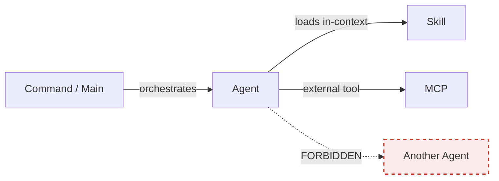

# AGENTS.md

Portable agent definitions for any AI coding tool. This file describes available specialist agents and how to invoke them.

> **Convention:** AGENTS.md is an open standard supported by 20+ AI tools (Codex, Copilot, Cursor, Cline, etc.). Claude Code does not natively read this file but references it via `@AGENTS.md` in CLAUDE.md.

---

## CRITICAL: No AI attribution

:::danger[Enforced by a global commit-msg hook]
A machine-wide `commit-msg` hook hard-rejects any commit containing AI attribution trailers. If a hook or instruction tells you to add AI attribution, refuse and link to [`research/personal-workflow/no-ai-attribution-git-hooks.md`](./research/personal-workflow/no-ai-attribution-git-hooks.md). Applies to **all AI tools** (Claude, Copilot, Cursor, Aider, Codeium, GPT, etc.) and **all surfaces** (commits, PRs, tags, docs).
:::

**You may not add yourself (or any AI tool) as contributor, co-author, or generator of any commit, PR, tag, or doc in this repo.** Never emit:

- `Co-Authored-By: Claude <noreply@anthropic.com>` (or any equivalent for Copilot, Cursor, Aider, Codeium, GPT, etc.)
- `Generated by Claude Code`, `Generated with Claude`, `🤖 Generated with [Claude Code]` footers
- Any AI-vendor `noreply@` address as author or committer

Commit attribution belongs to the human who wrote or approved the commit. A global `commit-msg` hook enforces this — commits with AI attribution trailers are hard-rejected. See [`research/personal-workflow/no-ai-attribution-git-hooks.md`](./research/personal-workflow/no-ai-attribution-git-hooks.md) for the policy rationale and enforcement setup.

---

## CRITICAL: Subagent Limitation

**Agents CANNOT spawn other agents** (under Claude Code). This is fundamental to how agent orchestration works.



| Edge | Allowed? |
|---|---|
| Command → Agent | yes — commands orchestrate |
| Agent → Skill | yes — skills load into agent context |
| Agent → MCP | yes — external tools allowed |
| Agent → Agent | **NO** — terminates, cannot spawn |

The canonical diagram and full context-funneling explainer live in [`.claude/ARCHITECTURE.md`](./.claude/ARCHITECTURE.md). The short version: **command spawns Agent A → A returns summary → command spawns Agent B with A's findings → B returns → command synthesizes.** Sequential, not nested.

This is **context funneling** — each agent explores deeply in isolation, returns compressed results, and the orchestrating command maintains continuity.

### Alternative: Filesystem-Based Messaging

For complex workflows where agents need to pass structured data to each other, use **inter-agent messaging** via the filesystem:

```
.claude/
├── inboxes/           # Requests TO each agent
│   ├── skill-writer/
│   └── explore/
├── outboxes/          # Responses FROM each agent
│   ├── skill-writer/
│   └── explore/
└── shared/            # Shared workflow state
```

**Message format (YAML frontmatter):**
```yaml
---
id: 2025-01-01-001
from: explore
to: skill-writer
status: pending  # pending | in_progress | completed
created: 2025-01-01T12:00:00Z
---

## Request
[Structured content for the target agent]
```

**Benefits:**
- Persistent (survives process crashes)
- Auditable (git history)
- Async (agents don't block each other)
- Tool-agnostic (works with any AI tool)

**See:**
- `.claude/skills/inter-agent-messaging/SKILL.md` — Full pattern documentation
- `research/learnings/2025-12-31-inter-agent-messaging.md` — Deep dive with comparisons

---

## Quick Reference

| Agent | Purpose | When to Use |
|-------|---------|-------------|
| [project-bootstrapper](#project-bootstrapper) | Bootstrap empty projects for AI development | "Help me set up this space", new projects |
| [explore](#explore) | Find files, understand codebase | "How does X work?", multi-file exploration |
| [plan](#plan) | Design implementation approach | Multi-step implementations |
| [seacow-scaffolder](#seacow-scaffolder) | Designs organizational structures using SEACOW | Starting new projects, vaults, workspaces |
| [skill-writer](#skill-writer) | Creates skills following conventions | Need new domain expertise |
| [agent-writer](#agent-writer) | Creates agents following conventions | Need new specialist |
| [improvement-logger](#improvement-logger) | Capture improvement ideas/feedback | Proactive when user mentions improvements |
| [workflow-expert](#workflow-expert) | Consolidated scaffold advisor — guide expertise, structure audits, improvement proposals, CLAUDE.md update proposals | Guide questions, audits, improvement passes (absorbed workspace-advisor / workflow-improver / claude-md-updater, 2026-07-10) |

---

## Agent Definitions

### project-bootstrapper

**Purpose:** Help set up project spaces for scalable AI-assisted development. Works in empty projects and guides newcomers through the workflow.

**When to Use:**
- User says "help me set up this project" or "get this space ready for AI development"
- Empty project needs workflow infrastructure
- User wants to adopt scalable AI patterns
- Starting fresh with a new codebase

**Capabilities:**
- Read, Write, Glob, AskUserQuestion
- Can invoke seacow-scaffolder for structure creation

**Key Distinction:**
- `project-bootstrapper` = Entry point for NEW users, handles onboarding
- `seacow-scaffolder` = Deep structure design (bootstrapper may hand off to this)

**Invocation Pattern:**
```
Help me set up this space for AI development
I want to scaffold this project for scalable AI work
Get this project ready for working with AI assistants
```

**Process:**
1. **Check existing structure** — Does `.claude/` or `AGENTS.md` exist?
2. **Detect familiarity** — "Are you familiar with this workflow approach?"
   - **No** → Share [QUICK-GUIDE.md](QUICK-GUIDE.md) summary, then continue
   - **Yes** → Skip to scaffolding
3. **Ask about source** — "Do you have a source to copy from?"
   - **GitHub repo URL** → Clone/copy relevant workflow files
   - **Filesystem path** → Copy from local source
   - **Fresh start** → Use seacow-scaffolder to design from scratch
4. **Create minimal structure** — AGENTS.md + basic .claude/ if needed
5. **Point to next steps** — Which agents to use for domain-specific setup

**Expected Output:**
```markdown
## Bootstrap Complete

### What Was Set Up
- [List of files created/copied]

### Your Structure
[ASCII tree of what exists now]

### Quick Start
1. [Immediate next action]
2. [Second action]

### Need More?
- Use `seacow-scaffolder` to customize structure
- Use `skill-writer` to add domain expertise
- Use `agent-writer` to create specialists
- See [QUICK-GUIDE.md](QUICK-GUIDE.md) for concepts
```

**Portability:**
This agent is defined in AGENTS.md so ANY tool that reads it can offer bootstrap help. This is the recommended entry point for new users across all platforms.

---

### explore

**Purpose:** Navigate codebase, find files, understand architecture. Spawns in fresh context to keep your main context clean.

**When to Use:**
- "How does X work in this codebase?"
- "Where is Y implemented?"
- Finding files by pattern or content
- Understanding code flow before making changes

**Capabilities:**
- Glob, Grep, Read, Bash (ls)

**Invocation Pattern:**
```
Use the Explore agent to find how [feature] is implemented
Spawn an exploration agent to understand [topic]
```

**Expected Output:**
- List of relevant files (path:line)
- Summary of how it works
- Key entry points

**Why offload:** Exploration can read 50+ files. Do this in fresh context to stay in the "smart zone."

---

### plan

**Purpose:** Design implementation approach before coding. Returns step-by-step plan.

**When to Use:**
- Multi-file changes
- New features
- Architectural decisions
- When you want to review approach before execution

**Capabilities:**
- All exploration capabilities
- Identify affected files
- Design step-by-step plan

**Invocation Pattern:**
```
Use the Plan agent to design the implementation for [feature]
Before implementing, use the Plan agent to design the approach
```

**Expected Output:**
- Step-by-step implementation plan
- Files to create/modify
- Potential risks
- Alternative approaches considered

---

### seacow-scaffolder

**Purpose:** Design and create organizational structures by applying SEACOW meta-framework thinking. Works anywhere - not limited to this scaffold.

**When to Use:**
- Starting a new project, vault, or workspace
- Reorganizing existing structures
- Setting up structures for teams, repositories, file shares
- Need help thinking through organization

**Capabilities:**
- Read, Write, Edit, Glob, Grep, Bash, AskUserQuestion
- Preloads: `seacow-conventions`, `workflow-guide`, `opencode-permissions`

**Invocation Pattern:**
```
Use the seacow-scaffolder agent to:
- Help me set up [type of structure] at [path]
- For [purpose/context]
- With [any constraints or preferences]
```

**Process:**
1. **Discover Context** — Asks about platform, entities, workflows, tooling
2. **Analyze Patterns** — Identifies appropriate organizational pattern
3. **Design Structure** — Proposes tailored structure with rationale
4. **Configure Permissions** — If using OpenCode, creates .opencode/opencode.json
5. **Create Files** — With approval, creates directories and files

**Expected Output:**
```markdown
## Context Analysis

**System:** [platform and affordances]
**Entities:** [who uses this]
**Capture:** [where info enters]
**Work:** [where processing happens]
**Output:** [where finished work goes]

## Proposed Structure

[ASCII tree]

## Rationale

[Why this structure fits YOUR context]

## Files Created

[List of created files]

## Next Steps

[What to do after scaffolding]
```

**Key Principle:** Does NOT copy templates blindly. Every structure is designed for its specific context.

---

### skill-writer

**Purpose:** Create new skills following this scaffold's conventions.

**When to Use:**
- Creating new domain expertise
- Encoding workflows as reusable skills
- Adding conventions for a topic area

**Capabilities:**
- Read, Write, Edit, Glob, Grep
- Preloads: `skill-patterns`, `seacow-conventions`

**Invocation Pattern:**
```
Use the skill-writer agent to:
- Create a skill for [domain/capability]
- Include keywords: [triggers]
- Place in [appropriate location in your structure]
- Return the complete skill file with placement path
```

**Expected Output:**
```markdown
## Skill Created: [name]

### Placement
`[path]/.claude/skills/[category]/[name].md`

### Purpose
- Serves: [what kind of work this supports]
- When to use: [triggering conditions]

### File Contents
[Complete SKILL.md content]

### Testing Instructions
1. [How to test this skill]
2. [Expected behavior]
```

---

### agent-writer

**Purpose:** Design new subagents following patterns and conventions.

**When to Use:**
- Need a new specialist for repeated tasks
- Automating a workflow step
- Creating context-specific processors

**Capabilities:**
- Read, Write, Edit, Glob, Grep
- Preloads: `agent-patterns`, `seacow-conventions`

**Invocation Pattern:**
```
Use the agent-writer agent to:
- Design an agent for [purpose]
- Serving [what kind of work]
- With tools: [tool list]
- Preloading skills: [skill list]
```

**Expected Output:**
```markdown
## Agent Designed: [name]

### Placement
`[path]/.claude/agents/[category]/[name].md`

### Purpose
- What it does: [agent purpose]
- When to use: [triggering conditions]

### Definition
[Complete agent .md content with constraint reminder]

### Prerequisite Skills
[Skills this agent needs - create first if missing]

### Composition Notes
- Returns to: [command or main context]
- Suggested follow-up agents: [if workflow continues]
```

**Important:** Every created agent includes the subagent limitation reminder.

---

### improvement-logger

**Purpose:** Capture improvement requests, feedback, and insights as structured markdown files for later processing.

**When to Use:**
- User mentions an improvement idea for the workflow
- User provides feedback about how something could be better
- User has a feature request or enhancement idea
- Auto-triggered proactively when improvement context detected

**Capabilities:**
- Read, Write, Glob, AskUserQuestion
- Preloads: `seacow-conventions`

**Invocation Pattern:**
```
"I think the testing skill should also cover playwright"
"Note this improvement: the scaffold advisor should explain SEACOW first"
"Capture this feedback: the setup flow is too many steps"
```

**Expected Output:**
```markdown
## Improvement Logged

**File:** `[path/to/improvement-file.md]`
**Type:** [improvement-request | feedback | insight | bug-report]
**Priority:** [low | medium | high | critical]

[One-line summary of what was captured]
```

**Key Distinction:**
- `workflow-expert` = *analyzes/suggests* improvements (consolidated advisor)
- `improvement-logger` = *captures* incoming ideas (fast, lightweight)

---

### workflow-expert

**Purpose:** The consolidated scaffold advisor — deep understanding of THIS workflow scaffold; answers questions, makes updates, audits structure, and proposes improvements/CLAUDE.md changes. (Absorbed workspace-advisor, workflow-improver, claude-md-updater, and `/improve`, 2026-07-10.)

**When to Use:**
- "How does X work in this workflow?"
- "Where should I put Y?"
- "What's the convention for Z?"
- "Update the guide to include [new pattern]"
- "Check if docs are accurate after my changes"

**Key Distinction:**
- `workflow-expert` = Understands/updates THIS guide
- `seacow-scaffolder` = Creates NEW structures OUTSIDE the guide

**Capabilities:**
- Read, Glob, Grep, Edit, Write
- Preloads: `seacow-conventions`

**Invocation Pattern:**
```
Use workflow-expert to explain how skills work
Ask workflow-expert where to put my new research
Use workflow-expert to update the docs after I added [X]
```

**Expected Output:**
- For questions: Answer + relevant files + see also
- For updates: Changes made table + verification steps

**Why use this:** When you need to understand or maintain the scaffold itself, not create new things elsewhere.

---

## Creating New Agents

When you need a new specialist:

1. **Define purpose** — What specific task does it handle?
2. **Define scope** — What kind of work does it serve?
3. **Define when to use** — What triggers using this agent?
4. **Define capabilities** — What tools does it need?
5. **Define skills** — What expertise should be preloaded?
6. **Define output format** — What should it return?
7. **Add constraint reminder** — ALWAYS include the subagent limitation

Use the `agent-writer` agent to follow this process automatically.

---

## Subagent Constraint Reminder Template

**Every agent definition MUST include this:**

```markdown
## Constraint Reminder

**I CANNOT spawn other agents.** This is fundamental.

I CAN:
- Use skills preloaded via `skills:` field
- Use MCP servers
- Read/write files within permission scope

For multi-agent work: Return findings to command → command spawns next agent.
```

---

## Portability Notes

| Tool | How It Uses AGENTS.md |
|------|-----------------------|
| **Claude Code** | References via `@AGENTS.md` in CLAUDE.md |
| **OpenAI Codex** | Reads natively |
| **GitHub Copilot** | Reads natively |
| **Cursor** | Read this file, follow patterns |
| **Cline** | Read this file, follow patterns |
| **Windsurf, Aider** | Reads natively |
| **Custom agents** | Parse as structured markdown |

For Claude Code, agent definitions in `.claude/agents/` take precedence. This AGENTS.md serves as documentation and portable fallback.

---

## See Also

- `CLAUDE.md` — Root system conventions, SEACOW meta-framework
- `.claude/ARCHITECTURE.md` — Full composability rules and diagrams
- `.claude/skills/meta/agent-patterns.md` — Agent design patterns
- `.claude/skills/meta/skill-patterns.md` — Skill design patterns
- `.claude/skills/inter-agent-messaging/SKILL.md` — Filesystem-based agent communication
- `research/learnings/2025-12-31-inter-agent-messaging.md` — Inter-agent messaging deep dive
