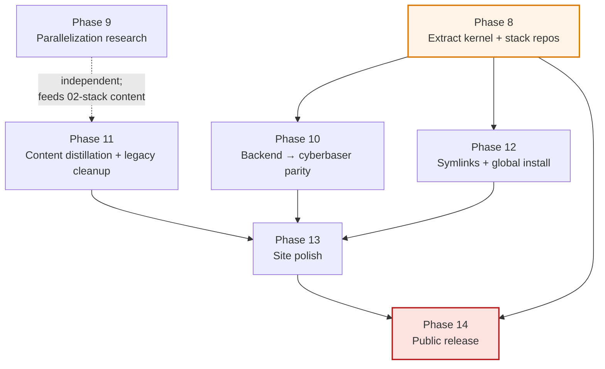

# Agentic Workflow Roadmap

A portable, progressive-disclosure scaffold and agent-memory system for filesystem-based AI agent workflows. Three tiers: **kernel** (universal, forkable by anyone), **stack** (my opinionated toolkit, forkable for similar setups), **work** (my personal case study). Long-form rationale lives in [`01-kernel/PHILOSOPHY.md`](./01-kernel/PHILOSOPHY.md) + [`01-kernel/principles/`](./01-kernel/principles/).

---

## Done — First-Iteration Init (2026-04-17)

**Structural foundation**

- [x] Three-tier decomposition — `01-kernel/`, `02-stack/`, `03-work/`, plus `00-meta/` for scaffold-dev tooling
- [x] Migration from flat `.claude/` + scattered docs/research/ into tier structure (non-destructive copies + deletions of merged skills)
- [x] Stratum-tagging convention (1–5) applied to every markdown file via automated injector — 88 files updated
- [x] Frontmatter hygiene pass — doubled-frontmatter merge (26 files), CRLF→LF (21), colons-in-values quoted (17)

**Philosophy & principles content**

- [x] `01-kernel/PHILOSOPHY.md` — 10 invariants as claims about the world (~1.6k words)
- [x] 10 principle pages with citations — capture→work→output, temperature gradient, skills/agents, progressive disclosure, convention-as-compressed-decision, single canonical addressability, five strata, four channels of context, meta/self-reference, multi-entity design (~9.5k words)
- [x] Ultraplan research attribution preserved at `03-work/memory/research/2026-04-17-kernel-and-dressing.md`

**Stack content**

- [x] Stack overview with layer diagram + dependency graph
- [x] 7 layer pages — AI coding, terminal, cross-device, knowledge mgmt, homelab, dev-infra, editor ext
- [x] Decision matrix — Claude Code vs Gemini vs Codex, Zellij vs tmux, Tailscale vs alternatives, Obsidian vs alternatives
- [x] Patterns — cross-device SSH full walkthrough, image-paste pipeline (Zipline + ShareX + sharex-clip2path)
- [x] Profiles migrated — bashrc snippets, keybindings

**Work-tier content (mostly personal)**

- [x] `03-work/memory/tool-picks.md` — current defaults across all layers
- [x] `03-work/memory/preferences.md` — coding style, review criteria, anti-preferences, vibe-coding philosophy
- [x] `03-work/memory/project-references.md` — 30+ projects grouped by type with "what pattern lives here"
- [x] `03-work/project-types/astro-starlight-docs.md` — canonical pattern for how I build docs sites (with `zz-` prefix convention)
- [x] `03-work/rebuild/` — 11-page rebuild-my-machine flow (index + 9 steps + verify + troubleshooting)
- [x] `03-work/homelab/` — PII-aware placeholder (actual specifics stay gated)

**Kernel components (migrated + merged)**

- [x] 13 meta-skills in `01-kernel/skills/` (merged `workflow-guide` + `workflow-meta` → `workflow-scaffold`; kept obsidian-family and `proactive-patterns` separate after honest review)
- [x] 10 meta-agents in `01-kernel/agents/` — seacow-scaffolder, skill-writer, agent-writer, workflow-expert, workflow-improver, claude-md-updater, workspace-advisor, improvement-logger, test-improver, knowledge-curator
- [x] 7 slash commands in `01-kernel/commands/`
- [x] `01-kernel/ARCHITECTURE.md`
- [x] Hook scripts in `01-kernel/scripts/hooks/`
- [x] Skeleton templates in `01-kernel/templates/skeleton/` (5 project types migrated)

**Site (Astro Starlight)**

- [x] `site/` scaffolded — Astro 6, Starlight 0.38, Flexoki theme, bun
- [x] `preflight.mjs` — WSL/Windows binary-stub handler
- [x] `sync-content.mjs` — reads tiers into `src/content/docs/`, normalizes frontmatter, reports wikilink issues
- [x] `serve.mjs` — interactive: dev / preview / build / Tailscale share
- [x] `smoke.mjs` — 39 curl-based route assertions; catches dead links, busted base path, missing content
- [x] `PageTitle.astro` custom component — stratum badges (S1 purple → S5 gray) + status + date chips
- [x] Starlight site-graph + image-zoom plugins
- [x] Homepage (`index.mdx`) — vision-first hero, 3-tier cards, CTAs to principles / stack / work
- [x] `PREVIEW.md` — Tailscale Serve walkthrough for phone / remote review
- [x] GitHub Actions workflow (`.github/workflows/deploy-site.yml`) — gated behind repo visibility + PII audit

**Meta / scaffold-dev tooling**

- [x] `00-meta/stratum-audit/classify.mjs` — 226-file classifier with path + keyword heuristics
- [x] `00-meta/stratum-audit/add-stratum-frontmatter.mjs` — retrofit stratum on source files
- [x] `00-meta/stratum-audit/pii-scan.mjs` — PII gate before any public-visibility change (0 critical after audit)
- [x] `00-meta/skills-audit.md` — rationale for 14→13 skill count (aggressive merge rejected for 2 honest reasons)

**Identity**

- [x] `README.md` rewrite — vision-first, tier overview, quick tour by audience
- [x] `CONTRIBUTING.md` — selective-acceptance policy, no-AI-attribution rule, style guide
- [x] `ROADMAP.md` (this file)

**Status as of init complete:** 70 HTML pages build, 39/39 smoke checks pass, 0 PII-critical findings.

---

## Phase dependency map

Phases are goal-oriented, not time-boxed. Some block others; some are parallelizable.

**Reading the map:** Phase 8 (extraction) is the structural pivot — it gates the multi-repo backend work (P10) and global install (P12). Phase 14 (public release) is the only phase that requires *all* upstream work plus a clean PII audit. Phase 9 is a parallel research track whose output lands in `02-stack/patterns/`.

---

## Phase 8 — Extract kernel + stack to their own repos

**Why:** kernel is generically useful; stack is fork-worthy for similar setups; keeping them in a monorepo forever conflates audiences and creates maintenance friction.

- [ ] Review end-to-end via Tailscale preview (phone + laptop pass)
- [ ] Resolve any content issues surfaced by review
- [ ] Re-run PII scan, confirm 0 critical + high-findings resolved or tolerated
- [ ] `git subtree split` `01-kernel/` to new branch
- [ ] Create private GitHub repo `cybersader/agentic-kernel`
- [ ] Push extracted kernel history to new repo
- [ ] Same flow for `02-stack/` → `cybersader/agentic-stack`
- [ ] Move `00-meta/test-workspace/` + `00-meta/stratum-audit/` to the kernel repo
- [ ] Replace `01-kernel/` + `02-stack/` in this repo with git submodules (tentative — revisit if feels too coupled, alternatives: git subtree pull, copy-on-demand script)
- [ ] Rename this repo on GitHub: `agentic-workflow-and-tech-stack` → `agentic-workflow`
- [ ] Rename local folder (many internal refs to fix — automate)
- [ ] Update each repo's `astro.config.mjs` base path to match new slug
- [ ] Each repo gets its own Starlight site (kernel + stack sites scaffolded fresh, reusing patterns)
- [ ] Cross-link sites in each homepage + README
- [ ] Extraction smoke test — clone each fresh on a throwaway machine, run `install.sh`, confirm no personal refs fail
- [ ] Repos stay **private** until PII audit clears + content review complete
- [ ] Public release order: kernel first (universally useful), stack second (fork-worthy for WSL+Claude+Obsidian setups), work stays private longer (personal content)

---

## Phase 9 — Parallelization research + content

**Why:** user flagged git worktrees + parallel agent patterns as under-researched. Deserves the Ultraplan treatment; output feeds directly into `02-stack/patterns/parallel-agents-worktrees.md`.

- [ ] Deep research session on parallel AI-agent workflows
  - Git worktrees — how to use, gotchas, integration with Claude Code's per-directory session model
  - OpenCode oh-my-opencode background agents — whether to adopt, ban-risk status in 2026
  - Multi-agent coordination patterns (beyond what `inter-agent-messaging` skill documents)
  - Watching: Conductor extension, other parallel-agent tooling
- [ ] Pattern doc: `02-stack/patterns/parallel-agents-worktrees.md` — the canonical how-to
- [ ] Update `02-stack/decisions/index.md` with parallel-work decision rows
- [ ] Update `03-work/memory/preferences.md` with my parallel-work flow

---

## Phase 10 — Backend alignment to cyberbaser

**Why:** as the scaffolded sites mature, the "full-featured Starlight" backend stack (Nova theme + site-graph + blog/changelog + announcements + tags + image-zoom) is worth adopting across all three agentic-workflow sites. MVP uses Flexoki for shipping speed; Nova is the target.

- [ ] Install + configure Nova theme on `agentic-workflow` site (swap from Flexoki)
- [ ] Add `starlight-announcement` for phase status banners
- [ ] Add `starlight-blog` as changelog prefix
- [ ] Add `starlight-tags` with proper `tags.yml` config
- [ ] Align `PageTitle.astro` with cyberbaser's conventions (custom badges + dates)
- [ ] Once extracted, apply same backend to `agentic-kernel` + `agentic-stack` sites
- [ ] Migration is pure config + plugin swap; content (markdown + frontmatter) unchanged

---

## Phase 11 — Content distillation + legacy cleanup

**Why:** original `docs/`, `research/`, `examples/`, `knowledge-base/`, `tutorials/`, `System/`, `templates/` still live at repo root. Sync script no longer pulls from them. They're raw source material for distillation, not content.

- [ ] Audit each legacy folder's markdown — is content methodology (stratum 1–4) or knowledge work (stratum 5 / exits)?
- [ ] Distill methodology bits into appropriate tier pages (principle pages, patterns, stack layer content, work memory)
- [ ] Exit actual knowledge work to user's external Obsidian vault
- [ ] Delete legacy folders once content is extracted
- [ ] Run full smoke pass after each folder's cleanup

---

## Phase 12 — Symlinks, global install, kernel consumption

**Why:** Claude Code needs to see skills/agents at `~/.claude/skills/` and `~/.claude/agents/`. Currently, copies exist in project-local `.claude/`. The install.sh script should symlink (or copy) kernel content into the global location.

- [ ] `kernel/scripts/install.sh` finalized — symlinks `~/.claude/skills/` → `$KERNEL_REPO/skills/`, same for agents, commands, scripts
- [ ] Validate Windows fallback (Windows git doesn't default to `core.symlinks=true`)
- [ ] `install.sh` prints clear "what was installed" summary
- [ ] Tested on a fresh VM via the rebuild flow (`03-work/rebuild/05-install-kernel.md`)
- [ ] In-repo `.claude/` at root becomes either a symlink or a documented cache of kernel content

---

## Phase 13 — Site polish

- [ ] Brand CSS — distinct palette from cyberbaser (not Nova default; project-specific)
- [ ] Custom SVG hero for homepage (optional)
- [ ] Site graph tuned — principles section should visibly cluster
- [ ] Search tuning (Pagefind) — boost principle pages
- [ ] Mobile navigation pass — real phone testing
- [ ] Accessibility audit — axe or similar
- [ ] Edit-link config verified against actual repo path
- [ ] `starlight-announcement` configured for current project phase
- [ ] Status badges on all pages — cross-check `stratum:` frontmatter is correct

---

## Phase 14 — Public release

- [ ] Final PII audit clean (0 critical, 0 high-findings-without-tolerance)
- [ ] LICENSE finalized for each repo
- [ ] `CONTRIBUTING.md` tuned per repo (kernel = open-source-friendly; stack = selective; workflow = mostly personal)
- [ ] README final pass per repo
- [ ] Switch GitHub repos to public — one at a time, starting with agentic-kernel
- [ ] Enable GitHub Pages on each
- [ ] Cross-linking on all sites verified
- [ ] Announcement (blog post, README banner) explaining the three-repo structure

---

## Watching / deferred

**OpenCode ecosystem**
- If `sst/opencode` session bugs are fixed (issues [#4378](https://github.com/sst/opencode/issues/4378), [#3551](https://github.com/sst/opencode/issues/3551), [#4557](https://github.com/sst/opencode/issues/4557)), revisit as a Claude Code alternative.
- oh-my-opencode native background-agent support makes it attractive for parallel work if reliability improves.

**AI coding CLI wrappers**
- OpenCode, OpenClaw, T3Code currently avoided for ban-risk + security reasons. Revisit 2027 if an ecosystem entrant proves 2+ years clean operation with provider cooperation.

**Knowledge graph integration**
- Neo4j + Ollama + MegaMem — Obsidian → Neo4j bridge for semantic search. Pre-beta; watching.
- Openclast (my project) — browser-based Obsidian with CRDT sync. Becomes an alternative for multi-device vault editing when it matures.

**Enterprise scale**
- If the scaffold ever needs to serve a team, identity layer becomes load-bearing. Authelia or Keycloak ACLs for per-user access to different tiers.
- Enterprise MCP gateways (microsoft/mcp-gateway) — aware but not adopted for personal use.

**Tooling experiments**
- Tests beyond smoke: lightweight Playwright suite for interaction patterns (lightbox, search, navigation) if pain points emerge.
- Auto-update-attention hook — cron-run script that reads mtime and updates `status: hot | warm | cold | frozen` in frontmatter automatically.

---

## Ideas backlog

- [ ] Visual workflow designer for agentic pipelines
- [ ] Agent performance metrics (which agent + which skill combo gets things done)
- [ ] Skill effectiveness tracking — auto-detect skills loaded but never referenced in output
- [ ] Cross-project skill learning — pattern mining across projects
- [ ] Workflow recording + replay for reproducible agent runs
- [ ] Version control for agent/skill evolution (semver per skill?)
- [ ] `sharex-clip2path` for Mac/Linux equivalents
- [ ] Obsidian plugin that reads this scaffold's principles + patterns as in-vault reference

---

## Design principles for this roadmap

1. **Done section is dense + specific.** Checkboxes + short descriptions. No weasel words about "completed initial setup" — list what.
2. **Phases are goal-oriented, not time-boxed.** "Extract kernel" is a phase; "Q2 2026 work" is not.
3. **Every phase answers: what, why, what's the exit criterion.**
4. **Deferred != dead.** Watching + ideas backlog stay as explicit parking.
5. **Updated every significant merge.** The README + site link here; the `Done` section should grow.

Last updated: 2026-04-17
