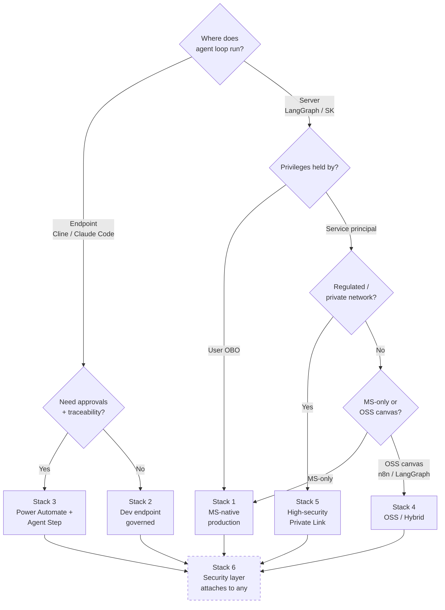

# Enterprise MCP Architecture Stacks

## The Core Problem

Standard OAuth 2.0 doesn't work for agentic AI:
- Agent masquerades as user → inherits ALL permissions
- Prompt injection = "Confused Deputy" attack
- No attribution for WHY a task was performed
- Autonomous agents are too complex for OAuth

## The Solution: Layered Architecture

Every enterprise MCP deployment needs these layers:

```
┌─────────────────────────────────────────────────────────────┐
│ SURFACES                                                     │
│ Teams / Portal / VS Code (Cline) / CLI (Claude Code)         │
├─────────────────────────────────────────────────────────────┤
│ ORCHESTRATION / CANVAS                                       │
│ Azure AI Foundry | Power Automate | n8n | LangGraph          │
├─────────────────────────────────────────────────────────────┤
│ MODEL GATEWAY (Egress Control)                               │
│ APIM / AI Gateway: allowlist, budget, DLP, logging           │
├─────────────────────────────────────────────────────────────┤
│ TOOL GATEWAY (MCP Policy Enforcement)                        │
│ MCP Gateway + Policy Engine (OPA/Cedar) + Token Exchange     │
├─────────────────────────────────────────────────────────────┤
│ TOOL SERVICES (MCP Servers)                                  │
│ Graph/SQL/ServiceNow wrappers with Managed Identity          │
├─────────────────────────────────────────────────────────────┤
│ ENTERPRISE ASSETS                                            │
│ M365, SharePoint, SQL, Data Lake, Internal APIs              │
├─────────────────────────────────────────────────────────────┤
│ OBSERVABILITY + GRC (cross-cutting)                          │
│ OTel traces, SIEM, approvals, ticket IDs, non-repudiation    │
└─────────────────────────────────────────────────────────────┘
```

---

## Stack 1: Microsoft-Native Production Agents

**Use Case**: Server-side autonomous agents with full governance

```
[Users] → [Teams/Portal]
              │
              v
     [Agent Orchestrator]
     Azure AI Foundry (Prompt Flow)
     + LangGraph/Semantic Kernel
              │
     ┌────────┴────────┐
     │                 │
     v                 v
[Model Gateway]    [MCP Gateway]
   (APIM)            (PEP)
     │                 │
     v                 v
  [Azure        [MCP Servers]
  OpenAI]           │
                    v
               [Assets]
          (M365/SQL/ServiceNow)
```

**Components**:
- **Identity**: Entra ID + Managed Identities
- **Canvas**: Azure AI Foundry Prompt Flow
- **Orchestration**: LangGraph or Semantic Kernel
- **Model Gateway**: Azure API Management
- **Tool Gateway**: microsoft/mcp-gateway
- **Policy Engine**: OPA/Cedar
- **Observability**: OpenTelemetry → Azure Monitor/Sentinel

**Key Scopes** (define in Entra ID):
- `Tools.Read`
- `Finance.Execute`
- `HR.Sensitive`

---

## Stack 2: Developer Agents (Cline/Claude Code) - Governed

**Use Case**: Dev productivity tools with enterprise controls

```
[Developer Laptop]
├── VS Code + Cline
├── Claude Code CLI
│
├── LLM calls ──────▶ [Model Gateway] ──▶ [Models]
│
└── Tool calls ─────▶ [MCP Gateway] ──▶ [MCP Servers] ──▶ [Assets]
```

**Critical Controls**:
- **Endpoint**: Intune/MDM for config
- **Identity**: Entra SSO to gateways
- **Network**: Force all LLM traffic via gateway
- **Tools**: MCP Gateway allowlists only approved tools

**Safer Variant**: Run agents inside Azure Dev Box / AVD

---

## Stack 3: Workflow-First (Power Automate + Agent Step)

**Use Case**: Business automation with bounded AI assistance

```
[Business Users]
      │
      v
[Power Automate / Logic Apps]
 (approvals, connectors, audit)
      │
      └──▶ [Bounded Agent Service]
               (LangGraph/SK API)
                    │
              ┌─────┴─────┐
              v           v
        [Model GW]   [MCP Gateway]
              │           │
              v           v
          [Models]   [MCP Servers]
```

**When to Use**:
- Approvals and traceability are non-negotiable
- Agent is a helper step, not the whole workflow
- Need deterministic connectors + probabilistic AI

---

## Stack 4: OSS/Hybrid (n8n + LangGraph + Entra)

**Use Case**: Flexibility with Microsoft identity governance

```
[Users]
   │
   v
[n8n Canvas (self-hosted)]
 Entra SSO enforced
   │
   v
[LangGraph Runtime]
   │
   ├──▶ [Model Gateway] ──▶ [Models]
   │
   └──▶ [MCP Gateway] ──▶ [MCP Servers] ──▶ [Assets]
```

**Requirements for Enterprise**:
- Self-host on AKS/VMs
- Enforce Entra SSO (n8n Enterprise)
- Restrict HTTP Request nodes
- Network egress controls

---

## Stack 5: High-Security / Regulated (Private Network)

**Use Case**: Financial, healthcare, government

```
[Surfaces: Teams/DevBox]
      │
      v
[Orchestrator on Private Compute]
 (AKS/ACA in VNet)
      │
      ├──▶ [Private Model Endpoint]
      │     (Azure OpenAI Private Link)
      │
      └──▶ [MCP Gateway + Policy Engine]
                 │
                 v
            [MCP Servers] ──▶ [Private Assets]

Network: Private Link, no public egress
Sandbox: Ephemeral containers for code exec
```

---

## Stack 6: Security/Testing Layer (Attaches to Any Stack)

```
[Any Agent Runtime]
      │
      ├──▶ [Tracing: OTel/LangSmith]
      │
      ├──▶ [Eval Harness + CI Gates]
      │
      └──▶ [SIEM + Incident Response]
```

**Components**:
- **Tracing**: OpenTelemetry, LangSmith
- **Testing**: Promptfoo, Garak, custom harnesses
- **Security**: Prompt firewalls, output validators

---

## Where Each Tool Fits

| Tool | Stack(s) | Role |
|------|----------|------|
| **Cline** | 2, 5 | Dev endpoint agent |
| **Claude Code** | 2, 5 | Dev endpoint agent |
| **OpenCode** | 2, 5 | Dev endpoint agent |
| **Copilot Studio** | 1, 3 | Surface/UI only |
| **Power Automate** | 3 | Workflow canvas |
| **n8n** | 4 | OSS workflow canvas |
| **Azure AI Foundry** | 1, 3 | Agent canvas |
| **LangGraph** | 1, 4, 5 | Orchestration runtime |
| **Semantic Kernel** | 1 | Orchestration runtime |
| **MCP Gateway** | All | Tool policy enforcement |
| **MCPJungle** | 1, 4 | Tool catalog/registry |
| **LangSmith** | 6 | Observability |
| **Keycloak** | 4 (self-host) | Identity provider |

---

## Identity Patterns

### Pattern A: Service Identity (Managed Identity)
- Agent runs as its own identity
- Has only scopes it needs
- Best for: Autonomous agents, scheduled tasks

### Pattern B: On-Behalf-Of (OBO)
- Agent acts in user's context
- Token exchanged at gateway for purpose-bound token
- Best for: "Check MY email" type requests

### Pattern C: Purpose-Bound Tokens
- Require `ticket_id`, `change_request`, `justification`
- Gateway enforces: "no tool call without business context"
- Best for: Audit/compliance requirements

---

## Key Decisions

Four questions narrow you to one of the six stacks:



1. **Where does agent loop run?** — Endpoint (Cline) vs Server (LangGraph)
2. **Who holds privileges?** — User token (OBO) vs Service principal
3. **Where is enforcement?** — Model gateway only vs Model + MCP gateway
4. **Workflow UI needs?** — Power Automate (approvals) vs Foundry (LLM-centric) vs n8n (general)
