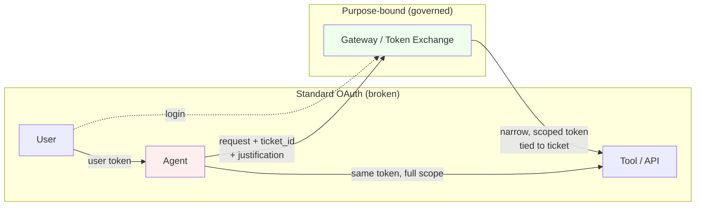

# Personal vs Enterprise MCP Stacks

## Your Two Tracks

You're solving two related but distinct problems:

1. **Personal Stack** - Your home lab, Claude Code workflow, convenience
2. **Enterprise Stack** - Role-based identity governance, audit, compliance

---

## Personal Stack (Home Lab)

### Goals
- Convenient
- Simple
- Secure (Tailscale-first)
- Powerful

### Architecture

```
┌─────────────────────────────────────────────────────────────┐
│                    YOUR MACHINE                              │
│  Claude Code ───────────────────────────────────────────────│
│       │                                                      │
└───────┼──────────────────────────────────────────────────────┘
        │ MCP / Git
        │
════════╪═══════════════════════════ Tailscale ════════════════
        │
┌───────┼──────────────────────────────────────────────────────┐
│       v              TRUENAS SCALE                           │
│  ┌─────────────┐  ┌─────────────┐  ┌─────────────┐          │
│  │   Gitea     │  │ MCPJungle   │  │  Neo4j +    │          │
│  │ (Git repo)  │  │ (Gateway)   │  │  Qdrant     │          │
│  └──────┬──────┘  └──────┬──────┘  │ (RAG Graph) │          │
│         │                │         └─────────────┘          │
└─────────┼────────────────┼──────────────────────────────────┘
          │                │
┌─────────┼────────────────┼──────────────────────────────────┐
│         v                v        HOME ASSISTANT VM          │
│  ┌─────────────┐  ┌─────────────┐                           │
│  │ Git Pull    │  │   HA MCP    │                           │
│  │  Add-on     │  │   Server    │                           │
│  └─────────────┘  └─────────────┘                           │
│                                                              │
│  Config: /config/*.yaml                                      │
└──────────────────────────────────────────────────────────────┘
```

### Components

| Layer | Tool | Purpose |
|-------|------|---------|
| **Config Mgmt** | Gitea + Git Pull Add-on | Review-before-deploy workflow |
| **MCP Gateway** | MCPJungle | Central visibility, tool registry |
| **Live Control** | HA MCP Server | Real-time device control |
| **RAG/Memory** | Neo4j + Qdrant | Knowledge graph for Claude |
| **Network** | Tailscale | Secure tunnel, no public exposure |

### Security Model
- **No SSH** to HA or TrueNAS
- **Git workflow** for config = audit trail + review
- **Bearer tokens** for MCP (sufficient with Tailscale)
- **MCPJungle** for visibility into what's connected

### Phase 1 (Start Here)
1. Install Gitea on TrueNAS
2. Set up Git Pull add-on on HA
3. Clone config locally, Claude edits, you push

### Phase 2 (Add Gateway)
1. Deploy MCPJungle on TrueNAS
2. Register HA MCP in gateway
3. Single endpoint for Claude

### Phase 3 (Add RAG)
1. Deploy Neo4j + Qdrant
2. Add GraphRAG MCP server
3. Start curating knowledge

---

## Enterprise Stack

### Goals
- Role-based access control (RBAC)
- Identity governance
- Audit/compliance
- Works in Microsoft environment

### Architecture

```
┌─────────────────────────────────────────────────────────────┐
│ SURFACES                                                     │
│ Teams / Portal / Cline / Claude Code                         │
├─────────────────────────────────────────────────────────────┤
│ ORCHESTRATION                                                │
│ Azure AI Foundry | Power Automate | n8n | LangGraph          │
├─────────────────────────────────────────────────────────────┤
│ MODEL GATEWAY                                                │
│ Azure APIM: allowlist, budget, DLP, logging                  │
├─────────────────────────────────────────────────────────────┤
│ MCP GATEWAY (Policy Enforcement Point)                       │
│ microsoft/mcp-gateway + OPA/Cedar + Entra ID                 │
├─────────────────────────────────────────────────────────────┤
│ MCP SERVERS                                                  │
│ Graph/SQL/ServiceNow with Managed Identity                   │
├─────────────────────────────────────────────────────────────┤
│ ASSETS                                                       │
│ M365, SharePoint, SQL, Data Lake                             │
├─────────────────────────────────────────────────────────────┤
│ OBSERVABILITY                                                │
│ OpenTelemetry → Azure Monitor / Sentinel / LangSmith         │
└─────────────────────────────────────────────────────────────┘
```

### Components

| Layer | Tool | Purpose |
|-------|------|---------|
| **Identity** | Entra ID + Managed Identity | No user masquerading |
| **Model Gateway** | Azure APIM | Cost, DLP, logging |
| **MCP Gateway** | microsoft/mcp-gateway | Tool-level RBAC |
| **Policy Engine** | OPA / Cedar | Fine-grained authorization |
| **Canvas** | Azure AI Foundry | Agent workflow design |
| **Observability** | LangSmith + Sentinel | Full trace correlation |

### Key Differences from Personal

| Aspect | Personal | Enterprise |
|--------|----------|------------|
| **Identity** | Bearer tokens | Entra ID + scopes |
| **Authorization** | Gateway allowlist | OPA/Cedar policies |
| **Agent Identity** | N/A | Service Principals |
| **Token Type** | Static | Purpose-bound |
| **Logging** | Optional | Mandatory + correlated |
| **Approvals** | You | Ticket ID required |

### The OAuth Problem

Standard OAuth doesn't work for agents:
- Agent masquerades as user
- Inherits ALL permissions
- Prompt injection = full user access

**Solution**: Purpose-bound tokens with:
- `ticket_id`
- `change_request`
- `justification`
- Scope-limited to specific tools



The narrow path attaches business context (ticket, justification) to every call — prompt injection can't widen scope it never had.

---

## Decision Matrix

| You Want... | Use... |
|-------------|--------|
| Quick home lab setup | Personal Stack Phase 1 |
| Central visibility | MCPJungle |
| Full enterprise governance | microsoft/mcp-gateway + Entra |
| Knowledge memory | Neo4j + Qdrant + Zep |
| Config management | Git workflow |

---

## Summary

**Personal**: Tailscale + Gitea + MCPJungle + (optional) RAG Graph

**Enterprise**: Entra ID + APIM + mcp-gateway + OPA + LangSmith

Start personal, learn patterns, then translate to enterprise when needed.
