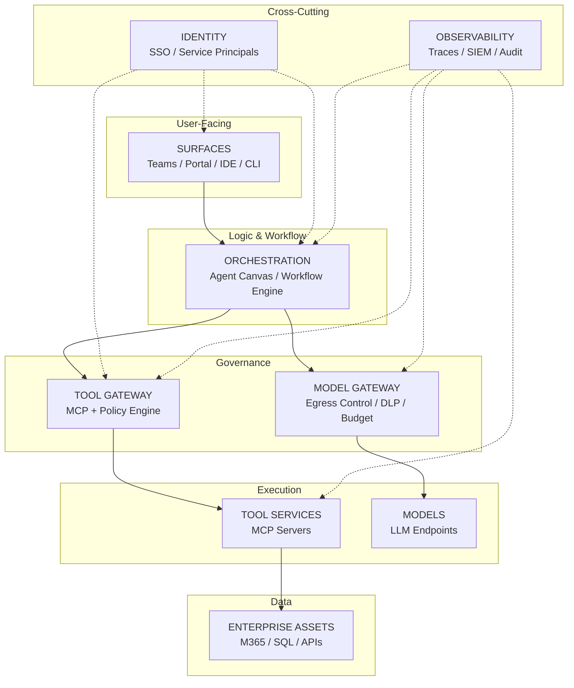
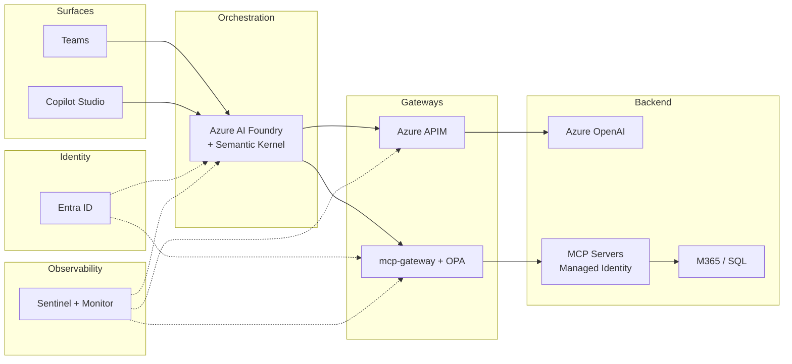
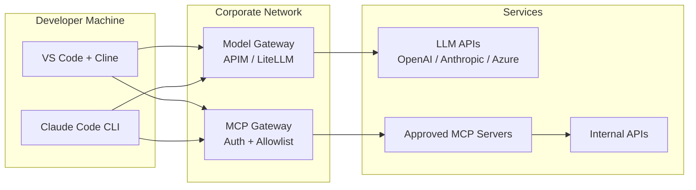
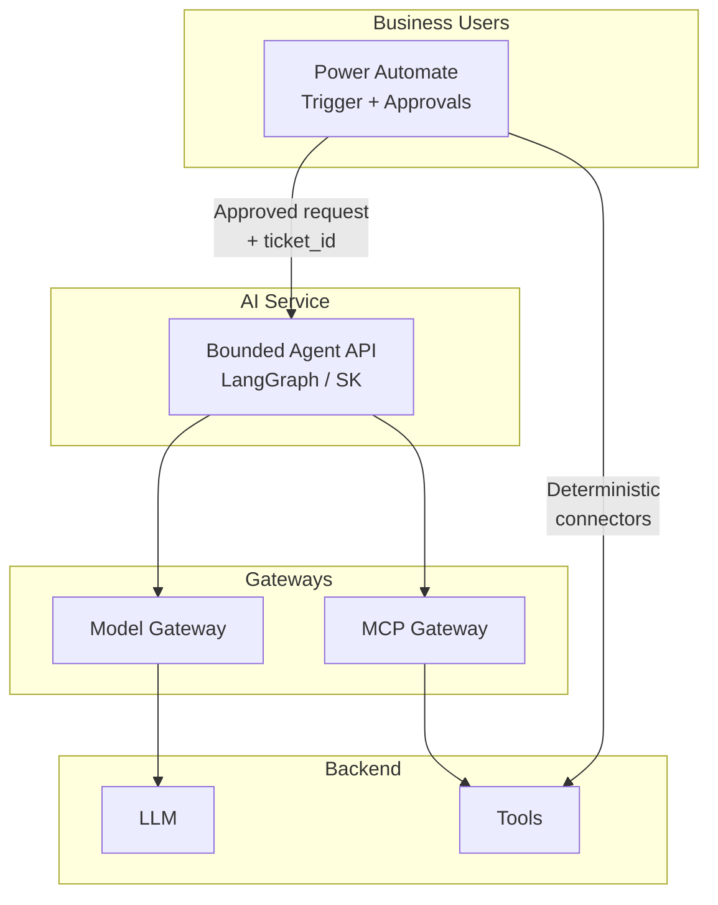
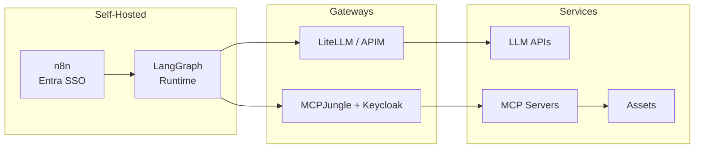
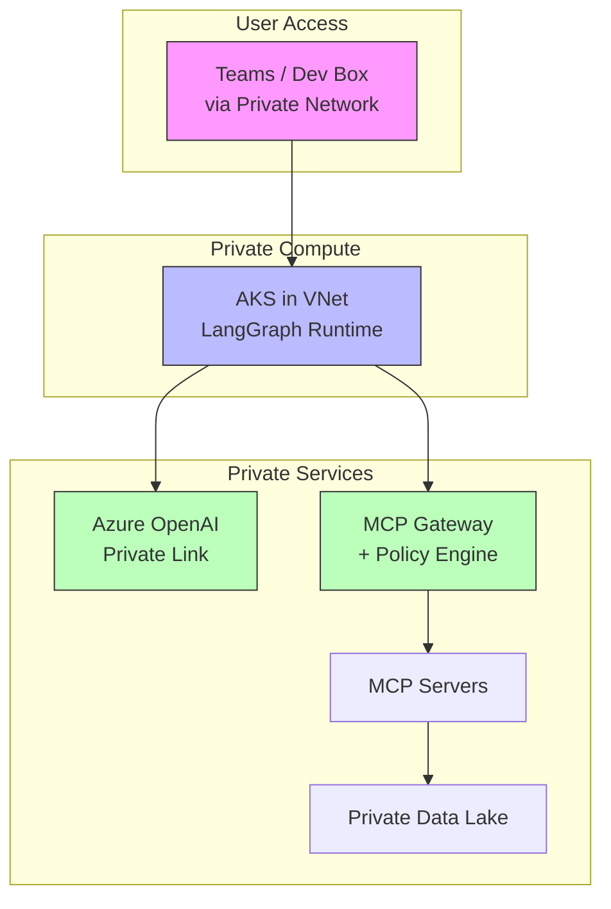

# Enterprise AI/MCP Reference Architecture

## Purpose

This document outlines high-level tech stacks for common enterprise settings, with visual diagrams and alternative technologies at each layer. Use this as a reference when designing governed AI agent deployments.

---

## The Fundamental Problem

**Standard OAuth 2.0 doesn't work for agentic AI:**

```
┌─────────────────────────────────────────────────────────────┐
│  WHAT HAPPENS WITH STANDARD OAUTH                           │
│                                                              │
│  User logs in ──► Agent gets user's token                   │
│                          │                                   │
│                          ▼                                   │
│                   Agent acts AS user                         │
│                   (inherits ALL permissions)                 │
│                          │                                   │
│                          ▼                                   │
│          Prompt injection = full user access                 │
│                                                              │
│  This is the "Confused Deputy" problem                       │
└─────────────────────────────────────────────────────────────┘
```

**What we need instead:**
- Agents with their own identity (Service Principals)
- Purpose-bound tokens (tied to ticket_id, justification)
- Tool-level authorization (not just "user can access")
- Full audit trail (who, what, why, when)

---

## The Universal Layer Model

Every enterprise AI deployment should consider these layers:



---

## Layer Breakdown with Alternatives

### Layer 1: Surfaces (User Entry Points)

| Category | Options | Notes |
|----------|---------|-------|
| **Chat/Portal** | Teams, Slack, Custom Portal, Copilot Studio | Where users interact |
| **IDE** | VS Code + Cline, Claude Code, Cursor, Continue | Developer surfaces |
| **CLI** | Claude Code, custom scripts | Automation/scripting |
| **Mobile** | Custom apps, systemprompt MCP | Emerging space |

### Layer 2: Orchestration (Agent Logic)

| Category | Microsoft | OSS/Hybrid | Notes |
|----------|-----------|------------|-------|
| **Agent Canvas** | Azure AI Foundry, Copilot Studio | n8n, Flowise | Visual workflow design |
| **Runtime** | Semantic Kernel | LangGraph, CrewAI, AutoGen | Where agent logic executes |
| **Workflow** | Power Automate, Logic Apps | n8n, Temporal | Approvals, connectors |

### Layer 3: Model Gateway (LLM Egress Control)

| Function | Options |
|----------|---------|
| **API Gateway** | Azure APIM, Kong, AWS API Gateway |
| **AI-Specific** | LiteLLM Proxy, Portkey, Helicone |
| **Controls** | Model allowlist, rate limits, cost caps, DLP scanning |

### Layer 4: Tool Gateway (MCP Policy Enforcement)

| Function | Options |
|----------|---------|
| **MCP Gateway** | microsoft/mcp-gateway, MCPJungle, MCP Auth Proxy |
| **Policy Engine** | OPA (Rego), Cedar, Casbin |
| **Token Exchange** | Entra ID, Keycloak, custom middleware |

### Layer 5: Tool Services (MCP Servers)

| Category | Examples |
|----------|----------|
| **M365** | Graph MCP, SharePoint MCP |
| **Databases** | SQL MCP, Neo4j MCP |
| **ITSM** | ServiceNow MCP, Jira MCP |
| **Custom** | Internal API wrappers |

### Layer 6: Identity (Cross-Cutting)

| Pattern | Implementation | Use Case |
|---------|---------------|----------|
| **User SSO** | Entra ID, Okta, Keycloak | User authentication |
| **Service Principal** | Entra App Registration, K8s Service Account | Agent identity |
| **OBO Flow** | Entra On-Behalf-Of | User-context actions |
| **Purpose-Bound** | Custom token claims | Audit/compliance |

### Layer 7: Observability (Cross-Cutting)

| Function | Options |
|----------|---------|
| **Tracing** | OpenTelemetry, LangSmith, Langfuse |
| **SIEM** | Microsoft Sentinel, Splunk, Elastic |
| **Audit** | Custom logging, compliance platforms |

---

## Common Enterprise Stacks

### Stack A: Microsoft-Native (Full Governance)



**Best For:** Microsoft shops, regulated industries, full audit requirements

**Key Components:**
- Identity: Entra ID + Managed Identities
- Orchestration: Azure AI Foundry + Semantic Kernel
- Model Gateway: Azure APIM
- Tool Gateway: microsoft/mcp-gateway + OPA
- Observability: Azure Monitor → Sentinel

---

### Stack B: Developer Productivity (Governed Endpoints)



**Best For:** Engineering teams needing AI coding assistants with guardrails

**Key Controls:**
- Endpoint: Intune/MDM pushes MCP config
- Network: Force LLM traffic through gateway
- Tools: Allowlist approved MCP servers only
- Audit: Log all tool invocations

**Safer Variant:** Run dev environments in Azure Dev Box / AVD

---

### Stack C: Workflow-First (Power Automate + AI Step)



**Best For:** Business process automation where AI is one step, not the whole flow

**Key Characteristics:**
- Approvals baked into workflow (Power Automate native)
- Agent is bounded/scoped, not autonomous
- Mix of deterministic connectors + probabilistic AI
- Clear audit trail via workflow history

---

### Stack D: OSS/Hybrid (n8n + LangGraph + Entra)



**Best For:** Teams wanting flexibility while maintaining Microsoft identity governance

**Requirements:**
- Self-host on AKS or VMs
- Enforce Entra SSO (n8n Enterprise feature)
- Restrict HTTP Request nodes
- Network egress controls

---

### Stack E: High-Security / Regulated



**Best For:** Financial services, healthcare, government

**Key Requirements:**
- No public egress
- Private Link for all services
- Ephemeral containers for code execution
- Data residency compliance
- HSM for key management

---

## Identity Patterns Deep Dive

### Pattern 1: Service Principal (Managed Identity)

```
Agent runs as its own identity
├── Has App Registration in Entra
├── Assigned only scopes it needs
├── No user token involved
└── Best for: Scheduled tasks, background processing
```

**Scopes Example:**
```
Tools.Read
Finance.Execute
HR.Sensitive
```

### Pattern 2: On-Behalf-Of (OBO)

```
User authenticates
├── User token sent to agent
├── Agent exchanges for OBO token
├── OBO token has reduced scope
└── Best for: "Check MY email" requests
```

**Token Flow:**
```
User Token ──► Gateway ──► OBO Exchange ──► Scoped Token ──► MCP Server
```

### Pattern 3: Purpose-Bound Tokens

```
Every tool call requires:
├── ticket_id (ServiceNow, Jira)
├── change_request (if modifying data)
├── justification (free text or enum)
└── Gateway enforces: no context = no access
```

**Token Claims:**
```json
{
  "sub": "agent-finance-bot",
  "scope": "Finance.Execute",
  "ticket_id": "INC0012345",
  "justification": "Monthly close reconciliation",
  "exp": 1735689600
}
```

---

## Decision Framework

### Question 1: Where does the agent loop run?

| Choice | Implications |
|--------|--------------|
| **Endpoint (Cline/Claude Code)** | User's machine, harder to control egress |
| **Server (LangGraph/SK)** | Central control, but more infrastructure |

### Question 2: Who holds privileges?

| Choice | Implications |
|--------|--------------|
| **User token (OBO)** | User-scoped actions, prompt injection = user access |
| **Service principal** | Agent-scoped, least privilege possible |

### Question 3: Where is policy enforced?

| Choice | Implications |
|--------|--------------|
| **Model gateway only** | Controls LLM access, not tool access |
| **Model + Tool gateway** | Full governance, more complexity |

### Question 4: What workflow UI is needed?

| Need | Solution |
|------|----------|
| **Approvals critical** | Power Automate, Temporal |
| **LLM-centric design** | Azure AI Foundry, Flowise |
| **General automation** | n8n, Make |

---

## Technology Alternatives Matrix

| Layer | Microsoft | OSS | Cloud-Agnostic |
|-------|-----------|-----|----------------|
| **Identity** | Entra ID | Keycloak, Authelia | Okta, Auth0 |
| **Orchestration** | Semantic Kernel | LangGraph, CrewAI | LangChain |
| **Canvas** | AI Foundry, Copilot Studio | n8n, Flowise | Retool |
| **Model Gateway** | Azure APIM | Kong, LiteLLM | Portkey |
| **Tool Gateway** | mcp-gateway | MCPJungle, custom | - |
| **Policy** | - | OPA, Cedar | Styra |
| **Tracing** | Azure Monitor | LangSmith, Langfuse | Datadog |
| **SIEM** | Sentinel | Elastic, Wazuh | Splunk |

---

## Common Mistakes to Avoid

1. **Giving agents user tokens directly**
   - Creates confused deputy vulnerability
   - Use OBO or service principals instead

2. **Logging only at LLM layer**
   - Miss tool invocations and downstream actions
   - Log at gateway AND tool level

3. **No tool-level authorization**
   - "User can access SharePoint" ≠ "Agent can access SharePoint"
   - Enforce per-tool scopes

4. **Skipping policy engine**
   - Allowlists are not enough
   - Need conditional logic (OPA/Cedar)

5. **Ignoring non-determinism in testing**
   - LLMs give different outputs each time
   - Test repeatedly, assess by impact not likelihood

---

## Next Steps

1. **Identify your stack pattern** (A-E above)
2. **Map your existing infrastructure** to layers
3. **Identify gaps** (especially Tool Gateway and Observability)
4. **Pilot with low-risk use case** before production
5. **Build muscle on identity patterns** (OBO, purpose-bound tokens)

See also:
- [WWHF 2025 Insights](../research/wwhf-2025-insights.md) - Security research context
- [MCP Gateway Options](../research/mcp-gateway-options.md) - Tool gateway comparison
- [Personal vs Enterprise Stacks](./08-personal-vs-enterprise-stacks.md) - Contrast with home lab
