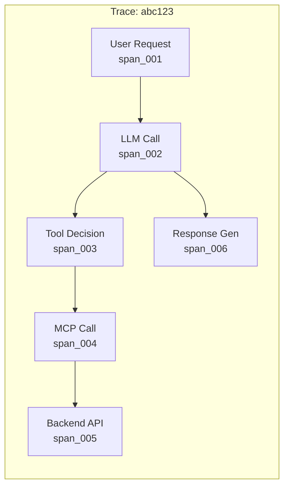
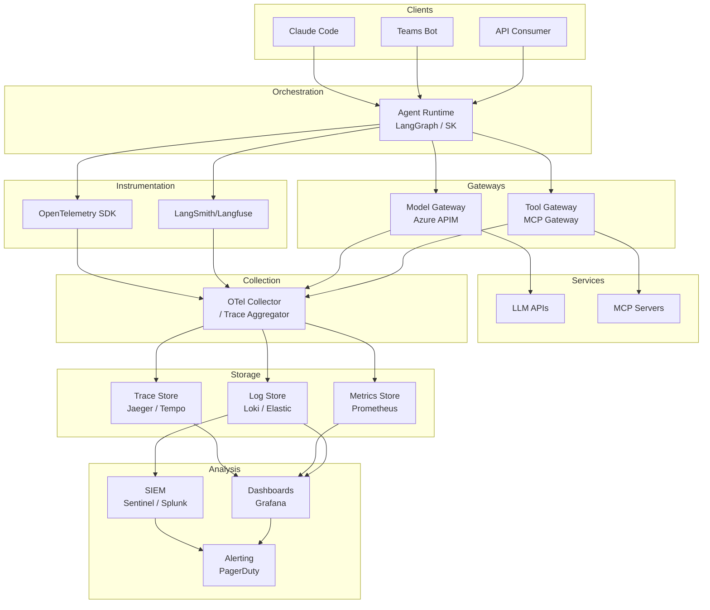
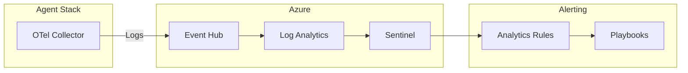

# Observability Architecture for AI Agents

## My Use Case

Enterprise AI deployments need complete visibility into what agents are doing. This isn't just about debugging—it's about:
- **Compliance** - Proving to auditors what happened
- **Security** - Detecting prompt injection or abuse
- **Operations** - Understanding cost, latency, failures
- **Business** - Measuring value and adoption

**Jake Williams insight:** "Log LLM inputs AND outputs... Include application context, not just LLM layer... Correlate: LLM request → MCP call → backend action"

---

## The Visibility Gap

### Where Most Organizations Are

```
┌────────────────────────────────────────────────────────────┐
│  TYPICAL LOGGING TODAY                                      │
│                                                             │
│  ┌─────────────┐   ┌─────────────┐   ┌─────────────┐       │
│  │ User Prompt │   │ LLM Call    │   │ Tool Call   │       │
│  │ "Summarize  │ → │ Logged?     │ → │ Logged?     │       │
│  │  my emails" │   │ Maybe...    │   │ Probably    │       │
│  └─────────────┘   │ (cost only) │   │ not...      │       │
│                    └─────────────┘   └─────────────┘       │
│                                                             │
│  RESULT: Can't answer "what did the agent actually do?"    │
└────────────────────────────────────────────────────────────┘
```

### Where We Need to Be

```
┌────────────────────────────────────────────────────────────┐
│  COMPLETE TRACE CORRELATION                                 │
│                                                             │
│  trace_id: abc123                                           │
│  ┌─────────────────────────────────────────────────────┐   │
│  │ span: user_request                                   │   │
│  │ • user: alice@contoso.com                           │   │
│  │ • prompt: "Summarize my emails from last week"      │   │
│  │ • timestamp: 2024-01-15T10:30:00Z                   │   │
│  └─────────────────────────────────────────────────────┘   │
│      │                                                      │
│      ▼                                                      │
│  ┌─────────────────────────────────────────────────────┐   │
│  │ span: llm_request                                    │   │
│  │ • model: gpt-4-turbo                                │   │
│  │ • input_tokens: 1,200                               │   │
│  │ • output_tokens: 800                                │   │
│  │ • tool_calls_planned: ["email_search", "email_read"]│   │
│  └─────────────────────────────────────────────────────┘   │
│      │                                                      │
│      ▼                                                      │
│  ┌─────────────────────────────────────────────────────┐   │
│  │ span: mcp_tool_call (email_search)                   │   │
│  │ • tool: email_search                                │   │
│  │ • parameters: {query: "from:* after:2024-01-08"}    │   │
│  │ • result: 47 emails found                           │   │
│  │ • gateway_decision: ALLOW                           │   │
│  └─────────────────────────────────────────────────────┘   │
│      │                                                      │
│      ▼                                                      │
│  ┌─────────────────────────────────────────────────────┐   │
│  │ span: backend_api_call                               │   │
│  │ • service: Microsoft Graph                          │   │
│  │ • endpoint: /me/messages                            │   │
│  │ • status: 200                                       │   │
│  │ • latency_ms: 340                                   │   │
│  └─────────────────────────────────────────────────────┘   │
│                                                             │
│  RESULT: Full chain of custody for every action            │
└────────────────────────────────────────────────────────────┘
```

---

## The Three Pillars

### 1. Traces (What Happened)

**Distributed tracing across the entire agent execution path.**



**Key Attributes per Span:**

| Span Type | Required Attributes |
|-----------|---------------------|
| `user_request` | user_id, session_id, prompt_hash, timestamp |
| `llm_request` | model, input_tokens, output_tokens, temperature |
| `llm_response` | response_hash, tool_calls, finish_reason |
| `gateway_decision` | tool, decision, policy_version, constraints |
| `mcp_tool_call` | tool, parameters, result_status, latency |
| `backend_api` | service, endpoint, method, status, latency |

### 2. Metrics (How It's Performing)

**Aggregated measurements for operations and cost.**

```
┌─────────────────────────────────────────────────────────────┐
│  OPERATIONAL METRICS                                         │
├─────────────────────────────────────────────────────────────┤
│  • llm_requests_total{model, agent, status}                 │
│  • llm_tokens_total{model, type=input|output}               │
│  • mcp_tool_calls_total{tool, agent, decision}              │
│  • mcp_tool_latency_seconds{tool}                           │
│  • agent_sessions_active{agent}                             │
│  • gateway_decisions_total{tool, decision, policy}          │
└─────────────────────────────────────────────────────────────┘

┌─────────────────────────────────────────────────────────────┐
│  COST METRICS                                                │
├─────────────────────────────────────────────────────────────┤
│  • llm_cost_dollars{model, agent, department}               │
│  • api_calls_total{service, endpoint}                       │
│  • cost_per_session_dollars{agent}                          │
└─────────────────────────────────────────────────────────────┘

┌─────────────────────────────────────────────────────────────┐
│  SECURITY METRICS                                            │
├─────────────────────────────────────────────────────────────┤
│  • gateway_denials_total{tool, reason}                      │
│  • prompt_shield_triggers_total{category}                   │
│  • suspicious_patterns_detected{pattern}                    │
└─────────────────────────────────────────────────────────────┘
```

### 3. Logs (Why It Happened)

**Structured logs with full context for debugging and audit.**

```json
{
  "timestamp": "2024-01-15T10:30:00.123Z",
  "level": "INFO",
  "trace_id": "abc123",
  "span_id": "span_004",

  "event": "mcp_tool_call",
  "message": "Tool call executed successfully",

  "context": {
    "user": "alice@contoso.com",
    "agent": "agent-email-summarizer",
    "session": "sess_789"
  },

  "tool": {
    "name": "email_search",
    "parameters": {
      "query": "from:* after:2024-01-08"
    },
    "result": {
      "status": "success",
      "count": 47
    }
  },

  "gateway": {
    "decision": "ALLOW",
    "policy_version": "v1.2.3",
    "constraints_checked": ["read_only", "user_mailbox_only"]
  },

  "performance": {
    "latency_ms": 340,
    "queue_time_ms": 12
  }
}
```

---

## Architecture Diagram



---

## Instrumentation Layers

### Layer 1: Agent Runtime

**Where:** LangGraph, Semantic Kernel, or custom orchestrator

```python
# LangGraph with OpenTelemetry
from opentelemetry import trace
from opentelemetry.trace import SpanKind

tracer = trace.get_tracer("agent-runtime")

@tracer.start_as_current_span("agent_invoke", kind=SpanKind.SERVER)
async def invoke_agent(user_prompt: str, user_context: dict):
    span = trace.get_current_span()
    span.set_attribute("user.id", user_context["user_id"])
    span.set_attribute("user.prompt_hash", hash_prompt(user_prompt))
    span.set_attribute("agent.id", AGENT_ID)

    # LLM call
    with tracer.start_span("llm_request") as llm_span:
        response = await call_llm(user_prompt)
        llm_span.set_attribute("llm.model", response.model)
        llm_span.set_attribute("llm.input_tokens", response.usage.input)
        llm_span.set_attribute("llm.output_tokens", response.usage.output)

    # Tool calls
    for tool_call in response.tool_calls:
        with tracer.start_span("tool_call") as tool_span:
            tool_span.set_attribute("tool.name", tool_call.name)
            result = await execute_tool(tool_call)
            tool_span.set_attribute("tool.status", result.status)

    return response
```

### Layer 2: Model Gateway

**Where:** Azure APIM, LiteLLM Proxy, or custom gateway

```yaml
# Azure APIM Policy for logging
<inbound>
    <set-variable name="trace_id" value="@(context.RequestId)" />
    <log-to-eventhub logger-id="llm-logs">
    @{
        return new JObject(
            new JProperty("timestamp", DateTime.UtcNow),
            new JProperty("trace_id", context.Variables["trace_id"]),
            new JProperty("model", context.Request.MatchedParameters["model"]),
            new JProperty("user", context.Request.Headers.GetValueOrDefault("X-User-Id", "unknown")),
            new JProperty("agent", context.Request.Headers.GetValueOrDefault("X-Agent-Id", "unknown")),
            new JProperty("input_tokens", context.Request.Body.As<JObject>()["usage"]?["input_tokens"])
        ).ToString();
    }
    </log-to-eventhub>
</inbound>
```

### Layer 3: Tool Gateway

**Where:** MCP Gateway with policy engine

```python
# MCP Gateway instrumentation
class InstrumentedGateway:
    def __init__(self, policy_engine, tracer):
        self.policy = policy_engine
        self.tracer = tracer

    async def handle_tool_call(self, request):
        with self.tracer.start_span("gateway_decision") as span:
            span.set_attribute("tool.name", request.tool)
            span.set_attribute("agent.id", request.agent_id)
            span.set_attribute("user.id", request.user_context.user_id)

            # Policy evaluation
            decision = await self.policy.evaluate(request)
            span.set_attribute("gateway.decision", decision.action)
            span.set_attribute("gateway.policy_version", decision.policy_version)
            span.set_attribute("gateway.matched_rule", decision.rule_id)

            if decision.action == "DENY":
                span.set_attribute("gateway.deny_reason", decision.reason)
                raise ToolAccessDenied(decision.reason)

            # Forward to MCP server
            with self.tracer.start_span("mcp_forward") as mcp_span:
                result = await self.forward_to_mcp(request)
                mcp_span.set_attribute("mcp.status", result.status)
                mcp_span.set_attribute("mcp.latency_ms", result.latency)

            return result
```

### Layer 4: MCP Servers

**Where:** Individual MCP server implementations

```python
# MCP Server instrumentation
from opentelemetry import trace

tracer = trace.get_tracer("mcp-server-email")

@tracer.start_as_current_span("email_search")
async def email_search(query: str, context: dict):
    span = trace.get_current_span()
    span.set_attribute("email.query", query)

    # Backend API call
    with tracer.start_span("graph_api_call") as api_span:
        api_span.set_attribute("api.service", "Microsoft Graph")
        api_span.set_attribute("api.endpoint", "/me/messages")

        results = await graph_client.search_messages(query)

        api_span.set_attribute("api.status", 200)
        api_span.set_attribute("api.result_count", len(results))

    span.set_attribute("email.result_count", len(results))
    return results
```

---

## LangSmith Integration

**Jake Williams specifically recommended LangSmith for visibility.**

### Why LangSmith

```
┌─────────────────────────────────────────────────────────────┐
│  LANGSMITH CAPABILITIES                                      │
├─────────────────────────────────────────────────────────────┤
│  • Automatic LangChain/LangGraph tracing                    │
│  • Full prompt/response capture                             │
│  • Latency breakdown per step                               │
│  • Token usage tracking                                     │
│  • Error tracking and debugging                             │
│  • Evaluation and scoring                                   │
└─────────────────────────────────────────────────────────────┘
```

### Setup

```bash
# Environment variables
export LANGCHAIN_TRACING_V2=true
export LANGCHAIN_API_KEY=your_key
export LANGCHAIN_PROJECT=production-agents
```

```python
# Automatic tracing for LangGraph
from langgraph.graph import StateGraph

# Any LangGraph execution automatically traced
graph = StateGraph(AgentState)
# ... define graph ...
result = await graph.invoke(initial_state)
# ^ This is fully traced in LangSmith
```

### Self-Hosted Alternative: Langfuse

```yaml
# docker-compose.yml for Langfuse
version: '3.8'
services:
  langfuse:
    image: langfuse/langfuse:latest
    ports:
      - "3000:3000"
    environment:
      - DATABASE_URL=postgresql://langfuse:password@db:5432/langfuse
      - NEXTAUTH_SECRET=your_secret
      - SALT=your_salt
    depends_on:
      - db

  db:
    image: postgres:15
    environment:
      - POSTGRES_USER=langfuse
      - POSTGRES_PASSWORD=password
      - POSTGRES_DB=langfuse
    volumes:
      - langfuse_data:/var/lib/postgresql/data

volumes:
  langfuse_data:
```

---

## SIEM Integration

### Log Forwarding to Sentinel



### Custom Table Schema

```kql
// Log Analytics custom table: AgentActivity_CL

// Query: Find all tool calls for a user in last 24h
AgentActivity_CL
| where TimeGenerated > ago(24h)
| where user_id_s == "alice@contoso.com"
| where event_s == "mcp_tool_call"
| project TimeGenerated, agent_id_s, tool_name_s, decision_s, latency_d
| order by TimeGenerated desc
```

### Detection Rules

```kql
// Rule: Unusual tool access pattern
let baseline = AgentActivity_CL
| where TimeGenerated between (ago(30d) .. ago(1d))
| where decision_s == "ALLOW"
| summarize baseline_count = count() by agent_id_s, tool_name_s, bin(TimeGenerated, 1h)
| summarize avg_count = avg(baseline_count), stdev_count = stdev(baseline_count)
  by agent_id_s, tool_name_s;

AgentActivity_CL
| where TimeGenerated > ago(1h)
| where decision_s == "ALLOW"
| summarize current_count = count() by agent_id_s, tool_name_s
| join kind=inner baseline on agent_id_s, tool_name_s
| where current_count > avg_count + (3 * stdev_count)
| project agent_id_s, tool_name_s, current_count, avg_count, stdev_count
```

```kql
// Rule: Gateway denials spike
AgentActivity_CL
| where TimeGenerated > ago(1h)
| where decision_s == "DENY"
| summarize denial_count = count() by agent_id_s, user_id_s, deny_reason_s
| where denial_count > 10
```

```kql
// Rule: Potential prompt injection (unusual tool sequence)
AgentActivity_CL
| where TimeGenerated > ago(1h)
| where event_s == "mcp_tool_call"
| summarize tools_used = make_set(tool_name_s) by trace_id_s, agent_id_s
| where array_length(tools_used) > 5  // Unusual breadth of tools
| where tools_used has "email_send" and tools_used has "file_write"  // Exfil pattern
```

---

## Alerting Strategy

### Severity Levels

| Severity | Condition | Response |
|----------|-----------|----------|
| **Critical** | Gateway bypass attempt | Immediate page, block agent |
| **High** | Unusual data access pattern | Alert SOC, investigate within 1h |
| **Medium** | Repeated gateway denials | Notify agent owner, review within 24h |
| **Low** | Latency degradation | Ops ticket, review next business day |

### Alert Examples

```yaml
# PagerDuty / Opsgenie alert definition
alerts:
  - name: gateway_bypass_attempt
    severity: critical
    condition: |
      event_type == "gateway_decision"
      AND decision == "DENY"
      AND subsequent_backend_call == true
    response: "Agent bypassed gateway. Immediately revoke agent credentials."

  - name: mass_data_access
    severity: high
    condition: |
      event_type == "mcp_tool_call"
      AND tool IN ["sql_query", "file_read"]
      AND result_count > 1000
      AND time_window < 5m
    response: "Large data extraction detected. Investigate for exfiltration."

  - name: unusual_off_hours_access
    severity: medium
    condition: |
      event_type == "mcp_tool_call"
      AND hour_of_day NOT BETWEEN 6 AND 22
      AND user_timezone_adjusted == true
    response: "Agent access outside business hours. Verify legitimacy."
```

---

## Dashboard Design

### Executive Dashboard

```
┌─────────────────────────────────────────────────────────────────┐
│  AI AGENT OPERATIONS - EXECUTIVE VIEW                           │
├─────────────────────────────────────────────────────────────────┤
│                                                                  │
│  ┌──────────────┐  ┌──────────────┐  ┌──────────────┐           │
│  │ Active       │  │ Daily        │  │ Monthly      │           │
│  │ Sessions     │  │ Requests     │  │ Cost         │           │
│  │   1,247      │  │   45,892     │  │   $12,340    │           │
│  └──────────────┘  └──────────────┘  └──────────────┘           │
│                                                                  │
│  ┌────────────────────────────────────────────────────────┐     │
│  │  Cost by Department                                     │     │
│  │  ████████████████ Engineering    $5,400                │     │
│  │  ███████████      Finance        $3,200                │     │
│  │  ████████         Sales          $2,100                │     │
│  │  █████            HR             $1,640                │     │
│  └────────────────────────────────────────────────────────┘     │
│                                                                  │
└─────────────────────────────────────────────────────────────────┘
```

### Security Dashboard

```
┌─────────────────────────────────────────────────────────────────┐
│  AI AGENT SECURITY - LAST 24 HOURS                              │
├─────────────────────────────────────────────────────────────────┤
│                                                                  │
│  ┌──────────────┐  ┌──────────────┐  ┌──────────────┐           │
│  │ Gateway      │  │ Prompt       │  │ Anomalies    │           │
│  │ Denials      │  │ Shield       │  │ Detected     │           │
│  │   127        │  │   Triggers   │  │   3          │           │
│  │   ↑12%       │  │   42         │  │   ⚠️         │           │
│  └──────────────┘  └──────────────┘  └──────────────┘           │
│                                                                  │
│  ┌────────────────────────────────────────────────────────┐     │
│  │  Gateway Denials by Reason                              │     │
│  │  ████████████████ Missing purpose context  (67)        │     │
│  │  ████████████     Scope exceeded           (34)        │     │
│  │  ██████           Tool not allowed         (18)        │     │
│  │  ███              Rate limited             (8)         │     │
│  └────────────────────────────────────────────────────────┘     │
│                                                                  │
│  ┌────────────────────────────────────────────────────────┐     │
│  │  Recent Anomalies                                       │     │
│  │  10:45 - agent-hr-bot accessed 500+ records (HIGH)     │     │
│  │  09:30 - agent-sales accessed Finance tools (MEDIUM)   │     │
│  │  08:15 - Unusual tool sequence detected (MEDIUM)       │     │
│  └────────────────────────────────────────────────────────┘     │
│                                                                  │
└─────────────────────────────────────────────────────────────────┘
```

### Operations Dashboard

```
┌─────────────────────────────────────────────────────────────────┐
│  AI AGENT OPERATIONS - REAL-TIME                                │
├─────────────────────────────────────────────────────────────────┤
│                                                                  │
│  ┌────────────────────────────────────────────────────────┐     │
│  │  Requests per Second                                    │     │
│  │                                                         │     │
│  │  50 ─┬────────────────────────────────────────────────│     │
│  │  40 ─┤         ╭─╮    ╭──╮                             │     │
│  │  30 ─┤    ╭───╯  ╰───╯   ╰──╮                         │     │
│  │  20 ─┤───╯                   ╰────────────────────────│     │
│  │  10 ─┤                                                 │     │
│  │   0 ─┴───────────────────────────────────────────────│     │
│  │       10:00     10:15     10:30     10:45     11:00   │     │
│  └────────────────────────────────────────────────────────┘     │
│                                                                  │
│  ┌─────────────────────┐  ┌─────────────────────┐               │
│  │  P50 Latency        │  │  P99 Latency        │               │
│  │     230ms           │  │     1,240ms         │               │
│  └─────────────────────┘  └─────────────────────┘               │
│                                                                  │
│  ┌────────────────────────────────────────────────────────┐     │
│  │  Top Tools by Call Volume                               │     │
│  │  1. email_search     ████████████████████  (4,200)     │     │
│  │  2. file_read        ██████████████        (3,100)     │     │
│  │  3. sql_query        █████████             (2,000)     │     │
│  │  4. sharepoint_list  ███████               (1,600)     │     │
│  └────────────────────────────────────────────────────────┘     │
│                                                                  │
└─────────────────────────────────────────────────────────────────┘
```

---

## Implementation Checklist

### Phase 1: Foundation
- [ ] Deploy OpenTelemetry Collector
- [ ] Instrument agent runtime with OTel SDK
- [ ] Establish trace_id propagation across services
- [ ] Set up basic log aggregation (Loki/Elastic)

### Phase 2: Gateway Instrumentation
- [ ] Add tracing to Model Gateway
- [ ] Add tracing to Tool Gateway
- [ ] Correlate gateway decisions with traces
- [ ] Log all policy evaluations

### Phase 3: LangSmith/Langfuse
- [ ] Enable automatic LangChain tracing
- [ ] Configure project/environment separation
- [ ] Set up evaluation pipelines
- [ ] Create debugging workflows

### Phase 4: SIEM Integration
- [ ] Forward logs to Sentinel/Splunk
- [ ] Create custom log schemas
- [ ] Build detection rules
- [ ] Configure alerting

### Phase 5: Dashboards
- [ ] Executive cost/adoption dashboard
- [ ] Security anomaly dashboard
- [ ] Operations real-time dashboard
- [ ] Per-agent detail views

---

## See Also

- [Identity Governance Patterns](./10-identity-governance-patterns.md) - Audit logging requirements
- [Enterprise Reference Architecture](./09-enterprise-reference-architecture.md) - Observability layer
- [WWHF 2025 Insights](../research/wwhf-2025-insights.md) - Jake Williams on logging
