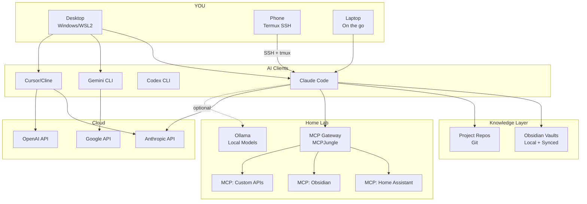
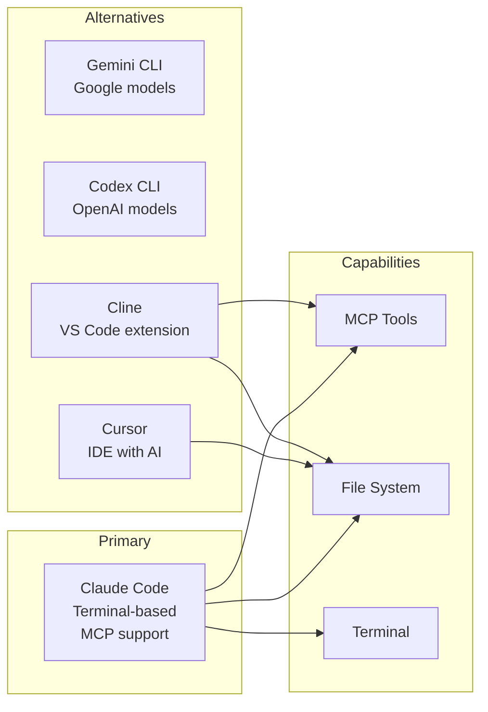
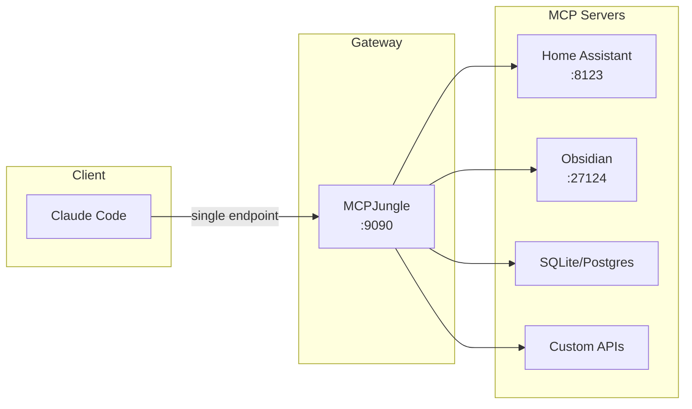
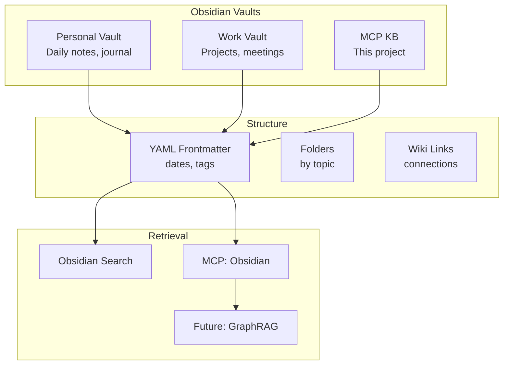
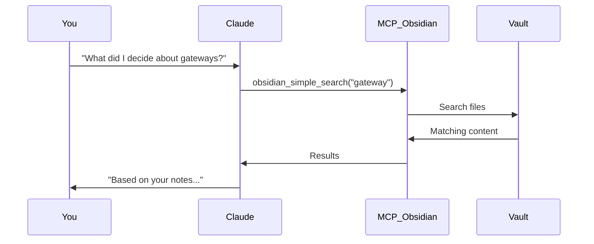
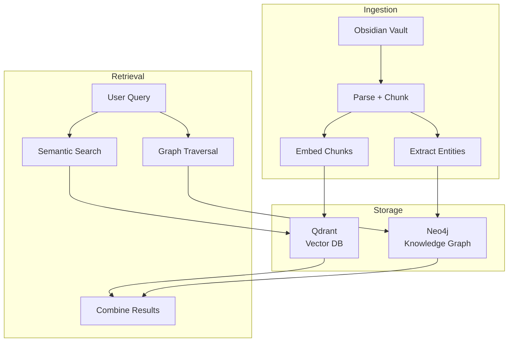
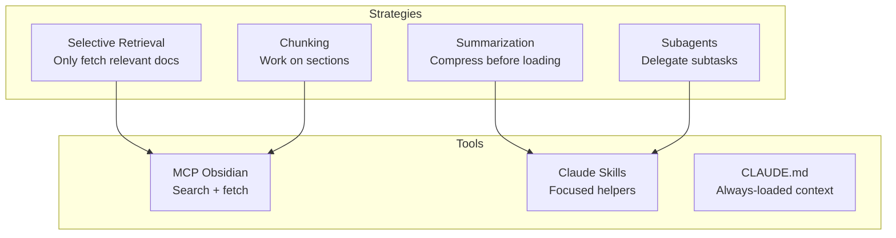
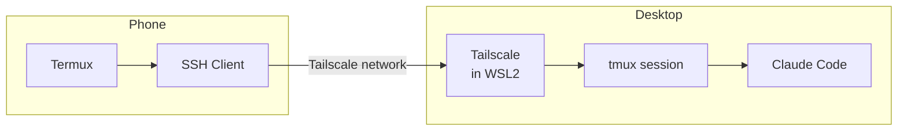

# Personal AI Architecture

## The Big Picture



---

## Where Things Live

### Decision: Knowledge Base Location

```
┌─────────────────────────────────────────────────────────────────┐
│  OPTION A: Local Desktop + Duplicati Backup (RECOMMENDED)       │
├─────────────────────────────────────────────────────────────────┤
│                                                                  │
│  C:\Users\You\Documents\                                         │
│  ├── Obsidian Vaults/                                           │
│  │   ├── personal-vault/                                        │
│  │   ├── work-vault/                                            │
│  │   └── mcp-kb/          ← This project                        │
│  └── Projects/                                                   │
│      └── repos/                                                  │
│                                                                  │
│  Backup: Duplicati → NAS or cloud                               │
│                                                                  │
│  ✅ Fast local access                                            │
│  ✅ Claude Code works natively                                   │
│  ✅ No path translation issues                                   │
│  ✅ Obsidian works directly                                      │
│  ⚠️  Need backup discipline                                      │
│                                                                  │
└─────────────────────────────────────────────────────────────────┘

┌─────────────────────────────────────────────────────────────────┐
│  OPTION B: SMB Share (PROBLEMATIC)                              │
├─────────────────────────────────────────────────────────────────┤
│                                                                  │
│  \\NAS\documents\vaults\                                        │
│                                                                  │
│  ❌ Path issues with Claude Code / MCP tools                    │
│  ❌ Network latency on file operations                          │
│  ❌ Obsidian can be slow                                        │
│  ✅ Centralized, always backed up                               │
│                                                                  │
└─────────────────────────────────────────────────────────────────┘

┌─────────────────────────────────────────────────────────────────┐
│  OPTION C: Git Repo (FOR CODE, NOT NOTES)                       │
├─────────────────────────────────────────────────────────────────┤
│                                                                  │
│  Good for: This MCP project, code, configs                      │
│  Bad for: Daily notes, media-heavy vaults                       │
│                                                                  │
│  ✅ Version control                                              │
│  ✅ Sync across machines                                         │
│  ⚠️  Friction for quick notes                                    │
│  ❌ Binary files (images) bloat repo                            │
│                                                                  │
└─────────────────────────────────────────────────────────────────┘

┌─────────────────────────────────────────────────────────────────┐
│  OPTION D: Obsidian Sync / Syncthing                            │
├─────────────────────────────────────────────────────────────────┤
│                                                                  │
│  Good for: Multi-device access to same vault                    │
│                                                                  │
│  ✅ Seamless sync                                                │
│  ✅ Works with mobile                                            │
│  ⚠️  Obsidian Sync = paid                                        │
│  ⚠️  Syncthing = self-managed                                    │
│                                                                  │
└─────────────────────────────────────────────────────────────────┘
```

**Recommendation:** Local desktop + Duplicati backup for primary work. Git for code/config projects. Obsidian Sync or Syncthing for vaults you need on mobile.

---

## Component Breakdown

### AI Clients



| Client | MCP Support | Best For |
|--------|-------------|----------|
| **Claude Code** | ✅ Native | Terminal work, automation, MCP integration |
| **Cline** | ✅ Via config | VS Code users, visual diff |
| **Cursor** | ❌ | IDE-centric coding |
| **Gemini CLI** | ⚠️ Limited | Google ecosystem |
| **Codex CLI** | ⚠️ Limited | OpenAI ecosystem |

### MCP Gateway (MCPJungle)



**Why a gateway?**
- Single endpoint for Claude Code config
- Visibility into all tool calls
- Add/remove MCP servers without reconfiguring client
- Future: auth, rate limiting

### Knowledge Storage



---

## RAG / Retrieval Strategy

### Current: MCP-Based Retrieval



**Pros:** Simple, works now, no extra infra
**Cons:** Keyword-based, no semantic understanding

### Future: GraphRAG



**GraphRAG adds:**
- Entity relationships (people, projects, decisions)
- Multi-hop reasoning ("What did Jake Williams say about identity that relates to our MCP setup?")
- Better context selection

**Components needed:**
- Qdrant (vector store) - runs on TrueNAS
- Neo4j (graph DB) - runs on TrueNAS
- Embedding model - Ollama or API
- MCP server for RAG queries

---

## Context Window Constraints

### The Problem

```
┌─────────────────────────────────────────────────────────────────┐
│  CONTEXT WINDOW REALITY                                          │
│                                                                  │
│  Claude: ~200K tokens                                            │
│  Gemini: ~1M tokens (but quality degrades)                       │
│  GPT-4: ~128K tokens                                             │
│                                                                  │
│  Your Obsidian vault: 50MB+ of text = millions of tokens        │
│                                                                  │
│  You can't just "load everything"                                │
└─────────────────────────────────────────────────────────────────┘
```

### Solutions



**See:** [Context Management Guide](../tools/context-management.md)

---

## File System Layout

### Recommended Structure

```
C:\Users\You\Documents\
├── Obsidian Vaults/
│   ├── personal/                    # Daily notes, journal
│   ├── work/                        # Work projects
│   └── mcp-workflow/                # This KB (or in Projects)
│
├── Projects/
│   ├── mcp-workflow-and-tech-stack/ # This repo (Git)
│   ├── home-assistant-projects/     # HA configs
│   └── other-repos/
│
└── .claude/                         # Claude Code config
    └── mcp_servers.json             # MCP server definitions
```

### WSL2 Consideration

```
Windows path: C:\Users\You\Documents\Projects\
WSL2 path:    /mnt/c/Users/You/Documents/Projects/

⚠️ Claude Code in WSL2 sees /mnt/c/ paths
⚠️ SSH keys must be in WSL2 home (~/.ssh), not /mnt/c/
```

---

## Phone Access



**Setup:** [WSL2 + Tailscale + SSH + tmux Guide](../personal-workflow/wsl2-tailscale-ssh-tmux.md)

---

## Optional Components

| Component | Purpose | When to Add |
|-----------|---------|-------------|
| **MCPJungle** | Gateway for multiple MCP servers | When you have 3+ MCP servers |
| **Ollama** | Local models | Privacy, offline work, cost savings |
| **Neo4j + Qdrant** | GraphRAG | When simple search isn't enough |
| **Gitea** | Self-hosted Git | For HA config review workflow |
| **n8n** | Workflow automation | Complex multi-step automations |

---

## Quick Start Checklist

### Minimal Setup
- [ ] Claude Code installed
- [ ] Obsidian vault in local Documents
- [ ] CLAUDE.md in project root
- [ ] Tailscale on desktop + phone (for remote access)

### Enhanced Setup
- [ ] MCP Obsidian server configured
- [ ] MCPJungle gateway on TrueNAS
- [ ] Home Assistant MCP registered
- [ ] Duplicati backup configured

### Advanced Setup
- [ ] GraphRAG (Neo4j + Qdrant) deployed
- [ ] Ollama for local inference
- [ ] Custom MCP servers for your APIs

---

## See Also

- [Enterprise Architecture](13-enterprise-architecture.md) - How this differs at work
- [Context Management Guide](../tools/context-management.md) - Working within LLM limits
- [MCP Gateway Options](../research/mcp-gateway-options.md) - Gateway comparison
- [RAG Graph Architecture](../research/rag-graph-architecture.md) - GraphRAG details
