# Enterprise AI Architecture

## The Big Picture

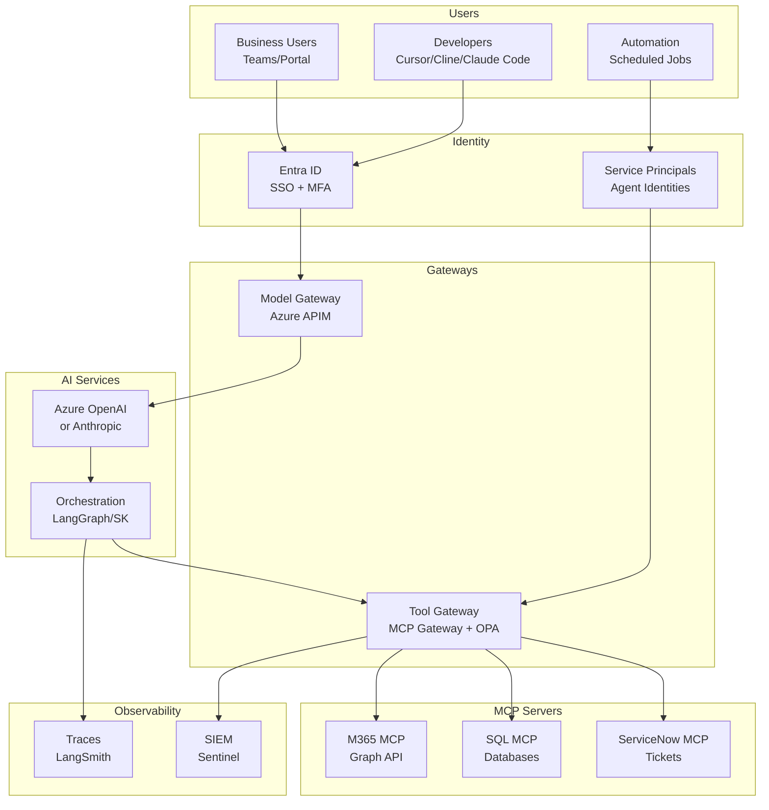

---

## The Core Problem: Identity

### Why Standard OAuth Fails for Agents

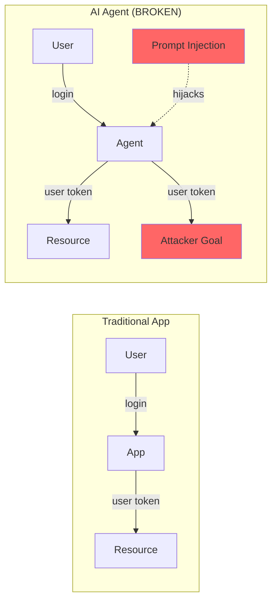

**The "Confused Deputy" Problem:**
- Agent inherits user's full permissions
- Prompt injection = agent does attacker's bidding with user's access
- Traditional RBAC doesn't help

### The Solution: Layered Identity

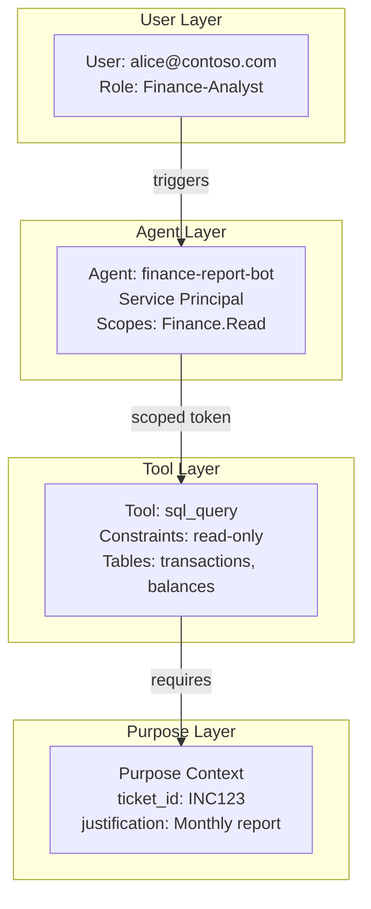

---

## Developer Access Pattern

### How Developers Use AI Coding Assistants

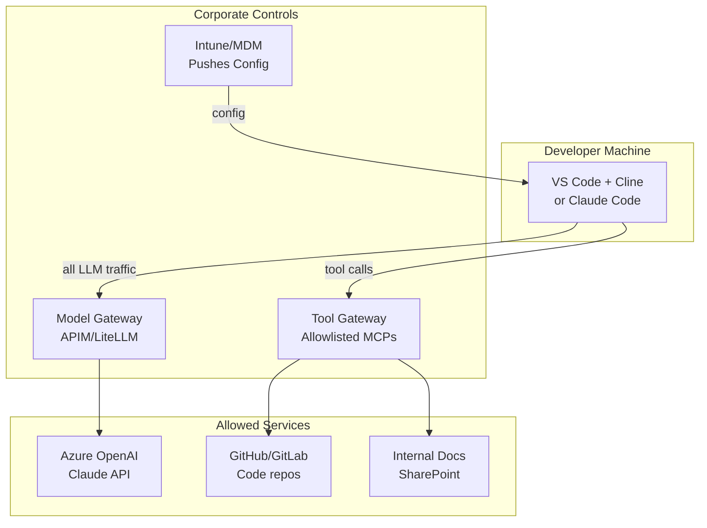

### Developer Controls

| Control | Implementation | Purpose |
|---------|---------------|---------|
| **Endpoint config** | Intune pushes MCP config | Only approved MCP servers |
| **Model gateway** | Force traffic through APIM | DLP, cost tracking, logging |
| **Tool allowlist** | Gateway blocks unapproved tools | Prevent shadow AI tools |
| **No production access** | Agents can't reach prod via MCP | Blast radius limitation |

### Claude Code in Enterprise

```yaml
# ~/.claude/mcp_servers.json (pushed by MDM)
{
  "servers": {
    "github": {
      "command": "npx",
      "args": ["-y", "@modelcontextprotocol/server-github"],
      "env": {
        "GITHUB_TOKEN": "${GITHUB_TOKEN}"  # From corp SSO
      }
    },
    "internal-docs": {
      "url": "https://mcp-gateway.corp.com/docs",
      "auth": "entra"  # SSO integration
    }
  }
}
```

---

## Business User Access Pattern

### Teams Bot / Portal

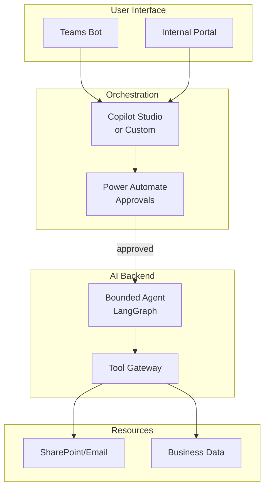

### Key Difference from Developers

| Aspect | Developers | Business Users |
|--------|-----------|----------------|
| **Surface** | CLI/IDE | Teams/Portal |
| **Agent type** | General coding assistant | Purpose-built bot |
| **Tools** | File system, Git, shell | Specific business actions |
| **Approval flow** | Optional | Often required |

---

## RBAC for MCP Tools

### Layered Authorization

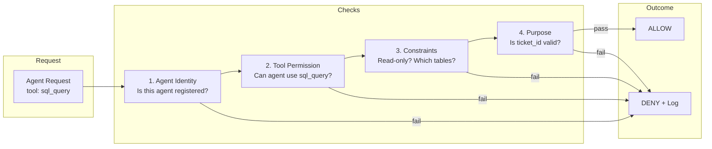

### Policy Definition (OPA/Rego)

```rego
package mcp.authz

default allow = false

# Agent must be registered
allow {
    agent_registered(input.agent_id)
    agent_has_tool(input.agent_id, input.tool)
    constraints_satisfied(input.agent_id, input.tool, input.parameters)
    purpose_valid(input.purpose)
}

agent_has_tool(agent, tool) {
    role := data.agents[agent].roles[_]
    tool == data.roles[role].tools[_].name
}

constraints_satisfied(agent, tool, params) {
    role := data.agents[agent].roles[_]
    tool_def := data.roles[role].tools[_]
    tool_def.name == tool
    check_constraints(tool_def.constraints, params)
}
```

### Role Examples

```yaml
roles:
  finance-report-reader:
    tools:
      - name: sql_query
        constraints:
          read_only: true
          tables: [transactions, balances, reports]
      - name: sharepoint_read
        constraints:
          sites: [finance, accounting]

  hr-assistant:
    tools:
      - name: employee_lookup
        constraints:
          fields: [name, department, manager]  # No salary, SSN
      - name: calendar_read
        constraints:
          own_calendar_only: true

agents:
  agent-finance-daily:
    roles: [finance-report-reader]
    service_principal: sp-finance-agent

  agent-hr-onboarding:
    roles: [hr-assistant]
    service_principal: sp-hr-agent
    requires_approval: true
```

---

## Observability Requirements

### What to Log

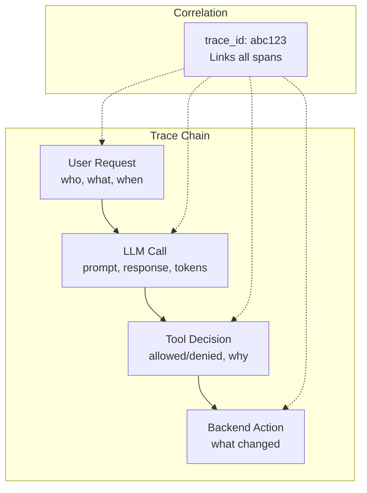

### Log Schema

```json
{
  "trace_id": "abc123",
  "timestamp": "2025-01-15T10:30:00Z",

  "identity": {
    "user": "alice@contoso.com",
    "agent": "agent-finance-daily",
    "service_principal": "sp-finance-agent"
  },

  "action": {
    "tool": "sql_query",
    "parameters": {"query": "SELECT..."},
    "decision": "ALLOW",
    "result": "150 rows"
  },

  "purpose": {
    "ticket_id": "INC0012345",
    "justification": "Monthly close report"
  }
}
```

---

## Stack Patterns

### Pattern A: Microsoft-Native

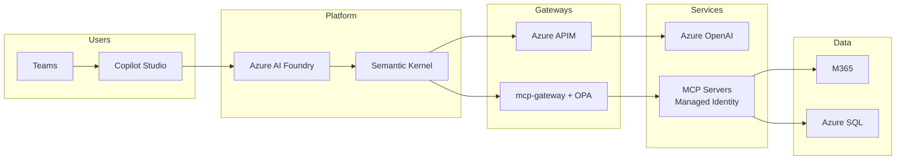

**Best for:** Microsoft shops, regulated industries, full Entra ID integration

### Pattern B: Hybrid (Entra + OSS)

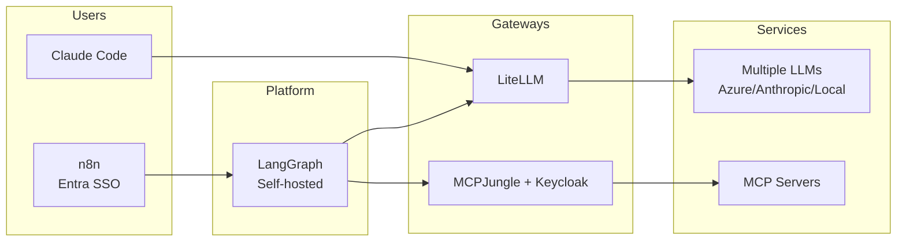

**Best for:** Teams wanting flexibility with Microsoft identity backbone

### Pattern C: High Security

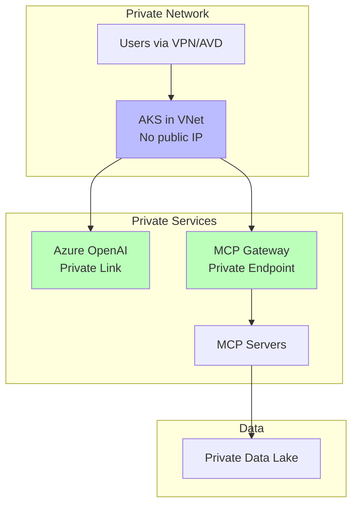

**Best for:** Financial services, healthcare, government

---

## Migration Path

### From: Uncontrolled AI Usage

```
Current State:
├── Developers using personal ChatGPT accounts
├── No visibility into what's being shared
├── Shadow AI tools proliferating
└── No MCP/tool governance
```

### To: Governed AI Platform

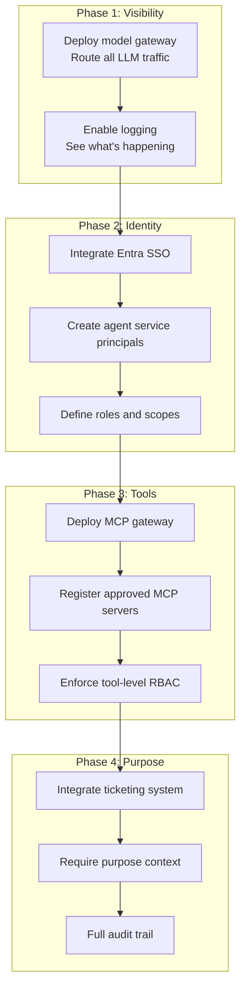

---

## Quick Reference

### Identity Patterns

| Pattern | Use Case | Token Type |
|---------|----------|------------|
| **Service Principal** | Background jobs, no user context | Agent's own token |
| **On-Behalf-Of (OBO)** | User-triggered, "my data" actions | Reduced-scope user token |
| **Purpose-Bound** | Regulated, audited actions | Token with ticket_id/justification |

### Gateway Functions

| Gateway | Function | Controls |
|---------|----------|----------|
| **Model Gateway** | LLM API access | DLP, cost, rate limits |
| **Tool Gateway** | MCP tool access | RBAC, constraints, audit |

### Key Decisions

| Decision | Recommended | Alternative |
|----------|-------------|-------------|
| Identity provider | Entra ID | Keycloak (self-hosted) |
| Model gateway | Azure APIM | LiteLLM Proxy |
| Tool gateway | mcp-gateway | MCPJungle |
| Policy engine | OPA (Rego) | Cedar |
| Observability | LangSmith → Sentinel | Langfuse (self-hosted) |

---

## See Also

- [Identity Governance Patterns](10-identity-governance-patterns.md) - Deep dive on auth
- [Observability Architecture](11-observability-architecture.md) - Logging and tracing
- [AI Security Testing](../security/ai-security-testing.md) - Testing before deploy
- [Personal Architecture](12-personal-architecture.md) - How this differs at home
