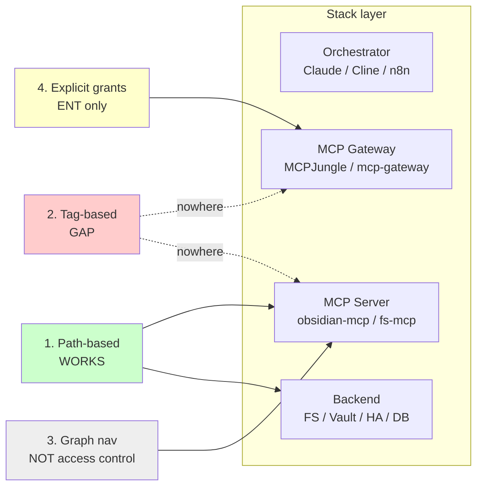

# Access Model Implementation: Where Each Mechanism Lives

This document answers the practical question: **WHERE in the tech stack is each access mechanism enforced?**

See [FOUNDATIONS.md](../FOUNDATIONS.md) for the principles. This doc covers implementation reality.

:::caution[Tag-based access does not exist]
Of the four mechanisms below, **path-based** and **graph navigation** work today, **explicit grants** exist in enterprise tooling, but **tag-based access control has no implementation in any current MCP server or gateway**. Designs that assume "the agent only sees files tagged `#home-lab`" will silently fall back to whatever path scope the server was started with. Use folder structure as the proxy until someone ships tag filtering.
:::

---

## The Four Mechanisms Mapped to Stack Layers



Read top-down: each mechanism lands at the layer that enforces it. Tag-based has no landing — that's the gap discussed below.


```
┌─────────────────────────────────────────────────────────────────────┐
│                         USER / ORCHESTRATOR                          │
│  (Claude Code, Cline, n8n, Power Automate)                          │
└────────────────────────────────┬────────────────────────────────────┘
                                 │
                                 ▼
┌─────────────────────────────────────────────────────────────────────┐
│                          MCP GATEWAY                                 │
│  (MCPJungle, microsoft/mcp-gateway)                                 │
│                                                                      │
│  ┌──────────────────────────────────────────────────────────────┐   │
│  │ ENFORCED HERE:                                                │   │
│  │ • Tool-level RBAC (allowed-tools per identity)               │   │
│  │ • Token exchange / identity assertion                         │   │
│  │ • Audit logging                                               │   │
│  │ • Rate limiting                                               │   │
│  │                                                               │   │
│  │ NOT CURRENTLY ENFORCED:                                       │   │
│  │ • Tag-based access filtering                                  │   │
│  │ • Graph edge grants                                           │   │
│  └──────────────────────────────────────────────────────────────┘   │
└────────────────────────────────┬────────────────────────────────────┘
                                 │
                                 ▼
┌─────────────────────────────────────────────────────────────────────┐
│                         MCP SERVER                                   │
│  (obsidian-mcp, home-assistant-mcp, filesystem-mcp, etc.)           │
│                                                                      │
│  ┌──────────────────────────────────────────────────────────────┐   │
│  │ ENFORCED HERE:                                                │   │
│  │ • Path-based access (server sees its configured scope)       │   │
│  │ • Tool availability (what operations the server exposes)     │   │
│  │                                                               │   │
│  │ NOT CURRENTLY ENFORCED:                                       │   │
│  │ • Tag-based filtering within scope                           │   │
│  │ • Fine-grained content filtering                             │   │
│  └──────────────────────────────────────────────────────────────┘   │
└────────────────────────────────┬────────────────────────────────────┘
                                 │
                                 ▼
┌─────────────────────────────────────────────────────────────────────┐
│                        BACKEND SYSTEM                                │
│  (File system, Obsidian vault, Home Assistant, database)            │
│                                                                      │
│  ┌──────────────────────────────────────────────────────────────┐   │
│  │ ENFORCED HERE:                                                │   │
│  │ • OS-level file permissions (NTFS, POSIX)                    │   │
│  │ • Application-level auth (HA user, DB credentials)           │   │
│  └──────────────────────────────────────────────────────────────┘   │
└─────────────────────────────────────────────────────────────────────┘
```

---

## Mechanism 1: Path-Based Access (WORKS TODAY)

**Where enforced:** MCP Server configuration + File System

### Current Reality

```yaml
# Example: Claude Code MCP config
mcpServers:
  obsidian:
    command: npx
    args: [-y, obsidian-mcp]
    env:
      VAULT_PATH: /home/user/vault/projects/mcp-workflow  # <-- PATH BOUNDARY
```

The MCP server only sees files within `VAULT_PATH`. This is the **primary access primitive** and it works today.

### How It Works

1. MCP server starts with configured path scope
2. Server can only read/write within that scope
3. OS file permissions provide additional layer
4. Agent inherits this scope—cannot see outside it

### Personal Stack

| Component | Path Enforcement |
|-----------|------------------|
| Claude Code | Working directory + `--allowedTools` paths |
| obsidian-mcp | `VAULT_PATH` environment variable |
| filesystem-mcp | `allowed_directories` config |

### Enterprise Stack

| Component | Path Enforcement |
|-----------|------------------|
| MCP Gateway | RBAC rules mapping identity → allowed servers |
| Azure Blob MCP | Storage account + container boundaries |
| SharePoint MCP | Site/library permissions via MS Graph |

---

## Mechanism 2: Tag-Based Access (GAP - DOES NOT EXIST)

**Where it SHOULD be enforced:** MCP Server or Gateway layer

### Current Reality

```
┌─────────────────────────────────────────────────────────────────┐
│                                                                  │
│  TAG-BASED ACCESS CONTROL DOES NOT CURRENTLY EXIST              │
│  IN ANY MCP SERVER OR GATEWAY IMPLEMENTATION.                   │
│                                                                  │
│  The concept is valid. The implementation is missing.           │
│                                                                  │
└─────────────────────────────────────────────────────────────────┘
```

### What Would Need to Exist

**Option A: MCP Server Layer**

```yaml
# HYPOTHETICAL: obsidian-mcp with tag filtering
obsidian:
  vault_path: /home/user/vault
  access_control:
    type: tag-based
    allowed_tags:
      - "#home-lab"
      - "#mcp-workflow"
    denied_tags:
      - "#personal"
      - "#finances"
```

The server would:
1. Parse YAML frontmatter on every file
2. Filter results based on tag policies
3. Return only content matching allowed tags

**Option B: Gateway Layer**

```yaml
# HYPOTHETICAL: Gateway with tag-based policy
policies:
  - identity: agent-home-automation
    tag_access:
      allow: ["#home-lab", "#smart-home"]
      deny: ["#work", "#finances"]
```

The gateway would:
1. Intercept MCP server responses
2. Parse content for tags
3. Filter before returning to orchestrator

**Option C: RAG/Retrieval Layer**

If using semantic search/RAG, the retrieval layer could filter:

```python
# HYPOTHETICAL: RAG query with tag filtering
results = rag.search(
    query="home assistant automations",
    filter={"tags": {"$in": ["#home-lab"]}}
)
```

### Why This Is Hard

1. **No standard tag format** — YAML frontmatter? Inline #tags? Both?
2. **Performance** — Parsing every file for tags on every request
3. **Consistency** — Tags in Obsidian ≠ tags in filesystem ≠ tags in SharePoint
4. **Trust boundary** — Who defines what tags mean access control vs organization?

### Workaround Today

Use **multiple MCP servers with different scopes** instead of tag-based filtering:

```yaml
mcpServers:
  # Separate servers = separate scopes
  vault-home-lab:
    env:
      VAULT_PATH: /home/user/vault/home-lab
  vault-work:
    env:
      VAULT_PATH: /home/user/vault/work
  vault-personal:
    env:
      VAULT_PATH: /home/user/vault/personal
```

Then control which agents can call which servers via gateway RBAC.

---

## Mechanism 3: Graph Navigation (WORKS - BUT IS NOT ACCESS CONTROL)

**Where it exists:** Within MCP server responses

### Current Reality

Graph navigation (links, backlinks, tags as navigation) works today—but it's **not access control**. It's navigation within granted scope.

```
┌─────────────────────────────────────────────────────────────────┐
│                                                                  │
│  GRAPH NAVIGATION ≠ ACCESS CONTROL                              │
│                                                                  │
│  An Obsidian link [[secret-file]] doesn't grant access          │
│  to secret-file if it's outside the server's path scope.        │
│                                                                  │
│  The link is just text. The agent can see the text.             │
│  The agent CANNOT follow it if it points outside scope.         │
│                                                                  │
└─────────────────────────────────────────────────────────────────┘
```

### How Links Work Today

1. Agent reads file A (within scope)
2. File A contains `[[File B]]` link
3. If File B is within scope → agent can read it
4. If File B is outside scope → agent sees dead link

The MCP server enforces the boundary, not the link.

### Personal Stack

| Tool | Graph Support |
|------|---------------|
| obsidian-mcp | Backlinks, outgoing links, tags (as search) |
| Claude Code | None built-in (follows file paths if readable) |

### Enterprise Stack

Graph databases (Neo4j, Cosmos DB) could provide richer traversal, but same principle: the graph helps navigate, doesn't grant access.

---

## Mechanism 4: Explicit Edge Grants (PARTIAL - ENTERPRISE ONLY)

**Where enforced:** Gateway policy engines (OPA, Cedar, Entra)

### Current Reality

Explicit grants that cross path boundaries exist in enterprise tooling:

```
┌─────────────────────────────────────────────────────────────────┐
│                                                                  │
│  EXPLICIT EDGE GRANTS = "BREAK GLASS" EXCEPTIONS                │
│                                                                  │
│  "Agent X normally sees /projects/,                             │
│   but for ticket #12345, also grant /finance/q4-report.xlsx"    │
│                                                                  │
│  This requires:                                                  │
│  1. Policy engine (OPA/Cedar/Entra)                            │
│  2. Context passing (ticket ID, justification)                  │
│  3. Audit logging                                               │
│                                                                  │
└─────────────────────────────────────────────────────────────────┘
```

### Personal Stack

Explicit grants barely exist. Options:

1. **Manual:** Add file to agent's working directory
2. **Symlinks:** Create symlink from within scope to outside file
3. **Skills:** `allowed-tools` can grant specific file paths

```yaml
# Skill with explicit path grant
allowed-tools:
  - Read
  - Glob
  - Grep
allowed-paths:
  - /home/user/vault/projects/*
  - /home/user/vault/shared/reference.md  # <-- explicit grant
```

### Enterprise Stack

Policy engines make this formal:

```rego
# OPA policy for explicit grants
allow {
    input.user == "agent-finance"
    input.resource == "/finance/q4-report.xlsx"
    input.context.ticket_id != ""  # Must have justification
}
```

| Component | Explicit Grant Mechanism |
|-----------|-------------------------|
| microsoft/mcp-gateway | Entra ID + OPA policies |
| n8n | Workflow-level permissions |
| Custom gateway | Cedar/OPA/custom rules |

---

## Summary: What Works vs What's Missing

| Mechanism | Personal Stack | Enterprise Stack | Gap? |
|-----------|---------------|------------------|------|
| **1. Path-based** | Working directory, MCP server config | RBAC on servers | No |
| **2. Tag-based** | N/A | N/A | **YES** |
| **3. Graph nav** | Works within scope | Works within scope | No (not access control) |
| **4. Explicit grants** | Manual/symlinks | Policy engines | Partial |

### The Big Gap: Tag-Based Access

Tag-based access is conceptually valid but has no implementation:

```
WHAT WE WANT:
"Agent sees all files tagged #home-lab regardless of folder"

WHAT EXISTS:
"Agent sees all files in /home-lab/ folder"

THE DIFFERENCE:
A file tagged #home-lab in /work/ folder would NOT be visible
with current tooling.
```

### Filling the Gap

To implement tag-based access, someone needs to build:

1. **MCP server with tag filtering** — Parse frontmatter, filter by config
2. **Gateway with content inspection** — Post-process responses, filter by tags
3. **Standard tag format** — Agreement on how tags are represented

Until then, use **folder structure as proxy for tags**:
- Instead of `#home-lab` tag → `/home-lab/` folder
- Multiple MCP servers with different scopes
- Gateway RBAC to control which agents see which servers

---

## Recommendations

### Personal Stack (Today)

1. **Use path scoping** — It works. Organize folders meaningfully.
2. **Multiple vaults/servers** — Different scopes for different concerns
3. **Skills as soft boundaries** — `allowed-paths` provides some control
4. **Accept the gap** — Tag-based ACL doesn't exist yet

### Enterprise Stack (Today)

1. **Gateway is the PEP** — All access control flows through gateway
2. **OPA/Cedar for policy** — Formal rules, not implicit conventions
3. **Path + identity** — Who you are + what path = access decision
4. **Audit everything** — Log decisions for compliance

### Future (Building Tag-Based Access)

If you wanted to build tag-based access:

1. Fork obsidian-mcp
2. Add tag-filtering config
3. Parse frontmatter on file read
4. Filter results based on policy
5. Contribute back to community

Or wait for someone else to do it.

---

## See Also

- [FOUNDATIONS.md](../FOUNDATIONS.md) — The principles this implements
- [Identity Governance Patterns](10-identity-governance-patterns.md) — Enterprise identity
- [Personal Architecture](12-personal-architecture.md) — Personal stack diagram
- [Enterprise Architecture](13-enterprise-architecture.md) — Enterprise stack diagram
