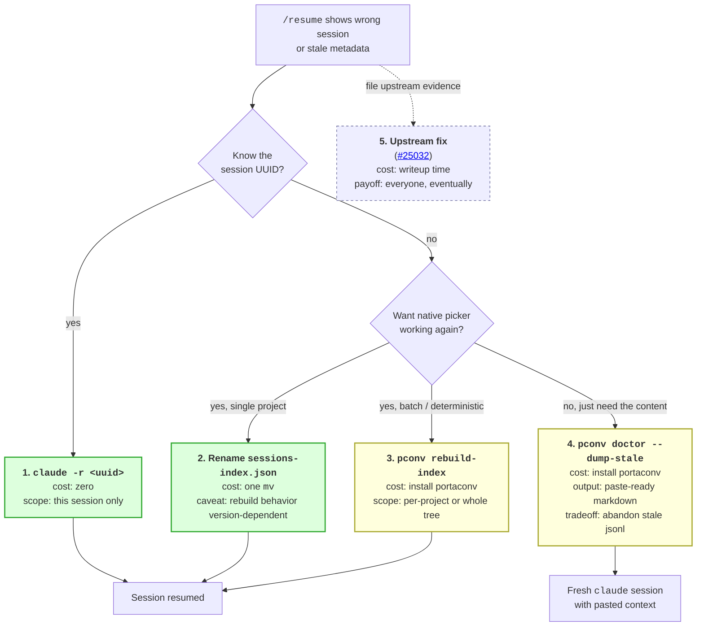

# Stale `sessions-index.json` — detection and recovery as a general pattern

## The core insight

**Claude Code has two sources of truth that can diverge: the append-only `.jsonl` session files (canonical conversation content) and the `sessions-index.json` summary file (cached metadata the `/resume` picker reads).** Ungraceful shutdowns — WSL force-close, `wsl --shutdown`, machine suspend — let the jsonl append stream keep writing while killing the process before the index rewrite. Compounded across months, the index can drift arbitrarily far from reality: 14 projects on one machine showed lags up to 93 days.

The `/resume` picker trusts the index. A 59 MB actively-in-use session can appear as a 9-message January stub because the index still carries stale metadata.

## Why this generalizes past Claude Code

The pattern is: **any CLI that caches a summary index over an append-only primary log is vulnerable to the same class of drift when the summary-write path isn't transactional with the log-write path.**

- Log-per-append + index-per-close is the simplest implementation, and it's what Claude Code does.
- Merging strategies (write-through caching, periodic rebuild, startup integrity check) each add complexity upstream.
- Third-party workarounds have exactly the same shape: read the log directly, ignore or rebuild the index.

This is the same structural issue as, e.g., browser history databases after an abrupt shutdown, or any `.cache/` directory whose dir tree is kept in sync with a primary store by process-level logic rather than filesystem-level atomicity.

## What upstream knows (and doesn't)

Canonical issue: [anthropics/claude-code#25032](https://github.com/anthropics/claude-code/issues/25032). Multiple open duplicates across platforms (WSL, macOS, Windows). Deepest RE to date: [#24729 comment by @agatho](https://github.com/anthropics/claude-code/issues/24729) pointing to a case-sensitivity bug in the multi-worktree code path (function `xa` in the minified `cli.js`).

**Not documented by Anthropic.** The `sessions-index.json` format appears in zero official docs — not on docs.anthropic.com, not on docs.claude.com. Format derived empirically.

**Graceful-shutdown hypothesis is partial.** [#41946](https://github.com/anthropics/claude-code/issues/41946) shows clean exits also drop entries. A [Zenn writeup](https://zenn.dev/tjst_t/articles/260220-claude-code-oom-session-recovery?locale=en) hypothesizes the write path re-reads cached state and overwrites (rather than merges with filesystem state), which would explain both "rolled back weeks" and the cumulative lag pattern.

**Picker behavior is version-dependent and contested.** [#38340](https://github.com/anthropics/claude-code/issues/38340) proves the picker does NOT filesystem-scan in v2.1.81 (synthetic test: valid hand-placed jsonl was invisible). [#44346](https://github.com/anthropics/claude-code/issues/44346) commenters claim it does scan in v2.1.92. Either the behavior changed between versions or one report is mistaken.

## The landscape of workarounds

All workarounds converge on one of two shapes:

1. **Rebuild the index by scanning the jsonls directly.** tirufege's [Python gist](https://gist.github.com/tirufege/0720c288092c1a3a4750f7c198aa524b) is the canonical implementation. Most surgical fix — restores the native `/resume` picker to accuracy.
2. **Replace the picker entirely.** [KirillPuljavin/cres](https://github.com/KirillPuljavin/cres) (Rust/Homebrew) and [riii111/claude-resume](https://github.com/riii111/claude-resume) (Rust+Ink) both read jsonls directly and render their own picker. Makes the index irrelevant.

A third shape — **paste-first recovery via extraction** — is what portaconv already does for the separate-but-related [cross-OS fragmentation problem](../zz-challenges/02-claude-code-conversation-fragmentation.md). Extending portaconv with `doctor` (detection + dump) and `rebuild-index` (repair) covers both failure modes with one tool. The key insight: all three workarounds benefit from the same jsonl walker.

## Recovery primitives ranked by cost

Cheapest first:

1. **`claude -r <session-uuid>`** — skips the picker, reads the jsonl directly. Zero installation. Requires knowing the UUID (grep `~/.claude/projects/` or check file mtimes). Works right now, no tool changes.
2. **Rename `sessions-index.json`** — `mv` it to a `.bak` suffix. Next graceful `claude` launch should rebuild it. Costs nothing, but verification requires a clean launch which may or may not fire the rebuild (picker behavior contested; see above).
3. **`pconv rebuild-index --project <path>`** — programmatic rebuild via portaconv subcommand. Deterministic. Batch-capable for the full `~/.claude/projects/` tree.
4. **`pconv doctor --dump-stale`** — detect and emit paste-ready markdown for the freshest session in each stale project. User pastes into a fresh `claude` session, abandons the stale one. Works even when jsonl size is too large for a practical resume.
5. **Upstream fix** — slowest path; addresses the root cause for everyone but depends on Anthropic prioritizing. Evidence for the fix-the-mechanism ask is on this machine's 14-project drift distribution.

The right choice depends on whether you want the native picker working again (1-3) or are happy to switch sessions (4).

## Why this belongs in the learning archive

- **Crosses tool boundaries.** Not strictly a Claude Code issue — the structural pattern applies to any append-only-log-plus-summary-index architecture. Same mitigation vocabulary.
- **Detection is cheap; recovery is pattern-shaped.** One filesystem `stat` comparison catches the drift. Once detected, three distinct recovery paths each serve a different situational need.
- **portaconv's scope legitimately expands because the infrastructure is free.** The jsonl walker, the scan-for-metadata code, the markdown renderer — all already exist for the cross-OS fragmentation case. Reusing them for this adjacent bug costs ~100 lines of glue.
- **The bug is widespread but undocumented.** Contributing upstream pushback + a third-party workaround is the leverage point.

## See also

- [agent-context/zz-research/2026-04-23-stale-sessions-index-bug.md](../../agent-context/zz-research/2026-04-23-stale-sessions-index-bug.md) — deep investigation notes with full evidence, upstream issue survey, third-party tool landscape, empirical gaps
- [research/zz-challenges/02-claude-code-conversation-fragmentation.md](../zz-challenges/02-claude-code-conversation-fragmentation.md) — sibling bug (cross-OS path poisoning), resolved via portaconv's original extract-and-paste design
- [02-stack/patterns/claude-code-session-recovery.md](../../02-stack/patterns/claude-code-session-recovery.md) — when this promotes, the practitioner-facing decision tree
- [portaconv](https://github.com/cybersader/portaconv) — with the v0.1.0+ `doctor` and `rebuild-index` subcommands
