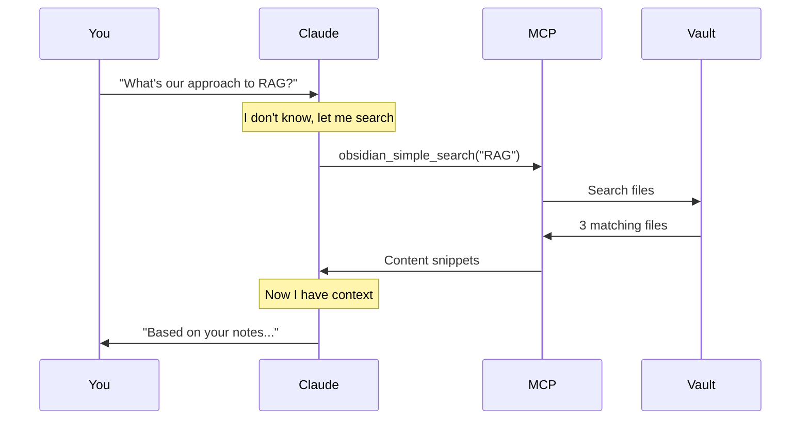

# Context Management Guide

## The Core Constraint

```
┌─────────────────────────────────────────────────────────────────┐
│  THE CONTEXT WINDOW BOTTLENECK                                   │
│                                                                  │
│  What you have:                                                  │
│  ├── Obsidian vault: 50MB+ of notes                             │
│  ├── Codebase: 100+ files                                       │
│  └── Conversation history: grows each message                   │
│                                                                  │
│  What the LLM can see at once:                                  │
│  ├── Claude: ~200K tokens (~150K words)                         │
│  ├── GPT-4: ~128K tokens                                        │
│  └── But quality degrades at the edges                          │
│                                                                  │
│  The gap: Your knowledge >> context window                      │
└─────────────────────────────────────────────────────────────────┘
```

---

## Strategy 1: CLAUDE.md (Always-Loaded Context)

### What It Is

A file in your project root that Claude Code **always reads first**.

```markdown
# CLAUDE.md

## Project Context
This is an MCP workflow project for home lab + enterprise.

## Key Decisions Made
1. MCPJungle for personal gateway
2. No SSH to HA (security)
3. Git for config changes

## Current Focus
Working on enterprise architecture docs.

## File Locations
- Architecture docs: docs/architecture/
- Research: docs/research/
- This KB uses YAML frontmatter with dates/tags
```

### Best Practices

| Do | Don't |
|----|-------|
| Keep it concise (<500 lines) | Dump entire docs into it |
| Focus on decisions and conventions | Include step-by-step tutorials |
| Update when major decisions change | Update every session |
| Link to detailed docs | Duplicate content |

---

## Strategy 2: Selective Retrieval (MCP Obsidian)

### How It Works



### Available Tools

| Tool | Use Case |
|------|----------|
| `obsidian_simple_search` | Keyword search across vault |
| `obsidian_get_file_contents` | Read specific file |
| `obsidian_batch_get_file_contents` | Read multiple files |
| `obsidian_complex_search` | JsonLogic queries (tags, dates) |
| `obsidian_list_files_in_dir` | Browse folder structure |

### Prompting for Retrieval

```
Good: "Search my Obsidian vault for notes about MCP gateways"
      → Claude uses obsidian_simple_search

Good: "Read the file docs/architecture/12-personal-architecture.md"
      → Claude uses obsidian_get_file_contents

Better: "Before answering, search my vault for anything about
         identity governance and enterprise RBAC"
      → Claude searches then synthesizes
```

---

## Strategy 3: Claude Code Subagents

### What They Are

Subagents are **separate Claude instances** that:
- Get their own context window
- Focus on a specific subtask
- Return results to the main conversation

### Built-in Subagents

| Type | Trigger | Use Case |
|------|---------|----------|
| `Explore` | Codebase questions | "How does auth work in this repo?" |
| `Plan` | Implementation planning | "Plan the refactor for module X" |

### Using Subagents

```
Prompt: "Use the Explore agent to find all files related to
         identity and authentication in this codebase"

What happens:
1. Claude spawns a subagent
2. Subagent gets fresh context window
3. Subagent searches/reads files
4. Subagent returns summary
5. Main Claude uses summary (not all the files)
```

### Why This Helps

```
Without subagent:
├── Main context loads file 1 (10K tokens)
├── Main context loads file 2 (15K tokens)
├── Main context loads file 3 (8K tokens)
└── Total: 33K tokens consumed from YOUR window

With subagent:
├── Subagent loads all 3 files
├── Subagent synthesizes findings
├── Returns: 500 token summary
└── Total: 500 tokens in YOUR window
```

---

## Strategy 4: Custom Skills

### What They Are

Skills are **reusable prompts** stored in `.claude/skills/`.

### Creating a Skill

```
.claude/
└── skills/
    └── vault-search/
        └── SKILL.md
```

**SKILL.md:**
```markdown
# Vault Search Skill

When the user asks about their notes or knowledge base:

1. Use obsidian_simple_search to find relevant files
2. Read the top 3 most relevant results
3. Synthesize a concise answer
4. Cite which files you used

Always check for:
- docs/architecture/ for design decisions
- docs/research/ for comparisons and options
- CLAUDE.md for current project context
```

### Using Skills

Skills are invoked when the context matches. You can also explicitly ask:
```
"Use the vault-search skill to find my notes on OAuth for agents"
```

---

## Strategy 5: Session Hygiene

### The Problem

```
Long session:
├── Message 1: Asked about file A
├── Message 2: Read file A (5K tokens)
├── Message 3: Asked about file B
├── Message 4: Read file B (8K tokens)
├── ... 50 more messages ...
└── Context full, quality degrading
```

### Solutions

| Command | Effect |
|---------|--------|
| `/clear` | Wipe conversation, keep project |
| New terminal | Fresh session |
| `claude --continue` | Resume last session |
| `claude --resume` | Pick from recent sessions |

### When to Clear

- Switching to unrelated topic
- Context feels "muddy" or confused
- Starting a new task
- After completing a major piece of work

---

## Strategy 6: Chunking Large Tasks

### Anti-Pattern

```
"Read all 50 files in docs/ and create a comprehensive summary"
→ Tries to load everything
→ Context overflow
→ Poor results
```

### Better Approach

```
Step 1: "List the files in docs/architecture/"
Step 2: "Read and summarize 12-personal-architecture.md"
Step 3: "Read and summarize 13-enterprise-architecture.md"
Step 4: "Now synthesize what you learned about the architecture"
```

### Or Use Subagent

```
"Use the Explore agent to understand the full architecture
 documented in this repo, then give me a summary"
```

---

## Strategy 7: Structured Knowledge Base

### Why Structure Matters

```
Unstructured vault:
├── random-note-1.md
├── meeting-notes-dec.md
├── ideas.md
└── Searching is hit-or-miss

Structured vault:
├── architecture/
│   ├── 12-personal-architecture.md
│   └── 13-enterprise-architecture.md
├── research/
│   └── topic-name.md
└── Predictable locations + YAML frontmatter
```

### Frontmatter for Retrieval

```yaml
---
created: 2025-01-15
updated: 2025-01-15
tags:
  - architecture
  - enterprise
  - mcp
---
```

Now you can search:
```
obsidian_complex_search with {"and": [
  {"glob": ["*.md", {"var": "path"}]},
  {"in": ["enterprise", {"var": "frontmatter.tags"}]}
]}
```

---

## Quick Reference

### Context Budget

| Content Type | Approx Tokens | Strategy |
|--------------|---------------|----------|
| CLAUDE.md | 500-2000 | Always loaded |
| Single file read | 1000-10000 | Selective retrieval |
| Subagent result | 200-1000 | Summarized |
| Conversation history | Grows! | Clear periodically |

### Decision Tree

```
Need information from vault?
├── Know the exact file? → Read directly
├── Need to search? → obsidian_simple_search
├── Complex query? → obsidian_complex_search
└── Large exploration? → Use Explore subagent

Context feeling crowded?
├── Unrelated to current task? → /clear
├── Just finished major work? → /clear
└── Need history? → Start new terminal, keep this one
```

### Commands Cheat Sheet

```bash
# Claude Code
claude                    # New session
claude -c                 # Continue last
claude --resume           # Pick session
/clear                    # Clear conversation

# In conversation
"Search my vault for X"   # Triggers MCP
"Use Explore agent to..." # Spawns subagent
```

---

## See Also

- [Claude Code Sessions](claude-code-sessions.md) - Session management
- [Obsidian MCP Setup](obsidian-mcp-setup.md) - MCP configuration
- [Personal Architecture](../architecture/12-personal-architecture.md) - Where things live
