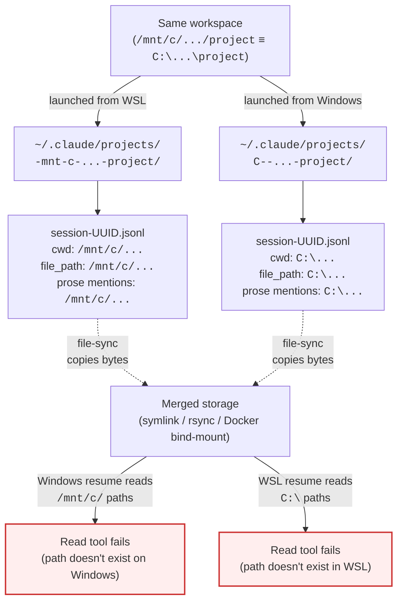

# 02 · Claude Code conversation fragmentation — resolved via portaconv

:::tip[Resolved 2026-04-21 via portaconv v0.1]
The shipped answer is a paste-first extractor: [portaconv](https://github.com/cybersader/portaconv) (binary `pconv`) with a `pa convos` shim in [portagenty](https://github.com/cybersader/portagenty). File-sync approaches (including the older `claudecode-project-sync` Docker tool) cannot fix the underlying content-layer poisoning — see the diagram below for why.
:::

## TL;DR

What looked like a **sync problem** (two OS encodings writing to two
`~/.claude/projects/` buckets) turned out to be a **content problem**
(conversation JSONLs contain OS-specific absolute paths baked into
`cwd`, `file_path`, tool calls, and prose). File-level sync cannot fix
content-layer divergence.

The answer is **paste-first recovery via a terminal-native extractor**
that reads each tool's native conversation storage and emits paste-ready
markdown with optional `/mnt/c/…` ↔ `C:\…` path rewriting. That tool
shipped as **[portaconv](https://github.com/cybersader/portaconv)**
(binary `pconv`) — a standalone Rust crate, not a subcommand of another
tool. **[portagenty](https://github.com/cybersader/portagenty)** provides
a thin `pa convos` shim that forwards to `pconv` with the current
workspace TOML injected, plus scaffolding for agents to self-discover
the MCP server.

This doc is kept as the historical record of the finding and as the
reference for the remaining open threads (sync-container migration,
upstream engagement).

---

## The evidence that drove the pivot (2026-04-19)

### Storage fragmentation

One real project on one real machine — six encoded directories for a
single workspace:

| Encoding | Encoded directory name | Size | Owner | Latest activity |
|----------|------------------------|------|-------|-----------------|
| WSL | `-mnt-c-...-mcp-workflow-and-tech-stack` | 54.1 MB | `cybersader` | 2026-04-19 12:01 |
| Windows | `C--...-mcp-workflow-and-tech-stack` | 54.1 MB | `root` | 2026-04-19 12:00 |
| WSL | `-mnt-c-...-tools-terminal-workspaces` | 8.4 MB | — | 2026-03-25 |
| Windows | `C--...-tools-terminal-workspaces` | 8.4 MB | — | 2026-03-25 |
| WSL | `-mnt-c-...-ultimate-workflow` | empty | — | — |
| Windows | `C--...-ultimate-workflow` | empty | — | — |

Both live buckets held the same session UUID (`97d7b58b-...`) as separate
files diverged by ~20 KB within the same day. `/resume` from WSL showed
"2 months ago" entries instead of today's session because it was reading
the wrong bucket.

### The content-layer finding

Spot-check of the 54 MB session file in the `C--` bucket:

- **9999+ occurrences of `/mnt/c/...` paths** (WSL-authored content)
- **72 occurrences of `C:\...` paths** (Windows-authored content)
- Embedded inside `cwd` fields, `file_path` tool-call args, and prose

Symlinking, copying, or bind-mounting the two encoded directories
merges *storage* but leaves *content* poisoned with the other OS's
paths. A Windows-launched Claude Code resuming a WSL-authored session
fails the first time it tries to Read `/mnt/c/...`, and vice versa.

The two encoded directories are **storage-layer divergence** — fixable by sync. The path strings *inside* each JSONL are **content-layer divergence** — every file-sync tool faithfully replicates the poisoning. The only fix that closes the loop is rewriting paths during extraction, which is the portaconv `--rewrite` transform.

Hence: don't resume in place. **Extract and paste.**

---

## What shipped (portaconv v0.1)

Implementation lives in [`cybersader/portaconv`](https://github.com/cybersader/portaconv).
The v0.1 surface is feature-complete:

| Capability | Command | Notes |
|---|---|---|
| List sessions across all encodings | `pconv list` | Collapses WSL/Windows duplicates by default; `--show-duplicates` exposes both physical files |
| Scope by workspace | `pconv list --workspace-toml auto` | Walks up to nearest `*.portagenty.toml`; supports `previous_paths` for moved-folder recovery |
| Time window | `pconv list --since 2d` | Relative (`2d`/`6h`/`30m`) or absolute dates |
| Substring filter | `pconv list --grep "react refactor"` | Title + cwd match |
| Dump to markdown | `pconv dump <id>` | Paste-ready User/Assistant blocks, tool calls as fenced JSON |
| Trim | `pconv dump --tail 30` | Keep only last N messages (records how many dropped) |
| Path rewrite | `pconv dump --rewrite wsl-to-win\|win-to-wsl\|strip` | Touches text + tool args + results; leaves `cwd` metadata alone |
| Pick a specific physical file | `pconv dump --file <path>` | Escape hatch when the default picker chooses the wrong duplicate (WSL vs Windows encoding) |
| JSON output | `pconv dump --format json` | Normalized `Conversation` model, stable across adapters |
| MCP server | `pconv mcp serve` | stdio server exposing `list_conversations` / `get_conversation` + per-conversation resources |
| List cache | Automatic | ~40s → ~3s on a 2607-JSONL corpus; per-file invalidation by mtime+size |

Adapter scope: Claude Code only in v0.1. Adapter trait is the documented
extension point for OpenCode / Cursor / Aider / continue.dev in follow-up
PRs.

### Portagenty integration

- **`pa convos` shim** (portagenty) — forwards to `pconv` with
  `--workspace-toml auto` injected so workspace scope is the default.
- **`pa init --with-agent-hooks`** — scaffolds MCP config + skill
  documents under `.claude/` so Claude Code agents self-discover the
  extractor and can bootstrap context from prior sessions on their own.
- **`previous_paths` in workspace TOML** — portagenty auto-maintains
  this when it detects a workspace re-register from a new path;
  portaconv consumes it to bridge moved-folder sessions.

---

## Q&A — the investigation's closed questions

### Adapter trait — frozen

OpenAI Chat Completions shape as the canonical model, with
Anthropic-style `ContentBlock` variants for tool calls, plus an
`extensions: serde_json::Value` escape hatch for tool-specific fields.
Each adapter normalizes to this shared model on load; the renderer
operates only on the shared model. Locked per the portaconv design
Q&A — don't reopen without explicit user OK.

### Rendering defaults — set

Paste-ready markdown is the default output: `## User` / `## Assistant`
blocks, tool calls as fenced JSON, tool results truncated by default
(`--full-results` expands). Optional `--include-thinking` for assistant
thinking blocks. XML / plain-only variants deferred — markdown covers
the Claude and OpenCode paste targets observed in practice.

### Path rewrite — tested

`wsl-to-win`, `win-to-wsl`, and `strip` transforms touch text blocks,
tool-call inputs, and tool-result bodies. `cwd` metadata is left alone
(that belongs to the original session, not the paste target). Proven
against a real 54 MB session without regex false-positives on paths
inside prose.

### Does `pconv` replace the third-party viewers?

No, intentionally. The existing viewers (d-kimuson/claude-code-viewer,
jhlee0409/claude-code-history-viewer, raine/claude-history, agsoft's
VS Code extension) own the browsing UX. `pconv` owns the terminal-native
extract-and-paste niche plus MCP. Recommend the viewers alongside.

### Workspace scoping default

`pconv list --workspace-toml auto` walks up from cwd; `pa convos` makes
that the default. Explicit `--workspace-toml <path>` overrides. The
default feels right in practice.

---

## What's still open

### 1. Migrate users off the Docker sync container

[`tools/claudecode-project-sync/`](../../tools/claudecode-project-sync/)
now has a ⚠️ superseded banner pointing at portaconv. Remaining work:

- A short recovery playbook for users in the already-diverged state (two
  same-UUID JSONLs, ~20 KB divergent) — currently a manual `pconv dump
  --file <path>` on each side followed by a diff. Worth promoting into
  a `pconv forks` subcommand or a portaconv doc page.
- Decide whether to delete the Docker tool entirely after some
  deprecation window, or keep as "aggressive-merge historical artifact."
  Current posture: keep, banner, don't promote.

### 2. Upstream engagement

The content-layer finding (9999+ vs 72 path references in one JSONL) is
almost certainly news to most contributors on these issues:

- [anthropics/claude-code#17682](https://github.com/anthropics/claude-code/issues/17682) — Cross-Environment Conversation History Synchronization
- [anthropics/claude-code#9668](https://github.com/anthropics/claude-code/issues/9668) — Duplicate 'Warmup' titles / wrong conversations in WSL
- [anthropics/claude-code#9306](https://github.com/anthropics/claude-code/issues/9306) — Project-Local Conversation History Storage

A concise writeup on #17682 with the evidence + a link to portaconv
would raise the bar for what "fix" means — storage-layer merges alone
can't solve it. Open question: do that ourselves, or wait until portaconv
hits crates.io and has a proper public-facing page?

### 3. Additional adapters

OpenCode (sibling tool) is the natural forcing function for proving the
adapter trait is genuinely tool-agnostic rather than Claude-Code-shaped.
Cursor / Aider / continue.dev follow. Each is a separate PR on portaconv,
not part of this challenge.

### 4. Project-relative recovery

Committing `pconv dump --export` output into a repo (`docs/agent-context/
YYYY-MM-DD-<topic>.md`) makes conversation slices first-class repo
citizens — they survive retention, travel with git clone, and become
the authoritative record when the JSONL decays. Worth documenting as a
pattern, not a feature; the existing tools already support it.

---

## Why this matters (why we kept it as a challenge)

`/resume` is one of the most-used Claude Code commands. When it silently
shows the wrong list, users lose confidence that the tool remembers
their work, accidentally restart instead of continuing, waste tokens
reloading context, and can't audit what's actually been done. The
fragmentation is also not Claude-specific — every agentic coding tool
stores history somewhere, each in its own format. A cross-tool
extractor is broadly useful, not a one-off WSL patch.

portaconv's design sits behind this logic: the problem generalizes,
so the solution is an adapter-per-tool extractor, not a
Claude-Code-specific bridge.

---

## Context to read

### The shipped tools

- [**portaconv**](https://github.com/cybersader/portaconv) — extractor + MCP server (the answer)
- [**portagenty**](https://github.com/cybersader/portagenty) — workspace launcher that hosts the `pa convos` shim
- [portaconv docs site](https://cybersader.github.io/portaconv/) — full command / adapter / MCP reference
- [portagenty → portaconv integration page](https://cybersader.github.io/portagenty/concepts/portaconv-integration/) — how the two fit together

### The historical artifact

- [`tools/claudecode-project-sync/`](../../tools/claudecode-project-sync/) — file-layer sync (superseded). Kept for the cautionary-tale value.

### Upstream (tracking, not dependencies)

- [anthropics/claude-code#17682](https://github.com/anthropics/claude-code/issues/17682)
- [anthropics/claude-code#9668](https://github.com/anthropics/claude-code/issues/9668)
- [anthropics/claude-code#9306](https://github.com/anthropics/claude-code/issues/9306)

### Related third-party tools (complementary, not competitors)

- [d-kimuson/claude-code-viewer](https://github.com/d-kimuson/claude-code-viewer) — full-featured web viewer (recommended for browsing UX)
- [jhlee0409/claude-code-history-viewer](https://github.com/jhlee0409/claude-code-history-viewer) — desktop viewer
- [raine/claude-history](https://github.com/raine/claude-history) — TUI fuzzy search
- [kvsankar/claude-history](https://github.com/kvsankar/claude-history) — CLI extract/convert
- [agsoft VS Code extension](https://marketplace.visualstudio.com/items?itemName=agsoft.claude-history-viewer) — sidebar with diffs

---

## Open threads (still interesting, lower-priority)

- **Sibling bug — stale `sessions-index.json`.** A separate `/resume`
  failure mode encountered 2026-04-23: same encoded bucket, same jsonl,
  but the index metadata lags months behind the file it describes, so
  the picker shows the wrong summary / message count / mtime for an
  actively-in-use session. Appears tied to ungraceful WSL shutdowns
  skipping the index rewrite. Fix is renaming the index so the next
  launch regenerates it, or `claude -r <uuid>` to bypass the picker
  entirely. Captured in
  [`agent-context/zz-research/2026-04-23-stale-sessions-index-bug.md`](../../agent-context/zz-research/2026-04-23-stale-sessions-index-bug.md)
  — promote to `03-stale-sessions-index.md` alongside this doc if the
  hypothesis is confirmed reproducibly.
- **The `-ultimate-workflow` empty-dir footgun.** Claude Code appears to
  auto-create encoded dirs on launch even when CWD is misidentified.
  Worth a minimal repro filed upstream.
- **`wsl.conf automount metadata`.** Would changing WSL mount options
  change the ownership (`root` vs `cybersader`) pattern we observed?
  Orthogonal, but could reduce confusion.
- **Moving projects off `/mnt/c/` into WSL-native FS.** Sidesteps the
  dual-encoding entirely at the cost of native Windows editor access.
  Tradeoff worth a short writeup.
- **Agents extracting their own context.** With the MCP server in
  place, an agent can call `list_conversations` / `get_conversation`
  to bootstrap from prior sessions on its own. Nice meta-property of
  the paste-first design — already enabled by `pa init
  --with-agent-hooks` scaffolding.
