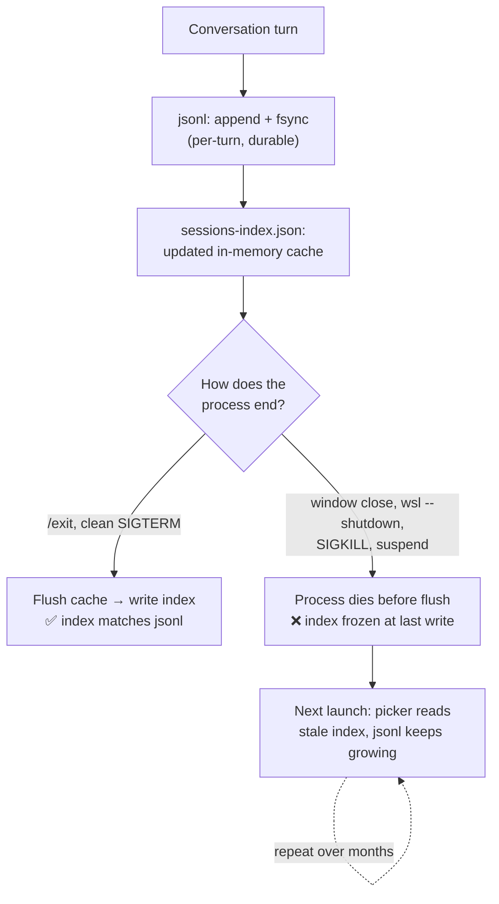

## Why this is captured

First encounter with this failure mode. `/resume` couldn't find an actively-in-use session that had four months of continuous history. Not a portaconv case — that tool is for cross-OS content poisoning and moved-folder recovery, neither of which applied. Different bug, same surface complaint, worth its own lineage.

## The evidence

Single project, single encoded bucket (WSL only), single session UUID:

| File | mtime | Size | What it should describe |
|---|---|---|---|
| `97d7b58b-…jsonl` | 2026-04-23 02:22 | 59 MB | Active session — continuous append activity from 2025-12-10 through today |
| `sessions-index.json` | **2026-01-27 16:25** | 2.8 KB | Describes the session state as of 2026-01-27 |

The index's entry for the active session:

```json
{
  "sessionId": "97d7b58b-09f5-41ea-a59f-a12f230083b0",
  "firstPrompt": "No prompt",
  "summary": "OpenCode permissions setup and Terminal Workspaces bug fix",
  "messageCount": 9,
  "created": "2026-01-09T15:38:59.766Z",
  "modified": "2026-01-09T15:48:27.815Z"
}
```

Frozen in January. The jsonl itself meanwhile grew from ~100 KB to 59 MB across four months of real work. The `/resume` picker reads the index to build its list, so from the user's perspective the active session looked like a trivial nine-message January stub and got outranked (or misrendered) by other entries.

No path issue. No OS-crossing. Just metadata that stopped tracking reality.

## Hypothesis

Claude Code rewrites `sessions-index.json` on **graceful shutdown** of the CLI — clean exit flushes the cache. Ungraceful closures (window-close of the WSL terminal, `wsl --shutdown`, machine suspend without cleanup) kill the process before the index rewrite. The jsonl-append path appears to be per-turn fsync, so conversation content survives fine, but the index doesn't catch up.

Repeat a few times across a long-running, repeatedly-resumed session and the index drifts arbitrarily far from the jsonls.



Even some clean exits drop entries (#41946) — the write path also re-reads cached state and overwrites rather than merging, so the drift compounds across both forced kills and certain graceful closures.

## This is systemic, not a one-off

Same-day scan of `~/.claude/projects/*/` showed **14 other project directories with `sessions-index.json` at least 7 days behind the newest jsonl in the same dir**. Lag distribution:

| Lag (days) | Project (tail of encoded name) |
|---|---|
| 93 | `-mnt-d-MEDIA` |
| 90 | `home-assistant-projects` |
| 84 | `…tasknotes…obsidian-plugins-tasknotes` (duplicate-encoded) |
| 80 | `…tasknotes-enhancements` |
| 79 | `cynario` |
| 66 | `retake-studio` |
| 65 | `4-VAULTS` |
| 57 | `…terminal-workspaces` |
| 57 | `b-g-33---Home-Lab--Home-Server` |
| 46 | `b-g-15---Family-Planning--Parenthood` |
| 44 | `3d-printing` |
| 12–12 | `b-g-vault-b-g`, `…tasknotes…plugins-tasknotes` (dot-prefix variant) |
| 11 | `DFD-Excalidraw-System` |

That rules out "one-time WSL crash." It's consistent with **every ungraceful close dropping an index update**, accumulating across months of normal WSL lifecycle. Whatever fraction of Claude Code shutdowns on this machine are graceful, it's not 100%, and the drift is cumulative.

Action: the same `mv sessions-index.json sessions-index.json.bak-<date>` recipe applies to each of those dirs — one command per project, indexes rebuild on next `claude` launch. Deferred pending user approval since touching other projects' state is out of scope for this bug note.

## Fix applied

```bash
cd ~/.claude/projects/-mnt-c-…-mcp-workflow-and-tech-stack/
mv sessions-index.json sessions-index.json.bak-2026-04-23
```

Next `claude` launch should scan the jsonls and regenerate the index. Backup kept for one cycle in case the rebuild misbehaves.

## Alternative: resume by explicit ID, skip the picker

When you already know which session you want, this is immune to index staleness:

```bash
claude -r 97d7b58b-09f5-41ea-a59f-a12f230083b0
```

The resume-by-ID path reads the jsonl directly. Worth promoting as **the recovery primitive** any time the picker looks wrong — cheaper and safer than rebuilding the index if you only need one session back.

:::tip[First move when /resume looks wrong]
Reach for `claude -r <uuid>` before rebuilding the index or invoking portaconv. It bypasses the index entirely (reads the jsonl directly), works in seconds, and leaves all other state untouched — so it's safe even when you don't yet know whether the bug is staleness, fragmentation, or something else. Keep recent UUIDs handy via `ls -t ~/.claude/projects/<encoded>/*.jsonl | head`.
:::

## Why this is distinct from challenge 02

Sibling bug, different mechanism. Surfaces the same "`/resume` is lying to me" complaint, so it's worth documenting under the same lineage.

| Dimension | [02 · Fragmentation](/agentic-workflow-and-tech-stack/research/zz-challenges/02-claude-code-conversation-fragmentation/) | This bug (stale index) |
|---|---|---|
| Encoded buckets involved | Two (WSL + Windows) | One |
| Session files involved | Two diverging `.jsonl`s | One `.jsonl`, one stale index |
| Broken layer | Content — OS-specific paths baked into jsonl | Metadata — index lags jsonl |
| Trigger | Dual-OS workspace access | Ungraceful shutdown |
| portaconv is primary fix? | Yes (paste-first extraction) | No (but `pconv dump` is a fine rescue) |
| User-visible symptom | Wrong session **list** | Wrong session **details** for a session that is in the list |

## Why portaconv isn't the primary fix here

portaconv is the **escape hatch** for this bug, not the primary fix. Its value proposition is paste-first extraction when (a) the jsonl content is poisoned with the wrong OS's paths, or (b) the file is in a bucket the current `/resume` can't see. Neither applies here — the jsonl is clean, in the right bucket, keyed to the right cwd. The index is the only broken artifact, and Claude Code can regenerate it from the jsonls.

`pconv dump 97d7b58b-…` remains a rescue path if:

- Rebuilding the index doesn't help (jsonl itself is corrupted)
- The session is too big for `/resume` to load practically
- You'd rather carve out a slice and paste into a fresh session than continue the 59 MB monolith

But the right shape of the fix for this specific bug is a **small dedicated rebuilder** (or an upstream fix), not bolted onto portaconv's extractor surface.

## Upstream status — already widely reported

This is well-known upstream. Multiple open GitHub issues on `anthropics/claude-code` with the same symptom pattern (stale picker, active sessions missing from list):

| Issue | Title / context | Relevance |
|---|---|---|
| [#25032](https://github.com/anthropics/claude-code/issues/25032) | "sessions-index.json not updated" (macOS, v2.1.39) | Canonical. Commenter @tirufege ships a repair script — most-cited workaround. |
| [#24729](https://github.com/anthropics/claude-code/issues/24729) | "summaries not generated, new sessions not indexed since ~v2.1.31" | Commenter @agatho deobfuscated `cli.js`, points to function `xa` with a case-sensitivity bug in the multi-worktree code path. Others confirm the bug occurs **without** worktrees too. |
| [#44346](https://github.com/anthropics/claude-code/issues/44346) | **WSL2, v2.1.92 — same env as here** | Commenter @SRHSoulja claims picker scans `.jsonl` files directly (contradicting the index-driven theory); @junaidtitan confirms via workaround. |
| [#38340](https://github.com/anthropics/claude-code/issues/38340) | Synthetic test: manually-placed valid `.jsonl` **invisible** to picker despite v2.1.81 changelog claiming filesystem scan | Proves picker does NOT scan the filesystem in that version. |
| [#41946](https://github.com/anthropics/claude-code/issues/41946) | Clean-exit session missing from picker | Rules out "only SIGKILL causes this" — even graceful exits can lose sessions from the index. |
| [#46522](https://github.com/anthropics/claude-code/issues/46522) | Mixed-`cwd` sessions hidden from picker | Adjacent: sessions excluded based on cwd mismatch, not index staleness. |
| [#47128](https://github.com/anthropics/claude-code/issues/47128) | PID-keyed `~/.claude/sessions/<PID>.json` files collide after container/PID-namespace reset | Different artifact, but confirms index state is tied to process lifecycle. |
| [#42030](https://github.com/anthropics/claude-code/issues/42030), [#22878](https://github.com/anthropics/claude-code/issues/22878), [#18619](https://github.com/anthropics/claude-code/issues/18619), [#18897](https://github.com/anthropics/claude-code/issues/18897) | Duplicate reports | Shows this is widespread and cross-platform (not WSL-specific). |

Not covered by fragmentation issues #17682 / #9668 / #9306 — those are about WSL↔Windows path encoding, a different mechanism.

**No Anthropic docs mention `sessions-index.json` at all.** The format is undocumented. Ref: docs.anthropic.com, docs.claude.com.

## Related upstream evidence — the "clean-exit also fails" wrinkle

The graceful-shutdown hypothesis is **partially corroborated** but not sufficient:

- [Zenn article by tjst_t](https://zenn.dev/tjst_t/articles/260220-claude-code-oom-session-recovery?locale=en) explicitly calls out: *"SIGKILL terminates a process immediately, application-side termination logic (signal handlers, atexit) is never executed"* → index update lost; JSONL survives because it's append-on-write. Also reports the index "rolled back two weeks" — the write path re-reads cached state and overwrites, rather than merging.
- **But #41946 shows clean exits can also lose sessions.** So the bug isn't purely "SIGKILL skips the flush." There's additional breakage — possibly the case-sensitivity bug in `xa` (#24729 comment), possibly buffered/debounced writes that drop on any abnormal timing.

The fuller mechanism is likely: write path is **both racy and re-reads stale cached state**, so even some graceful exits lose entries. SIGKILL just makes it worse. The 14-project-wide drift on this machine could be a mix of both.

## Third-party tools targeting exactly this problem

None of these use portaconv. They fit the "small dedicated thing" shape.

| Tool | Shape | What it does |
|---|---|---|
| [tirufege/repair-sessions-index.py](https://gist.github.com/tirufege/0720c288092c1a3a4750f7c198aa524b) | Python gist, ~100 lines | Rebuilds the index by scanning `.jsonl` files directly. Backs up first. Reference algorithm below. |
| [KirillPuljavin/cres](https://github.com/KirillPuljavin/cres) | Rust + Homebrew | Drop-in `/resume` picker replacement. Reads `.jsonl` directly, filters out headless runs. |
| [riii111/claude-resume](https://github.com/riii111/claude-resume) | Rust + Ink | Rich picker UI, `.jsonl`-direct, bypasses index entirely. |
| [Ruya-AI/cozempic](https://github.com/Ruya-AI/cozempic) | `doctor` subcommand (planned: `index-integrity` check) | Broader health-check tool; this is on roadmap. |
| [kanafm/claude-code-resume-anywhere](https://github.com/kanafm/claude-code-resume-anywhere) | Helper | Resumes from any directory (orthogonal: cwd scoping). |

**Reference algorithm (tirufege's, confirmed from the gist):** per-`.jsonl`-file scan:
- `sessionId` ← filename minus `.jsonl`
- `fullPath` ← absolute path
- `fileMtime` ← `os.path.getmtime() * 1000`
- `firstPrompt` ← first 200 chars of first `"user"`-typed message text block
- `customTitle` ← from `"custom-title"`-typed entries if present
- `messageCount` ← count of `"user"` + `"assistant"` lines
- `created` ← timestamp of first message, fall back to `st_birthtime` / `st_ctime`
- `modified` ← timestamp of last message, fall back to file mtime
- `gitBranch` ← empty string (not reconstructed)
- `projectPath` ← from old index if present, otherwise derivable from dir name
- `isSidechain` ← `False` (doesn't actually detect sidechains)
- Edge cases handled: malformed JSON lines skipped, missing timestamps fall back, content types (string vs list-of-blocks) both handled
- **Write: `shutil.copy2` backup first, then `json.dump` overwrite.** Not atomic (no temp+rename). Good enough in practice; not robust under crash.

Gaps vs a proper rebuild: doesn't detect sidechains, doesn't repopulate `gitBranch`, non-atomic write. Fine for manual recovery; would want hardening for an automated tool.

## Solutions matrix

| Option | Shape | Pros | Cons | When to use |
|---|---|---|---|---|
| **Rebuild manually** (`mv` + next launch) | One command | Zero code | Requires a clean launch to regenerate; if picker doesn't FS-scan, rebuild needs a write trigger | One-off recovery, willing to verify next launch |
| **`claude -r <uuid>`** | One command | Immune to index; works now | Requires knowing the UUID; doesn't fix picker for future launches | Immediate recovery of a known session |
| **Rebuild script** (tirufege-style, batch-capable) | Small Python/Bash, `.claude/tools/rebuild-sessions-index` | Deterministic, doesn't depend on Claude Code's write path; batch across all `~/.claude/projects/*/` | Bypasses whatever write-path logic upstream provides; can't repopulate `gitBranch` correctly | Routine recovery, systemic cleanup (14+ stale projects on this machine) |
| **Replacement picker** (`cres`, `claude-resume`) | External binary + shell alias | Full fix for the picker UX; index becomes irrelevant | Another tool to install; doesn't help anything else that reads the index | If picker UX is the only thing you care about |
| **SessionEnd hook** in `settings.json` | Add hook that calls a graceful-shutdown action | Prevents future drift without changing user habits | **Doesn't fire on SIGKILL / WSL force-close** — same failure mode as the bug itself | Only catches the subset of closures that already fire SessionEnd — partial |
| **Wrapper script** (`claude-safe` that traps SIGTERM and calls `/exit`) | Shell wrapper in `~/.local/bin/` | Covers more shutdown types than SessionEnd | SIGKILL / process-group-kill from `wsl --shutdown` still bypasses traps; complex to get right | Marginal improvement; not a full fix |
| **File upstream with evidence** | GitHub issue comment on #25032 or #24729 | Root-cause fix for everyone | Slow; depends on Anthropic prioritizing; you'd want measurements first | Once the mechanism is pinned down (strace or deobf'd `xa` reading) |
| **Move to `~/.local` (WSL-native FS)** | One-time project move | Sidesteps dual-encoding AND is faster I/O | Breaks Windows-editor access; doesn't actually fix index staleness (still happens on single-OS) | Only solves fragmentation, not this bug |

**Recommended stack for this machine (ranked by leverage):**

1. **Immediate recovery (done):** rename this project's index. Use `claude -r <uuid>` if the rebuild doesn't trigger on next launch.
2. **Systemic cleanup:** a batch rebuild script that walks `~/.claude/projects/*/`, detects lag > N days, rebuilds. One-shot run clears the 14-project backlog, and a weekly cron keeps it clean going forward.
3. **Upstream push:** add an evidence-bearing comment on #25032 with the "cumulative 14-project lag distribution" observation and the Zenn article's "rolled back two weeks" mechanism hypothesis. Goal: raise the bar for what "fix" means — the write path appears to re-read stale cached state rather than merge.
4. **Defer:** the picker replacement (`cres` / `claude-resume`). Worth revisiting if #38340 is right and the picker really doesn't FS-scan in current versions — would make the index entirely bypassable.

Not recommended: wrapping portaconv. The escape hatch is fine where it is.

## Empirical tests still worth running (by cost)

1. **`strace -fe trace=openat,rename,write,fsync -p $(pgrep -f 'claude.*cli')` through a full session, diffed against `/exit` vs SIGKILL vs `wsl --shutdown`.** Pins down the write cadence. ~30 min of work.
2. **Check whether next `claude` launch with absent index rebuilds it, or picker just starts empty.** ~1 min: start fresh, observe `/resume` picker + index file presence after clean exit. (I can't run this myself from inside a session; worth you observing.)
3. **Diff `cli.js` from v2.1.31 vs v2.1.118** to see if function `xa` changed shape. If it did, the case-sensitivity hypothesis is falsifiable across versions. Medium cost: deobfuscate both.

## Open questions (updated after investigation)

1. ~~**Is this already tracked upstream?**~~ **Yes, extensively.** #25032 is the canonical; #24729 has the deepest RE (function `xa`, case-sensitivity bug); #44346 is the exact WSL2 environment match; #38340 proves picker doesn't FS-scan as of v2.1.81; #41946 proves clean exits can also lose entries.
2. ~~**Does graceful shutdown always succeed?**~~ **No — #41946 shows even clean exits can drop sessions from the index.** The write path is racier than the pure "SIGKILL skips flush" model.
3. **Is `/resume`'s picker list derived purely from `sessions-index.json`, or does it also consult `.jsonl` mtimes?** Still contested: #38340 says no FS scan (synthetic-test evidence), #44346 says FS scan does happen. Likely version-dependent, and the answer drives whether a rebuild script is sufficient or whether a replacement picker is needed.
4. **What exact trigger events write `sessions-index.json`?** Undocumented. Would need `strace -fe trace=openat,rename,write,fsync` on a live session across `/exit`, SIGTERM, SIGKILL to pin down. Zenn writeup suggests the write path **re-reads cached state and overwrites**, which would explain "rolled back two weeks" and match this machine's cumulative 14-project drift.
5. **Is there a practical max jsonl size beyond which starting a fresh session beats continuing?** 59 MB crosses some threshold of pain (compaction cost, load time, index churn). Not formally bounded.
6. **Does this reproduce on OpenCode?** Different storage format, but the ungraceful-shutdown failure mode is generic enough to be worth checking. Out of scope for this note.
7. **Does the case-sensitivity bug in function `xa` (#24729 comment) still exist in v2.1.118?** @agatho's RE was against an older version. Worth diffing `cli.js` across versions.

## Actions taken

- [x] Renamed this project's `sessions-index.json` → `sessions-index.json.bak-2026-04-23`
- [x] Scanned all `~/.claude/projects/*/` — found 14 other projects with lag > 7 days (table above)
- [x] Surveyed upstream bug tracker, docs, and third-party tooling landscape
- [x] Collected reference rebuild algorithm (tirufege gist, fields + derivations)
- [x] Documented solutions matrix with tradeoffs
- [x] **Shipped `pconv doctor` + `pconv rebuild-index` subcommands** in [portaconv v0.1.0](https://github.com/cybersader/portaconv) — shared adapter helpers (`detect_staleness`, `build_index_for_project`, `write_index_atomic`), MCP integration for `doctor`, 23 new integration tests across both subcommands. Rebuilt this project's index via `pconv rebuild-index --project <path>`; `.bak-2026-04-23` preserved as historical artifact. Round-trip verified: `pconv doctor` reports clean.
- [x] **Posted upstream comment on #25032** — [comment 4304663073](https://github.com/anthropics/claude-code/issues/25032#issuecomment-4304663073). Evidence-bearing (14-project drift distribution, observed `sessions-index.json` format, mechanism hypothesis tying graceful-shutdown dependency to Zenn's "overwrite-with-cached-state" observation) with four prioritized asks (rebuild-on-startup-if-stale; merge-with-filesystem write path; document the format; emit a warning from the picker when it disagrees with `.jsonl` mtimes).
- [x] **Promoted to stack pattern + research learning** — see "Published as" below.
- [ ] Verify next clean `claude` launch in this project regenerates the index (follow-up, requires launch)
- [ ] Monitor upstream response on #25032; add OpenCode adapter if a PR opens that needs testing

## Published as

Findings landed across three scaffold layers:

- **Stack pattern (tier 2, the discoverable how-to):** [02-stack/patterns/claude-code-session-recovery.md](/agentic-workflow-and-tech-stack/stack/patterns/claude-code-session-recovery/) — decision tree for picking among `claude -r <uuid>` / `pconv rebuild-index` / `pconv doctor --dump-stale`.
- **Research learning (the insight-archive entry):** [research/learnings/2026-04-23-stale-sessions-index-detection-and-recovery.md](/agentic-workflow-and-tech-stack/research/learnings/2026-04-23-stale-sessions-index-detection-and-recovery/) — why the detect + recover-via-extractor pattern generalizes to any append-only-log-plus-summary-index architecture.
- **Upstream comment (the slow-path fix):** [drafted at 2026-04-23-upstream-comment-25032.md](/agentic-workflow-and-tech-stack/agent-context/zz-research/2026-04-23-upstream-comment-25032/), posted at [#25032 comment 4304663073](https://github.com/anthropics/claude-code/issues/25032#issuecomment-4304663073).

This research note stays in place as the **investigation proof** — full evidence, hypothesis-chase, and dead ends. The three published artifacts above are the usable takeaways.

## See also

- [[../../../research/zz-challenges/02-claude-code-conversation-fragmentation|02 · Claude Code conversation fragmentation]] — sibling `/resume` failure mode, resolved via portaconv
- [portaconv](https://github.com/cybersader/portaconv) — extractor you'd reach for if the jsonl itself becomes unusable
- [anthropics/claude-code#17682](https://github.com/anthropics/claude-code/issues/17682) — cross-environment history sync (different problem, adjacent area)
